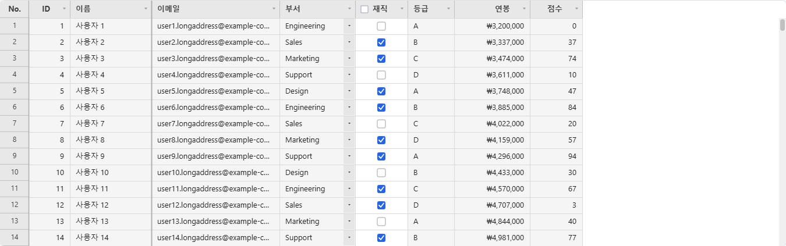
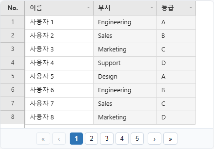
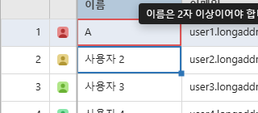
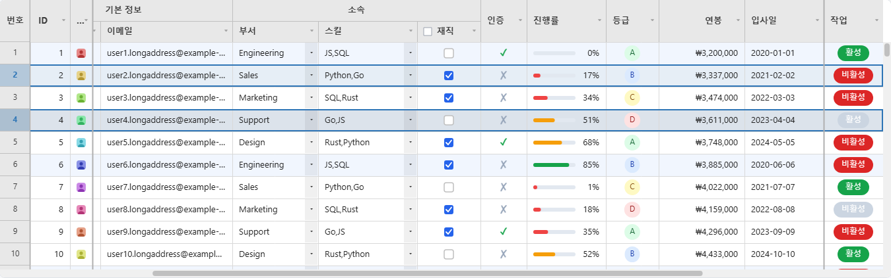
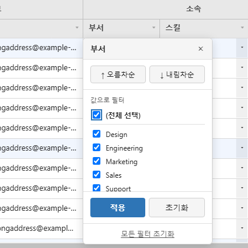
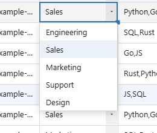
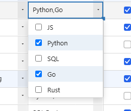
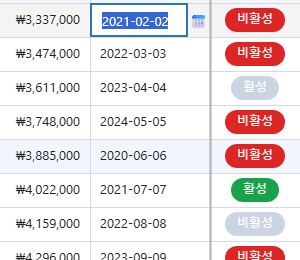
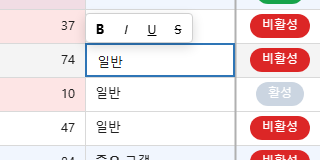

# API Reference

[← Docs index](README.md)

## Constructor Options

| Option | Type | Default | Description |
|---|---|---|---|
| `container` | `string \| Element` | **required** | CSS selector or DOM element |
| `fetchMeta` | `async (state?) => GridMeta` | one of these four required | Returns total row count and column list. Used together with `fetchData` |
| `fetchData` | `async (page, size, state?) => GridData` | one of these four required | Returns a page of row data. Used together with `fetchMeta` |
| `fetchPage` | `async (page, size, state?) => GridData & { totalRows, columns? }` | one of these four required | Single-callback alternative to `fetchMeta`+`fetchData` for a backend that returns both together — see [`fetchPage`](#fetchpage--single-callback-alternative) |
| `data` | `object[]` | one of these four required | In-memory array — convenience alternative to `fetchMeta`/`fetchData`/`fetchPage`, see [Local Array Data](#local-array-data-data) |
| `width` | `number` | `1200` | Grid width in CSS pixels |
| `height` | `number` | `700` | Grid height in CSS pixels |
| `rowHeight` | `number` | `28` | Row height in CSS pixels |
| `colWidth` | `number` | `130` | Column width in CSS pixels |
| `headerHeight` | `number` | `30` | Header row height in CSS pixels |
| `wrapHeader` | `boolean` | `false` | When `true`, header labels wrap onto multiple lines instead of being ellipsis-clipped |
| `hoverFadeMs` | `number` | `110` | Fade duration (ms) for the row-hover highlight's entrance/exit. `0` = instant. Forced to `0` under `prefers-reduced-motion: reduce` |
| `selectionMoveMs` | `number` | `90` | Travel time (ms) for the selection box moving to a new cell/range. Snaps instead of easing during an active drag. `0` disables it |
| `scrollEaseMs` | `number` | `120` | Glide length (ms) for mouse-wheel scrolling. Sub-row deltas (precision trackpads) are applied immediately regardless |
| `columnSlideMs` | `number` | `220` | Travel time (ms) for columns displaced by a column-header drag-reorder. `0` puts them straight into place |
| `scrollbarSize` | `number` | `12` | Scrollbar thickness in CSS pixels |
| `chunkSize` | `number` | `300` | Rows fetched per API request |
| `maxCachedChunks` | `number` | `50` | Maximum number of chunks kept in memory (LRU) |
| `pagination` | `{ enabled, pageSize? }` | `undefined` | When set, switches from continuous virtual scrolling to classic paging (fixed-size pages + a pager bar at the bottom). `pageSize` defaults to `50` when omitted, and takes priority over `chunkSize` when set |
| `onPageChange` | `Function` | `undefined` | Page-change callback `(page, pageCount) => void` — fired only when the page actually changes |
| `frozenCols` | `number` | `0` | Number of columns frozen from the left. Frozen columns always stay visible during horizontal scroll |
| `frozenColsRight` | `number` | `0` | Number of columns frozen from the right |
| `editableCols` | `string[] \| '*'` | `[]` | List of editable columns. All columns are readonly if omitted; `'*'` makes all columns editable |
| `deleteMode` | `'mark' \| 'permanent'` | `'mark'` | What `deleteRow()` does to a **server** row when the call doesn't say: `'mark'` dims it with a strikethrough and keeps it on screen (reported by `getDeletedRows()`); `'permanent'` removes it from the screen immediately (reported by `getRemovedRows()`). Either way the server itself is untouched — the grid only records the choice. `deleteRow(i, { permanent })` overrides this per call |
| `rowContextMenuItems` | `false \| string[]` | `undefined` (all shown) | Narrows which items appear in the row-number gutter's right-click menu. `false` disables it entirely; an array keeps only the named keys: `'row-insert-above'`, `'row-insert-below'`, `'row-insert-top'`, `'row-insert-bottom'`, `'row-delete'` (the last one covers mark/permanent/undelete together, since which renders is row state, not a host choice) |
| `colContextMenuItems` | `false \| string[]` | `undefined` (all shown) | Narrows which items appear in the column header's right-click menu. Same shape as `rowContextMenuItems`. Valid keys: `'freeze'`, `'freeze-right'`, `'visibility'`, `'insert-left'`, `'insert-right'`, `'delete'` |
| `cellContextMenuItems` | `false \| string[]` | `undefined` (all shown) | Narrows which items appear in the plain-cell right-click menu. Valid keys: `'col-insert-left'`, `'col-insert-right'`, `'col-delete'`, `'row-insert-below'`, `'row-delete'` |
| `cellContextMenuExtraItems` | `(ctx) => {label, onClick, disabled?}[] \| null` | `undefined` | Adds custom items to the plain-cell right-click menu, after whichever built-ins `cellContextMenuItems` left in place. Called fresh every time the menu opens for a cell; `ctx` carries `row`/`col`/`field`/`rowData`/`clientX`/`clientY` |
| `columnDefs` | `ColumnDef[]` | `undefined` | Per-column definitions (type, editor, validation, etc. — see the sections below) |
| `headerRows` | `HeaderRowDef[][]` | `undefined` | Explicitly defines multi-level header groups. Takes priority over auto-generation from `columnDefs[].group` when set |
| `showRowNumbers` | `boolean` | `true` | Shows a row-number column on the left. Required for `rowReorder` |
| `rowNumberWidth` | `number` | `50` | Width of the row-number column, in pixels |
| `hiddenColumns` | `string[]` | `undefined` | Fields to hide on initial render |
| `responsive` | `boolean` | `false` | Auto-resizes on container size changes via `ResizeObserver` (ignored in unsupported browsers) |
| `onCellChange` | `Function` | `undefined` | Cell value change callback `({ row, field, newValue, oldValue }) => void` |
| `rowSelection` | `'none' \| 'single' \| 'multi'` | `'none'` | Row selection mode. Rows are selected by click (plus `Ctrl`/`Shift` for multi-select) |
| `onRowSelect` | `Function` | `undefined` | Callback fired whenever the selected row index array changes `(rows: number[]) => void` |
| `rowReorder` | `boolean` | `false` | Enables dragging rows by the row-number gutter to reorder them. Scans the entire dataset once when enabled |
| `onRowReorder` | `Function` | `undefined` | Drag-reorder completion callback `(fromIndex, toIndex, rowData) => void` |
| `theme` | `object` | See [Theming](theming.md) | Partial theme override |
| `locale` | `string` | `'en-US'` | BCP-47 tag. Sets both the built-in UI text pack (e.g. `KO_I18N`) and the default locale for `CellRenderers.number/date/currency` |
| `i18n` | `object` | `undefined` | Per-key overrides layered on top of the text pack selected by `locale` |
| `ariaLabel` | `string` | `undefined` | `aria-label` of the grid container (defaults to `i18n.ariaGrid` if omitted) |
| `rowHighlighter` | `(rowData, rowIndex) => string \| null` | `undefined` | Callback that conditionally sets a row's background color. Called on every render |
| `cellBackground` | `(rowData, rowIndex, field, colIndex) => string \| null` | `undefined` | Callback that conditionally sets a cell's background color. Painted above `rowHighlighter` and below cell content |
| `cellDecorator` | `(ctx, args) => void` | `undefined` | Draws directly on the canvas on top of a cell's content — for a small corner mark, icon, or badge. Called for every visible, loaded cell on every render (`ctx` is the `CanvasRenderingContext2D`; `args` adds `field` to the usual `x`/`y`/`w`/`h`/`rowIndex`/`colIndex` renderer args). Exceptions are caught and logged, and don't interrupt rendering |
| `cellTooltip` | `(rowData, rowIndex, field, colIndex) => string \| null` | `undefined` | Custom tooltip text shown immediately (no hover delay) while the pointer idles over a cell. Takes priority over the built-in overflow-text tooltip, but a validation error on the cell still wins over this |
| `onSelectionChange` | `Function` | `undefined` | Cell/range selection change callback (`null` = selection cleared) |
| `onSort` | `Function` | `undefined` | Sort applied/cleared callback `(sorts: {field,dir}[] \| null) => void` |
| `onFilter` | `Function` | `undefined` | Filter applied/cleared callback `(filters) => void` |
| `onColumnReorder` | `Function` | `undefined` | Column drag-reorder completion callback `(columns: string[]) => void` |
| `onColumnResize` | `Function` | `undefined` | Column width resize (mouse-up) callback `(field, width) => void` |
| `onRowHeightResize` | `Function` | `undefined` | Per-row height drag-resize completion callback from the row-number gutter `(rowIndex, height) => void` |
| `onRender` | `Function` | `undefined` | Callback fired after every render |
| `onChunkError` | `Function` | `undefined` | Data chunk load failure callback `(err: Error) => void` |
| `onValidationError` | `Function` | `undefined` | Cell validity change callback `(row, field, message: string \| null) => void` |
| `onHeaderCheckboxChange` | `Function` | `undefined` | Header checkbox click callback `(field, checked) => void` |

---

## Data Source Interface

### `fetchMeta`

```ts
fetchMeta: (state?: GridFilterState | null) => Promise<{
  totalRows: number;   // total number of rows in the dataset (after state's filters, if any)
  columns: string[];   // ordered list of column keys
}>
```

`state` is the sort/filter/quick-filter the grid wants applied — the same shape `fetchData`
receives (see below). A `fetchMeta` that ignores it still works, it just always reports the
unfiltered total, which makes the scrollbar/row count wrong the moment a filter or sort is active.

### `fetchData`

```ts
fetchData: (page: number, size: number, state?: GridFilterState | null) => Promise<{
  rows: Record<string, unknown>[];  // `size` rows starting at offset page*size, honoring `state`
}>
```

```ts
interface GridFilterState {
  sorts:   { field: string; dir: 'asc' | 'desc' }[];
  // string = substring match (setFilter()); string[] = exact-match checkbox selection (setFilterValues())
  filters: Record<string, string | string[]>;
  quickFilter: string; // '' when inactive
}
```

JHGrid never filters or sorts data itself — it only tracks *what* the user asked for (which
column, which values, which direction) and hands that to `fetchMeta`/`fetchData` as `state` on
every call. Applying it (a `WHERE`/`ORDER BY` on a real backend, or an `Array.filter`/`sort` for
an in-memory source) is entirely the host's responsibility; a callback that ignores `state`
simply never filters or sorts.

Row objects must use the **same keys** as the `columns` array returned by `fetchMeta`.

```json
// fetchMeta → { "columns": ["name", "age", "city"] }
// fetchData → { "rows": [{ "name": "Alice", "age": 30, "city": "Seoul" }] }
```

### `fetchPage` — single-callback alternative

For a backend that already returns a page of rows *and* the total count together in one round
trip (e.g. a SQL `COUNT(*) OVER()` alongside the paged query), `fetchPage` collapses
`fetchMeta`+`fetchData` into a single callback instead of two:

```ts
fetchPage: (page: number, size: number, state?: GridFilterState | null) =>
  Promise<{
    rows: Record<string, unknown>[];
    totalRows: number;
    columns?: string[]; // only needed if not already provided via columnDefs
  }>
```

```js
const grid = new JHGrid({
  container: '#grid',
  columnDefs: [{ field: 'id' }, { field: 'name' }, { field: 'dept' }],
  fetchPage: (page, size, state) =>
    fetch('/api/grid', {
      method: 'POST',
      headers: { 'Content-Type': 'application/json' },
      body: JSON.stringify({ page, size, state }),
    }).then(res => res.json()), // { rows, totalRows }
});
```

The grid still asks for chunk 0 once at boot even though it needs both the row count and the rows
from that same call, so a plain `(page, size) => …` implementation isn't invoked twice for the
same page. Only one data source applies: supplying `fetchMeta`/`fetchData` alongside `fetchPage`
leaves those two in charge and `fetchPage` is ignored.



### Local Array Data (`data`)

For a dataset that already fits in memory — prototyping, a small/medium lookup table, tests —
pass a plain array via `data` instead of writing `fetchMeta`/`fetchData` yourself. Columns are
inferred from `columnDefs` if given, else from the keys of `data[0]`.

```js
const grid = new JHGrid({
  container: '#my-grid',
  data: [
    { name: 'Alice', age: 30, city: 'Seoul' },
    { name: 'Bob',   age: 25, city: 'Busan' },
  ],
  editableCols: '*',
});
```

Filtering, sorting, and the quick filter are applied against the array directly (same semantics a
server-backed `fetchMeta`/`fetchData` is expected to implement — see `onFilter`/`onSort`). This
re-scans the whole array on every state change with no indexing, so it's meant for small/medium
datasets; a large dataset still belongs behind `fetchMeta`/`fetchData` against a real, indexed
backend. `refresh()` re-reads the same array reference, so mutating it externally and calling
`refresh()` picks up the change.

Ignored if `fetchMeta`/`fetchData` is also provided.

---

## Pagination

The default is continuous virtual scrolling, but setting the `pagination` option switches to a
classic page-based UI. Each page shows exactly `pageSize` rows, and scrolling only happens within
that page — moving to the next/previous page only happens via the auto-rendered pager bar at the
bottom (`«`, `‹`, page numbers, `›`, `»`) or via `goToPage()`/`nextPage()`/`prevPage()`.



```js
const grid = new JHGrid({
  container: '#grid',
  fetchMeta, fetchData,
  pagination: { enabled: true, pageSize: 50 },
  onPageChange: (page, pageCount) => console.log(`${page + 1} / ${pageCount}`),
});

grid.nextPage();
grid.goToPage(3);
grid.getCurrentPage(); // 0-based
grid.getPageCount();
```

Every public API that deals with row indices (`getEdits()`, `onCellChange`, etc.) always uses
**absolute indices relative to the entire dataset**, regardless of pagination — pagination only
limits what's scrolled/visible at once, it never changes how rows are addressed.

`pageSize` is fixed at construction time and cannot be changed at runtime.

---

## Column Definition Reference

Every entry in `columnDefs` is one `ColumnDef`. Most fields are covered by their own section
further down (`type`/`editor` under [Column Types](#column-types-date--richtext--image-and-custom-editorsrenderers),
`validation` under [`isValid()`/`getInvalidCells()`/`validateAll()`](#isvalid--getinvalidcells--validateall),
`button` under [Button Columns](#button-columns-type-button), `headerCheckbox` under
[Row Selection](#row-selection-rowselection--header-checkbox), `group` under
[Multi-Level Header Groups](#multi-level-header-groups-columndefsgroup)) — this table is the
complete field list in one place.

| Field | Type | Description |
|---|---|---|
| `field` | `string` | **Required.** The data key this column reads/writes |
| `label` | `string` | Header text. Defaults to `field` |
| `align` | `'left' \| 'center' \| 'right'` | Cell content alignment |
| `headerAlign` | `'left' \| 'center' \| 'right'` | Header label alignment. Defaults to `align` when omitted |
| `width` | `number` | Column width in CSS pixels. Falls back to `opts.colWidth` |
| `group` | `string \| string[]` | Group-header path (outermost → innermost). See [Multi-Level Header Groups](#multi-level-header-groups-columndefsgroup) |
| `type` | `'text' \| 'dropdown' \| 'multiselect' \| 'checkbox' \| 'button' \| 'date' \| 'image'` | Selects the built-in editor + renderer pair. Defaults to `'text'` |
| `renderer` | `string \| (ctx, args) => void` | A `CellRenderers` key, or a custom draw function. Overrides the renderer `type` would otherwise select |
| `editor` | `string \| (ctx) => {value, remove}` | A `CellEditors` key, or a custom editor factory. Overrides the editor `type` would otherwise select |
| `editorOptions` | `object` | Options forwarded to the named `CellEditors` factory when `editor` is a string key |
| `format` | `string` | Date format for `type: 'date'` columns (e.g. `'YYYY-MM-DD'`). Applied to both rendering and clipboard copy |
| `options` | `DropdownOption[] \| (rowData) => DropdownOption[]` | Option list for `type: 'dropdown'`/`'multiselect'` — a string array, `{value,label}` array, or a function computing options per row |
| `editable` | `boolean` | Per-column override of `opts.editableCols`. Only meaningful to make a column *excluded* by `editableCols` editable anyway, or vice versa |
| `validation` | `ColumnValidation` | Declarative required/pattern/min/max/length/custom rules — see [validation](#isvalid--getinvalidcells--validateall) |
| `button` | `ButtonColumnDef` | Button config for `type: 'button'` — see [Button Columns](#button-columns-type-button) |
| `headerCheckbox` | `boolean` | Draws a select-all checkbox in this column's header — see [Row Selection](#row-selection-rowselection--header-checkbox) |
| `aggregate` | `'sum' \| 'avg' \| 'count' \| 'min' \| 'max' \| {fn, format?}` | Aggregate function shown in a group-header row/footer. Built-in types cast with `Number(row[field])` and ignore `NaN` (`'count'` counts non-null values instead); a custom `fn(rows, field)` computes the value itself, and `format(value)` controls the display string. **Only meaningful with a row-grouping plugin installed** — without one the value is retained but never drawn anywhere |

---

## Public Methods

### `refresh()`
Resets scroll position, clears edits, and reloads data.

```js
grid.refresh();
```

### `repaint()`
Schedules a redraw without touching data, scroll position, edits, filters, or sort — for when
something a `cellBackground`/`rowHighlighter`/`cellDecorator` callback reads changed *outside*
the grid (some other host state) and the next frame needs to reflect it. Much cheaper than
`refresh()` when the underlying data hasn't actually changed.

```js
someExternalFlag = true;
grid.repaint(); // cellBackground etc. re-evaluate on the next frame
```

### `scrollTo(rowIndex)`
Scrolls to the specified row. If `pagination` is enabled, first switches to the page that row belongs to.

```js
grid.scrollTo(5000);
```

### `goToPage(page)` / `nextPage()` / `prevPage()`
Only works when the `pagination` option is enabled. `goToPage()` clamps the value to a valid page range.

```js
grid.goToPage(2);
grid.nextPage();
grid.prevPage();
```

### `getCurrentPage()` / `getPageCount()`
Returns the current 0-based page number and the total page count. Returns `0` and `1`, respectively, when `pagination` is disabled.

### `getEdits()`
Returns the cell values the user has edited. Use this when saving/sending to the server.

```js
const edits = grid.getEdits();
// { 42: { name: 'New Name' }, 100: { age: '25' } }
await fetch('/api/save', { method: 'POST', body: JSON.stringify(edits) });
```

### `clearEdits()`
Clears all edits (restores the original data).

```js
grid.clearEdits();
```

### `setCellValue(row, field, value)`
Programmatically sets a cell value, going through the same edit/validation/undo/`onCellChange`
path as a normal edit (checkbox toggle, paste, fill). Useful when one column's value needs to be
updated from another column (e.g. a button column toggling a checkbox column's value). Throws if
`row` is not a non-negative integer, if `field`/`value` is not a string, or if `field` is not an
existing column.

```js
grid.setCellValue(3, 'active', 'false'); // sets row 3's 'active' column to 'false'
```

### `setCellValues(entries)`
Bulk counterpart to `setCellValue()` — applies every entry through the same edit/validation/undo
pipeline as a single edit/undo step and one redraw, instead of one redraw per cell. Use this for
large-scale updates (e.g. a header checkbox toggling every currently-filtered row) where looping
`setCellValue()` would redraw once per row. Throws under the same conditions as `setCellValue()`.

```js
grid.setCellValues([
  { row: 0, field: 'active', value: 'true' },
  { row: 1, field: 'active', value: 'true' },
  { row: 2, field: 'active', value: 'true' },
]);
```

> **Performance note:** even batched, this still runs the full edit/validation pipeline once per
> entry. Applying it to a very large number of rows at once (hundreds of thousands or more) can
> take a long time and block the main thread while it runs — see the performance note under
> [`Delete`](interaction.md) for a concrete measurement of the same underlying cost at that scale.

### `undo()` / `redo()`
Undoes or redoes the most recent action (cell edit, paste/fill, row/column add/delete, column
hide/show/resize/reorder/auto-fit, `setState()`).
Also works via `Ctrl+Z` (undo) / `Ctrl+Y` or `Ctrl+Shift+Z` (redo). Use `canUndo()` / `canRedo()`
to check availability. Applying a sort/filter (`setFilter`/`setSort`/`clearFilters`, etc.) or
calling `refresh()` re-arranges row indices, so the undo/redo history is automatically cleared.

```js
grid.undo();
grid.redo();
if (grid.canUndo()) { /* ... */ }
```

### `isValid()` / `getInvalidCells()` / `validateAll()`
Checks for violations of a column's declared `validation` rules. Automatically checked whenever
an edit is committed, and shown with a red border (plus an error-message tooltip on hover).
`validateAll()` is meant for a one-shot bulk check before saving, and — like `autoFitColumns()`/
`printGrid()` — only checks currently loaded (cached) rows.

```js
const grid = new JHGrid({
  container: '#grid',
  fetchMeta, fetchData,
  editableCols: '*',
  columnDefs: [
    { field: 'email', validation: { required: true, pattern: /^\S+@\S+\.\S+$/ } },
    { field: 'age',   validation: { min: 0, max: 120 } },
    { field: 'code',  validation: { validator: (v) => v.startsWith('A') || 'Code must start with A.' } },
  ],
});

saveBtn.addEventListener('click', async () => {
  grid.validateAll();
  if (!grid.isValid()) {
    alert('Please check your input.');
    console.log(grid.getInvalidCells()); // { 3: { email: '...' } }
    return;
  }
  await fetch('/api/save', { method: 'POST', body: JSON.stringify(grid.getEdits()) });
});
```



### Button Columns (`type: 'button'`)
Renders the entire cell as a single clickable button. Activated by mouse click, touch tap, or
Space/Enter/F2 after selecting the cell, and always works regardless of `editableCols` (since it's
an action trigger, not a data edit). Shows a pointer cursor on hover, and clicking it does not draw
a cell-selection border (since it's an action target, not a selected data cell). `label`/`disabled`/
`variant` all support either a fixed value or a `(rowData, rowIndex) => value` function; if the
`label` function returns `null`/`''`, no button is drawn for that row.

Use `setCellValue()` alongside an action that actually changes another column's value (e.g.
toggling active/inactive) — the example below toggles the `active` checkbox column via a button,
and the button's own label/color update immediately based on that value.

```js
const grid = new JHGrid({
  container: '#grid',
  fetchMeta, fetchData,
  columnDefs: [
    { field: 'active', label: 'Active', type: 'checkbox' },
    {
      field: 'actions', label: 'Actions', width: 90,
      type: 'button',
      button: {
        label:   (row) => row?.active === 'false' ? 'Activate' : 'Deactivate',
        variant: (row) => row?.active === 'false' ? 'success' : 'danger',
        onClick(rowIndex, rowData) {
          const wasActive = rowData?.active !== 'false';
          grid.setCellValue(rowIndex, 'active', wasActive ? 'false' : 'true');
        },
      },
    },
  ],
});
```

### Row Selection (`rowSelection`) / Header Checkbox

Setting `rowSelection: 'single' | 'multi'` lets you select rows by clicking the row-number cell
(or `Ctrl`/`Shift` for multi-select). `onRowSelect(rows)` is called whenever the selection changes,
and `getSelectedRows()` returns the currently selected row indices at any time.



```js
const grid = new JHGrid({
  container: '#grid',
  fetchMeta, fetchData,
  rowSelection: 'multi',
  onRowSelect: (rows) => console.log('selected:', rows),
  columnDefs: [
    { field: 'name', label: 'Name', headerCheckbox: true },
    { field: 'age',  label: 'Age' },
  ],
});

grid.getSelectedRows();   // [2, 5, 9]
grid.clearRowSelection();
```

Setting `columnDefs[i].headerCheckbox: true` draws a select-all checkbox in that column's header,
and clicking it calls `onHeaderCheckboxChange(field, checked)`. You can also read/write the state
directly in code with `setHeaderCheckbox(field, checked)` / `getHeaderCheckbox(field)`.

### Set Filter / Quick Filter

Filters by a checkbox list of a column's distinct values in the header filter panel (based on
currently loaded rows, capped at 200 — automatically falls back to plain text search above that).



```js
grid.setFilterValues('status', ['active', 'pending']);
grid.setFilterValues('status', null); // clears the filter
```

### Tag Filter (`fetchFilterValues`)

Above that 200-value cap the panel falls back to a plain substring box, because the column's values
could not be enumerated from the rows in memory. Give it a way to look them up and that box becomes
a **tag picker** instead: the user types, picks from what the lookup returns, and each pick becomes
a chip. Chips are combined with **OR** and applied as a `string[]` — the same shape the checklist
already sends, so `fetchData`, `getState()`, and `onFilter` need no changes.

```js
new JHGrid({
  // …
  // Called as the user types, debounced. Bound it server-side where you can (LIMIT).
  fetchFilterValues: async (field, query) =>
    fetch(`/api/distinct?col=${field}&q=${encodeURIComponent(query)}&limit=50`).then(r => r.json()),
});
```

The lookup is debounced and waits for **two characters** (`filterValueMinChars`). A single character
against a large column is the most expensive query this control can issue and the least selective
answer it can get; below the threshold the panel says so and still offers the substring fallback,
which needs no lookup at all. Set it to `1` for the pre-existing behaviour.

Return however many matched — the panel builds at most 50 rows regardless and reports the rest as
"+N more, narrow the search". A one-letter query against a large column would otherwise mean
thousands of DOM nodes built on every keystroke, which is a freeze rather than a long list, and no
220px dropdown can show them anyway. A `LIMIT` on your side still saves the transfer.

Picking a value drops it into the tray, clears the box and leaves the caret there, so the next value
starts with a fresh search. The list keeps the same height whether or not any chips have been
collected yet — it is the tray below that gives way when the panel runs short of room, since chips
are what you already chose rather than what you are reading.

A column that was once too large to enumerate keeps its search box for the life of the grid. The
value scan only sees loaded rows, so a filter narrows them, and without this a column filtered down
to a handful of rows would look small enough for a checklist and swap the control out from under
whoever had just used the search to filter it.

Columns small enough to enumerate keep their checklist, which is more precise than searching. Omit
`fetchFilterValues` and nothing changes anywhere.

If the typed text matches nothing the lookup knows about, the list still offers a **contains "…"**
entry that falls back to today's substring filter and arrives as a plain `string`. A column carries
exact values *or* a substring, never both — the filter map holds one value per field and the two
mean different things — so picking the fallback clears the tags and shows its own dashed chip.

Chips wrap and then scroll rather than growing the panel off-screen, and a value too long for the
panel is ellipsized with the full text in its `title`. Nothing is applied until **Apply**: filtering
is a server round trip, and committing per chip would cost one request per tag.

A global search term across all columns is handled via the quick filter. JHGrid doesn't render
its own toolbar, so build the search box UI in the host page and pass the value through this API.

```js
searchInput.addEventListener('input', (e) => grid.setQuickFilter(e.target.value));
grid.getQuickFilter();
grid.clearQuickFilter();
```

### Field-Based Filter / Sort (`setFilter` / `setSort`)

Separately from `setFilterValues()` (the Set filter UI), you can also set an arbitrary filter
condition on a single field directly from code. Sorting is always single-column.

```js
grid.setFilter('status', 'active');   // only show rows where 'status' equals 'active'
grid.removeFilter('status');          // clear just that field's filter
grid.clearFilters();                  // clear all filters

grid.setSort('age', 'desc');          // sort by 'age' descending (replaces any existing sort)
grid.removeSort('age');
grid.clearSort();
```

### Adding/Deleting Rows (`addRow` / `deleteRow`)

```js
grid.addRow({ name: 'New', age: 0 });        // append at the end
grid.addRow({ name: 'New' }, { index: 0 });  // insert at the front

grid.deleteRow(3);      // marks row 3 as deleted (strikethrough, undoable)
grid.undeleteRow(3);    // clears the deletion mark

grid.getNewRows();      // rows added this session — use this to send new-insert requests to the server
grid.getDeletedRows();  // server indices of rows marked for deletion (see the note below)
```

By default `deleteRow()` **marks** a server row (dims it with a strikethrough, keeps it on
screen, and reports it via `getDeletedRows()`) rather than removing it — this is the `deleteMode`
constructor option, `'mark'` by default. Pass `{ permanent: true }` (or set `deleteMode:
'permanent'` for the whole grid) to take the row off the screen immediately instead:

```js
grid.deleteRow(3, { permanent: true }); // removed from the screen right away
grid.getRemovedRows(); // server indices removed this way — separate from getDeletedRows()
grid.undeleteRow(3);   // brings a permanently-removed row back too
```

A row added via `addRow()` ignores all of this — it was never sent anywhere, so `deleteRow()` on
it just removes it outright regardless of `deleteMode`.

`getDeletedRows()`/`getRemovedRows()` report **server indices**, not screen positions: a row
inserted above a marked one moves it down the screen, but not in what these two report.

### Adding/Deleting/Hiding Columns (`addColumn` / `deleteColumn` / `hideColumn`)

```js
grid.addColumn('email', { label: 'Email' });
grid.deleteColumn('email');
grid.undeleteColumn('email');
grid.getNewColumns();
grid.getDeletedColumns();
grid.commitColumns(['email']); // finalizes the add/delete marks (no longer undoable)

grid.hideColumn('age');
grid.showColumn('age');
grid.isColumnVisible('age');   // boolean
grid.getHiddenColumns();       // string[]
```

### Row Height (`setRowHeight` / `autoFitColumns`)

```js
grid.setRowHeight(3, 40);   // changes only row 3's height to 40px
grid.setRowHeight(28);      // called with one argument, changes the default row height for all rows
grid.getRowHeight(3);
grid.resetRowHeight(3);     // resets that row back to the default height

grid.autoFitColumns('name', 'age'); // auto-resizes the given columns to fit their content (all columns if no argument)
```
Like `isValid()`/`printGrid()`, `autoFitColumns()` only computes against currently loaded (cached) rows.

### State Snapshot/Restore (`getState` / `setState`)

Extracts the grid's current state (filters, sort, column order/visibility, edits, etc.) as a
serializable object, and can restore it later exactly as it was (e.g. saving a per-user view).

```js
const state = grid.getState();
localStorage.setItem('gridState', JSON.stringify(state));

grid.setState(JSON.parse(localStorage.getItem('gridState')));
```
A `setState()` call is recorded as a single undoable action. `setState()` returns a `Promise` that
resolves once the grid is actually showing that state — if the snapshot carries `sorts`,
`filters`, or `quickFilter`, those only describe what the *server* should return, so the grid
re-fetches and the promise waits for the answer. A snapshot that only moves columns around
resolves immediately, since there's nothing to ask for. Unknown fields are ignored, so a snapshot
taken with an older version of the grid still applies as far as it goes.

`GridState`'s fields:

| Field | Type | Description |
|---|---|---|
| `columns` | `string[]` | Current visible column order |
| `columnWidths` | `Record<string, number>` | Current width of every column, by field |
| `hiddenColumns` | `string[]` | Currently hidden fields |
| `frozenCols` / `frozenColsRight` | `number` | Current frozen-column counts |
| `sorts` | `{field, dir}[]` | Active sort(s) |
| `filters` | `Record<string, string \| string[]>` | Active per-column filters — `string` (substring match) or `string[]` (Set filter) |
| `quickFilter` | `string` | Active quick-filter term, `''` when inactive |
| `selectedRows` | `number[]` | Currently selected row indices (`rowSelection` mode) |
| `headerCheckboxState` | `Record<string, boolean>` | Checked state of every `headerCheckbox` column's header checkbox |
| `localColumns` | `ColumnDef[]` | Columns added via `addColumn()` not yet committed (see `getNewColumns()`/`commitColumns()`) |
| `deletedColumns` | `string[]` | Server columns marked deleted via `deleteColumn()`, not yet committed (see `getDeletedColumns()`) |
| `rowChanges` | `object` | Unsaved row work — see below |
| `grouping` / `treeData` / `colorFilters` | varies | Always present (as `null` when unused) even without the plugin that gives them meaning — a plain `getState()`/`setState()` round-trip preserves them regardless. Only a row-grouping/tree-data/color-filter plugin actually reads or writes them |

`rowChanges` is the row counterpart of `localColumns`/`deletedColumns`, keyed by **server index**
throughout (never screen position, since a snapshot is meant to outlive whatever arrangement
produced it):

| `rowChanges` field | Type | Description |
|---|---|---|
| `added` | `{anchor, data, edits}[]` | Rows from `addRow()`. `anchor` is the server index the row sits in front of (equal to the row count when appended at the end) |
| `removed` | `number[]` | Server indices removed via `deleteRow(i, { permanent: true })` — see `getRemovedRows()` |
| `marked` | `number[]` | Server indices marked for deletion — see `getDeletedRows()` |
| `edits` | `Record<number, Record<string, string>>` | Unsaved cell edits on server rows, `serverIndex -> field -> value` |

`setState()` treats `rowChanges` as a full replacement, not an addition — restoring the same
snapshot twice doesn't duplicate rows. Restoring against changed server data names different
records by index, the same caveat that applies to `filters` naming fields that may no longer exist.

### `getRowData(rowIndex)` / `ready()`

```js
grid.getRowData(3);  // row 3's current data (with unsaved edits applied; null if not loaded)
await grid.ready();  // waits until the initial metadata/first chunk load completes
```

### Incremental Save (`getOriginalRowData` / `isNewRow` / `acknowledgeSave` / `acknowledgeInsert`)

For a host that saves as the user goes (auto-save on commit) rather than in one batch via
`getEdits()`, these let a single row be reconciled with the server without the full reset
(scroll position, filters, sort, selection) that `refresh()` does.

```js
grid.getOriginalRowData(3); // row 3's pre-edit snapshot — what getRowData(3) returned before
                             // any unsaved edits, independent of later addRow()/deleteRow() calls
grid.isNewRow(3);           // true if row 3 came from addRow() and has no server counterpart yet
```

```js
// A server row the user just edited, saved successfully:
async function saveRow(rowIndex) {
  const saved = await fetch('/api/rows/' + rowIndex, {
    method: 'PUT',
    body: JSON.stringify(grid.getRowData(rowIndex)),
  }).then(r => r.json());
  grid.acknowledgeSave(rowIndex, saved); // patches the cache, drops the pending edit
}

// A row added via addRow(), just created on the server:
async function createRow(rowIndex) {
  const created = await fetch('/api/rows', {
    method: 'POST',
    body: JSON.stringify(grid.getRowData(rowIndex)),
  }).then(r => r.json());
  grid.acknowledgeInsert(rowIndex, created); // turns it into an ordinary server row in place
}
```

`acknowledgeSave()` is a no-op if `isNewRow(rowIndex)` is true (a brand-new row has no server slot
yet to patch — use `acknowledgeInsert()` for that case instead, which returns `false` if
`rowIndex` wasn't actually a local/unsaved row).

### Multi-Level Header Groups (`columnDefs[].group`)

Consecutive columns sharing the same label at a given level are automatically merged into a
single header group cell.

```js
columnDefs: [
  { field: 'q1_score', label: 'Q1', group: 'Quantitative' },
  { field: 'q2_score', label: 'Q2', group: 'Quantitative' },
  { field: 'review',   label: 'Comments', group: 'Qualitative' },
],
```
For finer control, define header rows explicitly with the `headerRows` option instead of
`columnDefs[].group`. `headerRows` is `HeaderRowDef[][]` — an array of header rows, each an array
of group cells for that row:

```js
headerRows: [
  [ // top row
    { label: 'Quantitative', fields: ['q1_score', 'q2_score'] },
    { label: 'Qualitative',  fields: ['review'] },
  ],
],
columnDefs: [
  { field: 'q1_score', label: 'Q1' },
  { field: 'q2_score', label: 'Q2' },
  { field: 'review',   label: 'Comments' },
],
```

| `HeaderRowDef` field | Type | Description |
|---|---|---|
| `label` | `string` | The group cell's text |
| `fields` | `string[]` | Field names this group spans. Recomputed automatically after a column reorder, so it always tracks the current column order rather than a fixed position |
| `colspan` | `number` | Explicit column span, if it shouldn't be inferred from `fields.length` |
| `rowspan` | `number` | How many header rows tall the cell is (for a group with no further subdivision below it) |
| `align` | `'left' \| 'center' \| 'right'` | Group cell text alignment |

### Locale / Internationalization (`locale` / `i18n`)

Setting `locale` switches both the built-in UI text pack (currently Korean/Japanese/Simplified
Chinese are bundled) and the default locale for the number/date/currency cell renderers. Use
`i18n` to override specific strings on top of that.

```js
import { JHGrid, KO_I18N } from '../dist/jhgrid.esm.js';

const grid = new JHGrid({
  container: '#grid',
  fetchMeta, fetchData,
  locale: 'ko',                 // or 'ko-KR' — defaults to 'en-US'
  i18n: { ...KO_I18N, loading: 'Loading…' }, // override specific strings only
});
```

### Conditional Styling (`rowHighlighter` / `cellBackground`)

```js
const grid = new JHGrid({
  container: '#grid',
  fetchMeta, fetchData,
  rowHighlighter: (row) => row?.status === 'ERROR' ? 'rgba(239,68,68,0.12)' : null,
  cellBackground: (row, rowIndex, field) =>
    row && field === 'score' && row.score < 60 ? '#fee2e2' : null,
});
```
Both callbacks are called on every render (for visible rows/cells), so keep them lightweight —
exceptions thrown in `cellBackground` are logged and ignored, and don't block rendering.

### Row Drag Reorder (`rowReorder`)

Drag rows by the row-number gutter to reorder them. Unlike column reordering, row data isn't
always resident in memory under server-side paging, so enabling this scans the entire dataset once
(it's an opt-in feature).

```js
const grid = new JHGrid({
  container: '#grid',
  fetchMeta, fetchData,
  rowReorder: true,
  onRowReorder: (fromIndex, toIndex, rowData) => console.log(fromIndex, '→', toIndex),
});
```

### Built-in Cell Renderers (`CellRenderers`)

Assign any of these to `columnDefs[i].renderer` (either the string key or a call to the factory
directly — both are equivalent, but calling it yourself lets you pass options):

```js
import { CellRenderers } from '../dist/jhgrid.esm.js';

columnDefs: [
  { field: 'progress', renderer: CellRenderers.progressBar({ max: 100, showLabel: true }) },
  { field: 'grade',    renderer: CellRenderers.badge({ colorMap: { A: { bg: '#dcfce7', fg: '#166534' } } }) },
]
```

| Renderer | Options | Description |
|---|---|---|
| `progressBar({ max?, showLabel? })` | `max` (default `100`), `showLabel` (default `false`) | A filled bar sized to `value / max`, with an optional percentage label |
| `badge({ colorMap? })` | `colorMap: Record<value, {bg?, fg?}>` | A pill-shaped tag per distinct value, colored per `colorMap` (falls back to a neutral gray for values not listed) |
| `checkmark({ trueColor?, falseColor?, showFalse? })` | colors + whether to draw anything for a false-y value | A ✓/✗ glyph instead of raw `'true'`/`'false'` text |
| `image({ fit?, radius? })` | `fit: 'cover' \| 'contain'` (default `'cover'`), `radius` (corner radius, px) | Renders the cell value as an image URL — see the `type: 'image'` note below for caching/decoding details |
| `number({ locale?, decimals? })` | BCP-47 `locale`, fixed `decimals` | `Intl.NumberFormat`-based number formatting |
| `date({ format?, locale?, dateStyle?, align? })` | `format`: a `YYYY`/`MM`/`DD`/`HH`/`mm`/`ss` pattern, or `'locale'` to format via `Intl.DateTimeFormat` | Date formatting — pattern-based by default, locale-aware when `format: 'locale'` |
| `currency({ locale?, currency? })` | BCP-47 `locale`, ISO 4217 `currency` code | `Intl.NumberFormat`-based currency formatting |
| `dropdown({ placeholder? })` | placeholder text for an empty value | Current value + a `▾` arrow, matching the dropdown editor's affordance |
| `multiselect({ placeholder? })` | placeholder text for an empty selection | Selected values joined + a `▾` arrow |
| `checkbox({ checkedColor?, size? })` | box color and size (px) | A checked/unchecked box glyph |
| `button({ label?, disabled?, variant? })` | same shape as `columnDefs[i].button` (see [Button Columns](#button-columns-type-button)) | Renders the cell as a clickable button — this is what `type: 'button'` uses internally |

`locale` on `number`/`date`/`currency` falls back to `theme.locale` (set via the top-level
`locale` constructor option) when omitted, so most grids never need to pass it per-column.

Clicking an already-selected `dropdown`/`multiselect` cell opens its editor immediately (no
double-click needed):




Register your own under a string key with `registerCellRenderer(name, factory)` (and the editor
counterpart, `registerCellEditor`) — see the custom-editor example below for the matching factory
shape.

### Column Types: `date` / `richtext` / `image`, and Custom Editors/Renderers

`columnDefs[i].type` supports `date`/`richtext`/`image` in addition to `checkbox`/`dropdown`/`button`.
When set, the matching editor (`CellEditors`) and display renderer (`CellRenderers`) are applied automatically.

```js
columnDefs: [
  { field: 'dob',    type: 'date', editorOptions: { min: '1900-01-01', max: '2100-12-31' } },
  { field: 'notes',  type: 'richtext' },              // bold/italic/underline/strikethrough
  { field: 'avatar', type: 'image', renderer: 'image', renderOptions: { fit: 'cover' } },
],
```

- `type: 'date'` — Uses a native `<input type="date">` editor (or `datetime-local` if
  `editorOptions: { mode: 'datetime-local' }` is set) and `CellRenderers.date({ format: 'locale' })`
  for display. `editorOptions.min`/`max` are passed straight through as that `<input>`'s `min`/`max`
  attributes. Combined with `validation: { min, max }`, values are compared as date strings (not numbers).

  
- `type: 'richtext'` — Double-clicking a cell opens a `contenteditable` editor with a bold/italic/
  underline/strikethrough toolbar. The stored value is a sanitized HTML string made up only of
  `<b>/<i>/<u>/<s>` tags, and the grid draws it on the canvas as a **single line** (line breaks,
  lists, and block elements aren't supported — to match the fixed row-height model). This string is
  copied as-is to CSV/clipboard.

  
- `type: 'image'` — Interprets the cell value as an image URL and draws it with
  `CellRenderers.image({ fit: 'cover' | 'contain', radius })`. Decoding is done via `fetch()` +
  `createImageBitmap(blob, { resizeWidth, resizeHeight })`, sized to fit the cell's display size, so
  memory usage stays low regardless of the source resolution — and the same URL is reused across
  grids via a page-wide LRU cache (50MB budget). Redraws automatically once the async load finishes.

To build your own cell editor, assign a function to `columnDefs[i].editor` — the same way `renderer`
accepts a function:

```js
{ field: 'color', editor: (ctx) => {
    const input = document.createElement('input');
    input.type = 'color';
    input.value = ctx.initialValue || '#000000';
    Object.assign(input.style, { position: 'absolute', left: ctx.x + 'px', top: ctx.y + 'px' });
    ctx.wrapper.appendChild(input);
    input.addEventListener('change', () => ctx.commit());
    return input; // any shape works as long as it has .value / .remove()
  } }
```

`ctx` carries `row`/`col`/`field`/`rowData`, position/size (`x`/`y`/`colW`/`rowH`), `theme`/`i18n`/
`columnLabel`, `initialValue`, and callbacks to notify the host grid: `commit()`/`cancel()`/
`moveSel(dr, dc)`/`focusWrapper()`. The return value only needs `.value` (a string) and `.remove()`,
so you can either return an `<input>` directly (as above) or return an object shaped like
`CellEditors.dropdown()`'s `{ get value() {...}, remove() {...} }`.

You can also register reusable editors/renderers by name, so multiple columns can reference them by string key:

```js
import { registerCellEditor, registerCellRenderer, CellRenderers } from '../dist/jhgrid.esm.js';

registerCellEditor('color', (opts) => (ctx) => { /* same factory shape as above */ });
registerCellRenderer('color', () => (ctx, info) => { /* draw a color swatch on the canvas */ });

columnDefs: [{ field: 'favoriteColor', editor: 'color', renderer: 'color' }]
```

### Data Export (`exportCsv` / `printGrid`)

By default, both APIs export only the **currently loaded/cached chunks** — pass `{ full: true }`
to export the entire server-side dataset instead (re-fetches every page while preserving the
current filter/sort conditions).

```js
await grid.exportCsv({ filename: 'users.csv', full: true });

grid.printGrid({ title: 'User List' });
```

### `destroy()`
Fully removes event listeners and DOM. Call this when unmounting a component or navigating away.

```js
grid.destroy();
```
