# API Reference

[← Docs index](README.md)

## Constructor Options

| Option | Type | Default | Description |
|---|---|---|---|
| `container` | `string \| Element` | **required** | CSS selector or DOM element |
| `fetchMeta` | `async (state?) => GridMeta` | one of these four required | Returns total row count and column list. Used together with `fetchData` — see [fetchMeta](#fetchmeta) |
| `fetchData` | `async (page, size, state?) => GridData` | one of these four required | Returns a page of row data. Used together with `fetchMeta` — see [fetchData](#fetchdata) |
| `fetchPage` | `async (page, size, state?) => GridData & { totalRows, columns? }` | one of these four required | Single-callback alternative to `fetchMeta`+`fetchData` for a backend that returns both together: see [`fetchPage`](#fetchpage-single-callback-alternative) |
| `data` | `object[]` | one of these four required | In-memory array, a convenience alternative to `fetchMeta`/`fetchData`/`fetchPage`, see [Local Array Data](#local-array-data-data) |
| `width` | `number` | `1200` (fallback when the container has no CSS size) | Grid width in CSS pixels. Setting this (or `height`) turns `responsive` off by default — see [Responsive sizing](#responsive-sizing-responsive) |
| `height` | `number` | `700` (fallback when the container has no CSS size) | Grid height in CSS pixels. Setting this (or `width`) turns `responsive` off by default — see [Responsive sizing](#responsive-sizing-responsive) |
| `rowHeight` | `number` | `28` | Row height in CSS pixels |
| `colWidth` | `number` | `130` | Column width in CSS pixels |
| `headerHeight` | `number` | `30` | Header row height in CSS pixels |
| `wrapHeader` | `boolean` | `false` | When `true`, header labels wrap onto multiple lines instead of being ellipsis-clipped |
| `hoverFadeMs` | `number` | `110` | Fade duration (ms) for the row-hover highlight's entrance/exit. `0` = instant. Forced to `0` under `prefers-reduced-motion: reduce` |
| `selectionMoveMs` | `number` | `90` | Travel time (ms) for the selection box moving to a new cell/range. Snaps instead of easing during an active drag. `0` disables it |
| `scrollEaseMs` | `number` | `120` | Glide length (ms) for mouse-wheel scrolling. Sub-row deltas (precision trackpads) are applied immediately regardless |
| `columnSlideMs` | `number` | `220` | Travel time (ms) for columns displaced by a column-header drag-reorder. `0` puts them straight into place |
| `scrollbarSize` | `number` | `12` | Scrollbar thickness in CSS pixels |
| `chunkSize` | `number` | `300` | Rows fetched per API request |
| `maxCachedChunks` | `number` | `50` | Maximum number of chunks kept in memory (LRU) |
| `pagination` | `{ enabled, pageSize?, pageSizeOptions?, pageSizePosition? }` | `undefined` | When set, switches from continuous virtual scrolling to classic paging (fixed-size pages + a pager bar at the bottom). `pageSize` is the starting rows per page (default `50`) and takes priority over `chunkSize` when set. `pageSizeOptions` (e.g. `[25, 50, 100]`) adds a page-size dropdown to the pager bar, on the side `pageSizePosition` names (`'left'` by default, or `'right'`) — see [Pagination](#pagination) |
| `onPageChange` | `Function` | `undefined` | Page-change callback `(page, pageCount) => void`, fired only when the page actually changes — see [Pagination](#pagination) |
| `onPageSizeChange` | `Function` | `undefined` | Page-size callback `(pageSize) => void`, fired when the rows per page change (through the selector or `setPageSize()`) — see [Pagination](#pagination) |
| `frozenCols` | `number` | `0` | Number of columns frozen from the left. Frozen columns always stay visible during horizontal scroll |
| `frozenColsRight` | `number` | `0` | Number of columns frozen from the right |
| `pinnedTopRows` | `object[]` | `undefined` | Row-data snapshots pinned above the scrollable area, always visible regardless of scroll/sort/filter — see [Pinned Rows](#pinned-rows-pinnedtoprows--pinnedbottomrows--pinrow) |
| `pinnedBottomRows` | `object[]` | `undefined` | Row-data snapshots pinned below the scrollable area (e.g. a totals/summary row) — see [Pinned Rows](#pinned-rows-pinnedtoprows--pinnedbottomrows--pinrow) |
| `editableCols` | `string[] \| '*'` | `[]` | List of editable columns. All columns are readonly if omitted; `'*'` makes all columns editable. Changeable on a live grid via `setOptions()` — see [Context Menus / setOptions](#context-menus-rowcontextmenuitems--colcontextmenuitems--cellcontextmenuitems--setoptions) |
| `rowKey` | `string` | `undefined` | The column that uniquely identifies a row (e.g. `'id'`). Required by `getChanges()`, which reports changed rows by this value instead of by row number — row numbers move whenever the grid is sorted or filtered, a key does not. See [Batch Save](#batch-save-rowkey--getchanges--acknowledgechanges) |
| `keyboardShortcuts` | `{ delete?, undo?, redo? }` | `undefined` (all on) | Switches built-in keys off with `false`: `delete` (`Delete`/`Backspace` clears the selection), `undo` (`Ctrl+Z`), `redo` (`Ctrl+Y` / `Ctrl+Shift+Z`) — see [`undo()` / `redo()`](#undo--redo) |
| `deleteMode` | `'mark' \| 'permanent'` | `'mark'` | What `deleteRow()` does to a **server** row when the call doesn't say: `'mark'` dims it with a strikethrough and keeps it on screen (reported by `getDeletedRows()`); `'permanent'` removes it from the screen immediately (reported by `getRemovedRows()`). Either way the server itself is untouched; the grid only records the choice. `deleteRow(i, { permanent })` overrides this per call — see [Adding/Deleting Rows](#addingdeleting-rows-addrow--deleterow) |
| `rowContextMenuItems` | `false \| string[]` | `undefined` (all shown) | Narrows which items appear in the row-number gutter's right-click menu. `false` disables it entirely; an array keeps only the named keys: `'row-pin'`, `'row-insert-above'`, `'row-insert-below'`, `'row-insert-top'`, `'row-insert-bottom'`, `'row-delete'`. `'row-delete'` covers mark/permanent/undelete together, and `'row-pin'` covers pin-to-top, pin-to-bottom and unpin, since which of them renders is row state, not a host choice. See [Context menus](#context-menus-rowcontextmenuitems--colcontextmenuitems--cellcontextmenuitems--setoptions) |
| `colContextMenuItems` | `false \| string[]` | `undefined` (all shown) | Narrows which items appear in the column header's right-click menu. Same shape as `rowContextMenuItems`. Valid keys: `'freeze'`, `'freeze-right'`, `'visibility'`, `'insert-left'`, `'insert-right'`, `'delete'` |
| `cellContextMenuItems` | `false \| string[]` | `undefined` (all shown) | Narrows which items appear in the plain-cell right-click menu. Valid keys: `'col-insert-left'`, `'col-insert-right'`, `'col-delete'`, `'row-insert-below'`, `'row-delete'` |
| `cellContextMenuExtraItems` | `(ctx) => {label, onClick, disabled?}[] \| null` | `undefined` | Adds custom items to the plain-cell right-click menu, after whichever built-ins `cellContextMenuItems` left in place. Called fresh every time the menu opens for a cell; `ctx` carries `row`/`col`/`field`/`rowData`/`clientX`/`clientY` |
| `rowPinButton` | `boolean \| 'top' \| 'bottom'` | `false` | Draws a pin toggle at the right edge of the row-number gutter: one click pins a copy of the row (to the top band for `true`/`'top'`, to the bottom band for `'bottom'`), another click on a pinned row removes the copy. Ignored, with a console warning, while `showRowNumbers` is `false`. Can be changed later with [`setOptions()`](#context-menus-rowcontextmenuitems--colcontextmenuitems--cellcontextmenuitems--setoptions) - see [Pinned Rows](#pinned-rows-pinnedtoprows--pinnedbottomrows--pinrow) |
| `onRowPinToggle` | `Function` | `undefined` | Called right after the *user* pins or unpins a row through the pin icon or the row menu: `({ pinned, rowIndex, position, rowData, handle }) => void`. Not called for `pinRow()`/`unpinRow()`/`togglePinRow()` made from code. See [Pinned Rows](#pinned-rows-pinnedtoprows--pinnedbottomrows--pinrow) |
| `columnDefs` | `ColumnDef[]` | `undefined` | Per-column definitions: type, editor, validation and the rest — see [Column Definition](#column-definition-reference) |
| `headerRows` | `HeaderRowDef[][]` | `undefined` | Explicitly defines multi-level header groups. Takes priority over auto-generation from `columnDefs[].group` when set — see [Multi-Level Header Groups](#multi-level-header-groups-columndefsgroup) |
| `columnLetterHeader` | `boolean` | `false` | Adds an Excel-style A/B/C/... row above the normal header row(s), one non-interactive cell per column (no sort/filter/checkbox) |
| `showRowNumbers` | `boolean` | `true` | Shows a row-number column on the left. Required for `rowReorder` |
| `rowNumberWidth` | `number` | `50` | Width of the row-number column, in pixels |
| `hiddenColumns` | `string[]` | `undefined` | Fields to hide on initial render — see [Hiding Columns](#addingdeletinghiding-columns-addcolumn--deletecolumn--hidecolumn) |
| `responsive` | `boolean` | `true` when neither `width` nor `height` is given, else `false` | Sizes the grid to its container and follows it when the container resizes, via `ResizeObserver` (ignored in unsupported browsers). While it is on, `width` and `height` are ignored with a console warning: give the container element a CSS size instead - see [Responsive sizing](#responsive-sizing-responsive) |
| `onCellChange` | `Function` | `undefined` | Cell value change callback `({ row, field, newValue, oldValue }) => void`. It fires for every cell a commit writes (each cell of a paste, fill or clear included), and also when the value came out the same, so compare `newValue` with `oldValue` if you only care about real changes. Values are strings - see [getEdits()](#getedits) |
| `onCellClick` | `Function` | `undefined` | Fired when the left button is pressed and released on the same cell, or a cell is tapped, alongside the built-in selection `(rowIndex, rowData, field) => void` — see [Selection, Focus and Editing from Code](#selection-focus-and-editing-from-code-getselection--setselection--focuscell--startediting--stopediting) |
| `onCellDoubleClick` | `Function` | `undefined` | Fired on every cell double-click, editable or not, alongside (not instead of) the built-in edit-start `(rowIndex, rowData, field) => void` |
| `rowSelection` | `'none' \| 'single' \| 'multi'` | `'none'` | Row selection mode. Rows are selected by click (plus `Ctrl`/`Shift` for multi-select) — see [Row Selection](#row-selection-rowselection--header-checkbox) |
| `onRowSelect` | `Function` | `undefined` | Callback fired whenever the selected row index array changes `(rows: number[]) => void` — see [Row Selection](#row-selection-rowselection--header-checkbox) |
| `rowReorder` | `boolean` | `false` | Enables dragging rows by the row-number gutter to reorder them. Scans the entire dataset once when enabled — see [Row Drag Reorder](#row-drag-reorder-rowreorder) |
| `fullScanConcurrency` | `number` | auto (`navigator.hardwareConcurrency` clamped to `[2, 8]`) | Worker-pool size for the full-dataset scan `rowReorder` runs via `fetchData` — see [Row Drag Reorder](#row-drag-reorder-rowreorder) |
| `fullScanPageSize` | `number` | falls back to `chunkSize` | Page size used by that same full-dataset scan — see [Row Drag Reorder](#row-drag-reorder-rowreorder) |
| `onRowReorder` | `Function` | `undefined` | Drag-reorder completion callback `(fromIndex, toIndex, rowData) => void` — see [Row Drag Reorder](#row-drag-reorder-rowreorder) |
| `theme` | `object` | See [Themes](theming.md) | Partial theme override |
| `locale` | `string` | `'en-US'` | BCP-47 tag. Sets both the built-in UI text pack (e.g. `KO_I18N`) and the default locale for `CellRenderers.number/date/currency` — see [Localization](#locale--internationalization-locale--i18n) |
| `i18n` | `object` | `undefined` | Per-key overrides layered on top of the text pack selected by `locale` — see [Localization](#locale--internationalization-locale--i18n) |
| `ariaLabel` | `string` | `undefined` | `aria-label` of the grid container (defaults to `i18n.ariaGrid` if omitted) |
| `confirmUnsaved` | `(message) => boolean` | `undefined` | Answers the "unsaved edits will be discarded" prompt a filter/sort change raises, in place of `window.confirm`. Returning `true` discards them. Must answer synchronously - see [Field-Based Filter / Sort](#field-based-filter--sort-setfilter--setsort) |
| `rowHighlighter` | `(rowData, rowIndex) => string \| null` | `undefined` | Callback that conditionally sets a row's background color. Called on every render — see [Conditional Styling](#conditional-styling-rowhighlighter--cellbackground) |
| `cellBackground` | `(rowData, rowIndex, field, colIndex) => string \| null` | `undefined` | Callback that conditionally sets a cell's background color. Painted above `rowHighlighter` and below cell content — see [Conditional Styling](#conditional-styling-rowhighlighter--cellbackground) |
| `cellDecorator` | `(ctx, args) => void` | `undefined` | Draws directly on the canvas on top of a cell's content, for a small mark, icon, or badge. Called for every visible, loaded cell on every render (`ctx` is the `CanvasRenderingContext2D`; `args` adds `field` to the usual `x`/`y`/`w`/`h`/`rowIndex`/`colIndex` renderer args). Exceptions are caught and logged, and don't interrupt rendering |
| `cellTooltip` | `(rowData, rowIndex, field, colIndex) => string \| null` | `undefined` | Custom tooltip text shown immediately (no hover delay) while the pointer idles over a cell. Takes priority over the built-in overflow-text tooltip, but a validation error on the cell still wins over this |
| `onSelectionChange` | `Function` | `undefined` | Cell/range selection change callback (`null` = selection cleared) |
| `onSort` | `Function` | `undefined` | Sort applied/cleared callback `(sorts: {field,dir}[] \| null) => void` |
| `onFilter` | `Function` | `undefined` | Filter applied/cleared callback `(filters) => void` |
| `onColumnReorder` | `Function` | `undefined` | Column drag-reorder completion callback `(columns: string[]) => void` |
| `onColumnResize` | `Function` | `undefined` | Column width callback `(field, width) => void`. Fires on mouse-up after a drag-resize, and once per column when `autoFitColumns()` fits columns. A double-click on a header border fits the column too, but does not call it |
| `onColumnVisibilityChange` | `Function` | `undefined` | Fired after `hideColumn()`/`showColumn()` or the column chooser's Apply actually changes the hidden-column set `(hiddenColumns: string[]) => void` |
| `onRowHeightResize` | `Function` | `undefined` | Per-row height drag-resize completion callback from the row-number gutter `(rowIndex, height) => void` |
| `onRender` | `Function` | `undefined` | Callback fired after every render |
| `onChunkError` | `Function` | `undefined` | Data chunk load failure callback `(err: Error) => void` |
| `onValidationError` | `Function` | `undefined` | Cell validity change callback `(row, field, message: string \| null) => void` — see [Validation](#isvalid--getinvalidcells--validateall) |
| `onHeaderCheckboxChange` | `Function` | `undefined` | Header checkbox click callback `(field, checked) => void` — see [Header Checkbox](#row-selection-rowselection--header-checkbox) |
| `fetchFilterValues` | `async (field, query) => (string \| number \| null)[]` | `undefined` | Supplies the value suggestions for a column's tag filter, given the column and what the user typed. Without it the tag filter can only suggest values found in the rows currently loaded: see [Tag Filter](#tag-filter-fetchfiltervalues) |
| `filterValueMinChars` | `number` | `2` | How many characters the tag filter waits for before it looks values up (through `fetchFilterValues`, or in the loaded rows when that is not set). One character against a large column is the most expensive question it can ask and the least useful answer it can get. `1` restores single-character lookups - see [Tag Filter](#tag-filter-fetchfiltervalues) |

---

## Data Source Interface

### `fetchMeta`

```ts
fetchMeta: (state?: GridFilterState | null) => Promise<{
  totalRows: number;   // total number of rows in the dataset (after state's filters, if any)
  columns: string[];   // ordered list of column keys
}>
```

`state` is the sort/filter/quick-filter the grid wants applied, the same shape `fetchData`
receives (see below). A `fetchMeta` that ignores it still works, it just always reports the
unfiltered total, which makes the scrollbar/row count wrong the moment a filter or sort is active.

### `fetchData`

```ts
fetchData: (page: number, size: number, state?: GridFilterState | null) => Promise<{
  rows: Record<string, unknown>[];  // `size` rows starting at offset page*size, honoring `state`
}>
```

```ts
interface GridFilterState {
  sorts:   { field: string; dir: 'asc' | 'desc' }[];
  // string = substring match (setFilter()); string[] = exact-match checkbox selection (setFilterValues())
  filters: Record<string, string | string[]>;
  quickFilter: string; // '' when inactive
}
```

JHGrid never filters or sorts data itself; it only tracks *what* the user asked for (which
column, which values, which direction) and hands that to `fetchMeta`/`fetchData` as `state` on
every call. Applying it (a `WHERE`/`ORDER BY` on a real backend, or an `Array.filter`/`sort` for
an in-memory source) is entirely the host's responsibility; a callback that ignores `state`
simply never filters or sorts.

Row objects must use the **same keys** as the `columns` array returned by `fetchMeta`.

```json
// fetchMeta → { "columns": ["name", "age", "city"] }
// fetchData → { "rows": [{ "name": "Alice", "age": 30, "city": "Seoul" }] }
```

How `columns` and `columnDefs` combine:

- The order of `columnDefs` wins. Columns the server reports that `columnDefs` does not mention are
  appended after them, as plain text columns.
- A `columnDefs` entry whose `field` the server did not report is ignored.
- Without `columnDefs`, the grid shows exactly the columns `fetchMeta` reports, in that order.

`page` is the 0-based index of a chunk of `size` rows, not a row number: page `2` with `size: 300`
is rows 600 to 899. `size` is the `chunkSize` option (or the page size when `pagination` is on).

```js
const grid = new JHGrid({
  container: '#grid',
  editableCols: '*',
  fetchMeta: async (state) => {
    const res = await fetch('/api/users/meta', {
      method: 'POST',
      headers: { 'Content-Type': 'application/json' },
      body: JSON.stringify(state ?? {}),           // sorts, filters, quickFilter
    });
    return res.json();                             // { totalRows: 1250, columns: ['id', 'name', 'dept'] }
  },
  fetchData: async (page, size, state) => {
    const res = await fetch('/api/users/data', {
      method: 'POST',
      headers: { 'Content-Type': 'application/json' },
      body: JSON.stringify({ page, size, ...(state ?? {}) }),
    });
    return res.json();                             // { rows: [ { id: 1, name: 'Alice', dept: 'Sales' }, ... ] }
  },
});
```

**Errors and retries.** A `fetchData` call that rejects (a network error, an HTTP error you turned
into a throw) is retried twice more, after 0.5 s and then 1 s. When the third attempt fails the grid
shows `i18n.loadError` in a banner for a few seconds, calls `onChunkError(err)`, and leaves that
chunk empty for about 5 seconds before it will ask for it again. A response that is not shaped like
`{ rows: [] }` is reported the same way but not retried, since asking again cannot fix it. Check
`res.ok` yourself, because `fetch` only rejects on network failure:

```js
fetchData: async (page, size, state) => {
  const res = await fetch(`/api/users?page=${page}&size=${size}`);
  if (!res.ok) throw new Error(`HTTP ${res.status}`);   // retried, then onChunkError
  return res.json();
},
onChunkError: (err) => console.error('load failed', err),
```

The grid keeps at most two chunk requests in flight and holds new requests while the user is
actively wheel-scrolling, so a fast scroll over a huge dataset asks only for the chunks it lands on.

### `fetchPage`: single-callback alternative

For a backend that already returns a page of rows *and* the total count together in one round
trip (e.g. a SQL `COUNT(*) OVER()` alongside the paged query), `fetchPage` collapses
`fetchMeta`+`fetchData` into a single callback instead of two:

```ts
fetchPage: (page: number, size: number, state?: GridFilterState | null) =>
  Promise<{
    rows: Record<string, unknown>[];
    totalRows: number;
    columns?: string[]; // only needed if not already provided via columnDefs
  }>
```

```js
const grid = new JHGrid({
  container: '#grid',
  columnDefs: [{ field: 'id' }, { field: 'name' }, { field: 'dept' }],
  fetchPage: (page, size, state) =>
    fetch('/api/grid', {
      method: 'POST',
      headers: { 'Content-Type': 'application/json' },
      body: JSON.stringify({ page, size, state }),
    }).then(res => res.json()), // { rows, totalRows }
});
```

The grid still asks for chunk 0 once at boot even though it needs both the row count and the rows
from that same call, so a plain `(page, size) => …` implementation isn't invoked twice for the
same page. Only one data source applies: supplying `fetchMeta`/`fetchData` alongside `fetchPage`
leaves those two in charge and `fetchPage` is ignored.

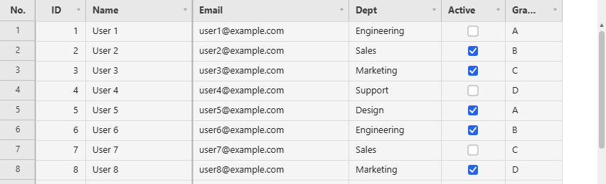

### Local Array Data (`data`)

For a dataset that already fits in memory (prototyping, a small/medium lookup table, tests)
pass a plain array via `data` instead of writing `fetchMeta`/`fetchData` yourself. Columns are
inferred from `columnDefs` if given, else from the keys of `data[0]`.

```js
const grid = new JHGrid({
  container: '#my-grid',
  data: [
    { name: 'Alice', age: 30, city: 'Seoul' },
    { name: 'Bob',   age: 25, city: 'Busan' },
  ],
  editableCols: '*',
});
```

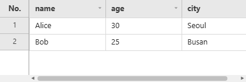

Filtering, sorting, and the quick filter are applied against the array directly (same semantics a
server-backed `fetchMeta`/`fetchData` is expected to implement; see `onFilter`/`onSort`). This
re-scans the whole array on every state change with no indexing, so it's meant for small/medium
datasets; a large dataset still belongs behind `fetchMeta`/`fetchData` against a real, indexed
backend. `refresh()` and `reloadData()` re-read the same array reference, so mutating it
externally and calling one of them picks up the change.

What the grid does with the array:

- **Columns.** With `columnDefs`, only the declared fields become columns; a key of the rows that
  is not declared is not shown. Without it, the columns are the keys of `data[0]`. An empty array
  needs `columnDefs`, otherwise the constructor throws.
- **Edits stay in the grid.** Editing a cell never writes into your array. Read the changes with
  [`getEdits()`](#getedits) and apply them to your own data.
- **Text filter** (`setFilter`, the filter panel's search box): case-insensitive substring match on
  that field. **Set filter** (`setFilterValues`, the checklist): exact match on the value as text.
- **Quick filter** (`setQuickFilter`): case-insensitive substring match against *every* value of the
  row object, including keys that have no column.
- **Sorting.** Two numbers compare as numbers; a `type: 'date'` column compares as dates read through
  its pattern, so `'12/31/2019'` sorts before `'03/01/2020'` under `MM/DD/YYYY`; anything else compares
  as text with numeric collation, so `'item2'` sorts before `'item10'`. Empty values, and a date value
  the pattern cannot read, compare as text.

```js
const users = [
  { id: 1, name: 'Alice', dept: 'Sales',       salary: 5200 },
  { id: 2, name: 'Bob',   dept: 'Engineering', salary: 6100 },
  { id: 3, name: 'Chloe', dept: 'Sales',       salary: 4800 },
];

const grid = new JHGrid({
  container: '#grid',
  data: users,
  editableCols: ['name', 'salary'],
  columnDefs: [
    { field: 'id',     label: 'ID',     width: 60 },
    { field: 'name',   label: 'Name' },
    { field: 'dept',   label: 'Dept' },
    { field: 'salary', label: 'Salary', align: 'right' },
  ],
});

grid.setSort('salary', 'desc');     // Bob, Alice, Chloe
grid.setQuickFilter('sales');       // Alice, Chloe

// The array itself is untouched by edits. Merge them yourself before saving:
const edits = grid.getEdits();      // { 0: { salary: '5300' } }, row index -> field -> text
```

Ignored if `fetchMeta`/`fetchData` or `fetchPage` is also provided.

---

## Column Definition Reference

Every entry in `columnDefs` is one `ColumnDef`. Most fields are covered by their own section
further down (`type`/`editor` under [Column Types](#column-types-date--richtext--image-and-custom-editorsrenderers),
`validation` under [Validation](#validation-columndefsvalidation) and
[`isValid()`/`getInvalidCells()`/`validateAll()`](#isvalid--getinvalidcells--validateall),
`button` under [Button Columns](#button-columns-type-button), `headerCheckbox` under
[Row Selection](#row-selection-rowselection--header-checkbox), `group` under
[Multi-Level Header Groups](#multi-level-header-groups-columndefsgroup)); this table is the
complete field list in one place.

| Field | Type | Description |
|---|---|---|
| `field` | `string` | **Required.** The data key this column reads/writes |
| `label` | `string` | Header text. Defaults to `field` |
| `align` | `'left' \| 'center' \| 'right'` | Cell content alignment |
| `headerAlign` | `'left' \| 'center' \| 'right'` | Header label alignment. Defaults to `align` when omitted |
| `width` | `number` | Column width in CSS pixels. Falls back to `opts.colWidth` |
| `group` | `string \| string[]` | Group-header path (outermost → innermost). See [Multi-Level Header Groups](#multi-level-header-groups-columndefsgroup) |
| `type` | `'text' \| 'dropdown' \| 'multiselect' \| 'checkbox' \| 'button' \| 'date' \| 'richtext' \| 'image'` | Selects the built-in editor + renderer pair. Defaults to `'text'`. See [Column Types](#column-types-date--richtext--image-and-custom-editorsrenderers) |
| `renderer` | `string \| (ctx, args) => void` | A `CellRenderers` key, or a custom draw function. Overrides the renderer `type` would otherwise select |
| `editor` | `string \| (ctx) => {value, remove}` | A `CellEditors` key, or a custom editor factory. Overrides the editor `type` would otherwise select. `ctx` carries the anchored-DOM surfaces a custom editor mounts its UI with - see [Editor surfaces](#editor-surfaces-ctxcellbox--ctxpopup--ctxdone) |
| `editorOptions` | `object` | Options for the column's built-in editor: the one `editor` names, or the one `type` selects (`'date'`, `'dropdown'`, `'multiselect'`, `'richtext'`). See [Editor options](#editor-options-columndefseditoroptions) |
| `format` | `string` | Date format for `type: 'date'` columns (e.g. `'YYYY-MM-DD'`, `'YY/MM/DD'`, `'YYYY-MM-DD HH:mm'`), or `'locale'` to write the date the way the grid's `locale` does (the editor is then the native date picker, see [`type: 'date'`](#date-columns-type-date)). With a pattern it drives the cell text, the editor's input mask, validation, clipboard copy, CSV export and printing. Default: the locale's own pattern - `'MM/DD/YYYY'` for `en`, `'YYYY-MM-DD'` for `ko`, `'YYYY/MM/DD'` for `ja` and `zh`, overridable for the whole grid with [`i18n.dateFormat`](#text-reference-i18n) |
| `options` | `DropdownOption[] \| (rowData) => DropdownOption[]` | Option list for `type: 'dropdown'`/`'multiselect'`: a string array, `{value,label}` array, or a function computing options per row. The cell stores the option's `value`; see [Dropdown and multiselect](#dropdown-and-multiselect-columns-type-dropdown--multiselect) |
| `editable` | `boolean` | Per-column override of `opts.editableCols`, in either direction: `true` makes the column editable even when `editableCols` leaves it out, `false` makes it read-only even under `editableCols: '*'`. Omit it to follow `editableCols` |
| `validation` | `ColumnValidation` | Declarative required/pattern/min/max/length/custom rules: see [Validation](#validation-columndefsvalidation) |
| `button` | `ButtonColumnDef` | Button config for `type: 'button'`: see [Button Columns](#button-columns-type-button) |
| `cellButton` | `{ width?, icon?, style?, iconSize?, iconColor?, onClick }` | A small click hotspot pinned to the cell's right edge, whatever the column's `type`: see [Cell Buttons](#cell-buttons-columndefscellbutton) |
| `headerCheckbox` | `boolean` | Draws a select-all checkbox in this column's header: see [Row Selection](#row-selection-rowselection--header-checkbox) |

---

## Public Methods

Every public method, and where it is documented. Methods whose behaviour is a feature in its own
right are written up under [Features](#features) rather than repeated here.

| Method | Documented under |
|---|---|
| `acknowledgeChanges()` | [Batch Save (`rowKey` / `getChanges` / `acknowledgeChanges`)](#batch-save-rowkey--getchanges--acknowledgechanges) |
| `acknowledgeInsert()` | [Incremental Save (`getOriginalRowData` / `isNewRow` / `acknowledgeSave` / `acknowledgeInsert`)](#incremental-save-getoriginalrowdata--isnewrow--acknowledgesave--acknowledgeinsert) |
| `acknowledgeSave()` | [Incremental Save (`getOriginalRowData` / `isNewRow` / `acknowledgeSave` / `acknowledgeInsert`)](#incremental-save-getoriginalrowdata--isnewrow--acknowledgesave--acknowledgeinsert) |
| `addColumn()` | [Adding/Deleting/Hiding Columns (`addColumn` / `deleteColumn` / `hideColumn`)](#addingdeletinghiding-columns-addcolumn--deletecolumn--hidecolumn) |
| `addRow()` | [Adding/Deleting Rows (`addRow` / `deleteRow`)](#addingdeleting-rows-addrow--deleterow) |
| `addRows()` | [Adding/Deleting Rows (`addRow` / `deleteRow`)](#addingdeleting-rows-addrow--deleterow) |
| `autoFitColumns()` | [Row Height (`setRowHeight` / `autoFitColumns`)](#row-height-setrowheight--autofitcolumns) |
| `canRedo()` | [`undo()` / `redo()`](#undo--redo) |
| `canUndo()` | [`undo()` / `redo()`](#undo--redo) |
| `clearEdits()` | [`clearEdits()`](#clearedits) |
| `clearFilters()` | [Field-Based Filter / Sort (`setFilter` / `setSort`)](#field-based-filter--sort-setfilter--setsort) |
| `clearQuickFilter()` | [Tag Filter (`fetchFilterValues`)](#tag-filter-fetchfiltervalues) |
| `clearRowSelection()` | [Row Selection (`rowSelection`) / Header Checkbox](#row-selection-rowselection--header-checkbox) |
| `clearSort()` | [Field-Based Filter / Sort (`setFilter` / `setSort`)](#field-based-filter--sort-setfilter--setsort) |
| `commitColumns()` | [Adding/Deleting/Hiding Columns (`addColumn` / `deleteColumn` / `hideColumn`)](#addingdeletinghiding-columns-addcolumn--deletecolumn--hidecolumn) |
| `deleteColumn()` | [Adding/Deleting/Hiding Columns (`addColumn` / `deleteColumn` / `hideColumn`)](#addingdeletinghiding-columns-addcolumn--deletecolumn--hidecolumn) |
| `deleteRow()` | [Adding/Deleting Rows (`addRow` / `deleteRow`)](#addingdeleting-rows-addrow--deleterow) |
| `destroy()` | [`destroy()`](#destroy) |
| `exportCsv()` | [Data Export (`exportCsv` / `printGrid`)](#data-export-exportcsv--printgrid) |
| `focusCell()` | [Selection, Focus and Editing from Code (`getSelection` / `setSelection` / `focusCell` / `startEditing` / `stopEditing`)](#selection-focus-and-editing-from-code-getselection--setselection--focuscell--startediting--stopediting) |
| `getCellValue()` | [`getRowData(rowIndex)` / `ready()`](#getrowdatarowindex--ready) |
| `getChanges()` | [Batch Save (`rowKey` / `getChanges` / `acknowledgeChanges`)](#batch-save-rowkey--getchanges--acknowledgechanges) |
| `getCurrentPage()` | [`getCurrentPage()` / `getPageCount()`](#getcurrentpage--getpagecount) |
| `getDeletedColumns()` | [Adding/Deleting/Hiding Columns (`addColumn` / `deleteColumn` / `hideColumn`)](#addingdeletinghiding-columns-addcolumn--deletecolumn--hidecolumn) |
| `getDeletedRows()` | [Adding/Deleting Rows (`addRow` / `deleteRow`)](#addingdeleting-rows-addrow--deleterow) |
| `getEdits()` | [`getEdits()`](#getedits) |
| `getHeaderCheckbox()` | [Row Selection (`rowSelection`) / Header Checkbox](#row-selection-rowselection--header-checkbox) |
| `getHiddenColumns()` | [Adding/Deleting/Hiding Columns (`addColumn` / `deleteColumn` / `hideColumn`)](#addingdeletinghiding-columns-addcolumn--deletecolumn--hidecolumn) |
| `getInvalidCells()` | [`isValid()` / `getInvalidCells()` / `validateAll()`](#isvalid--getinvalidcells--validateall) |
| `getNewColumns()` | [Adding/Deleting/Hiding Columns (`addColumn` / `deleteColumn` / `hideColumn`)](#addingdeletinghiding-columns-addcolumn--deletecolumn--hidecolumn) |
| `getNewRows()` | [Adding/Deleting Rows (`addRow` / `deleteRow`)](#addingdeleting-rows-addrow--deleterow) |
| `getOriginalRowData()` | [Incremental Save (`getOriginalRowData` / `isNewRow` / `acknowledgeSave` / `acknowledgeInsert`)](#incremental-save-getoriginalrowdata--isnewrow--acknowledgesave--acknowledgeinsert) |
| `getPageCount()` | [`getCurrentPage()` / `getPageCount()`](#getcurrentpage--getpagecount) |
| `getPageSize()` | [`setPageSize(n)` / `getPageSize()`](#setpagesizen--getpagesize) |
| `getPinnedRows()` | [Pinned Rows (`pinnedTopRows` / `pinnedBottomRows` / `pinRow`)](#pinned-rows-pinnedtoprows--pinnedbottomrows--pinrow) |
| `getQuickFilter()` | [Tag Filter (`fetchFilterValues`)](#tag-filter-fetchfiltervalues) |
| `getRemovedRows()` | [Adding/Deleting Rows (`addRow` / `deleteRow`)](#addingdeleting-rows-addrow--deleterow) |
| `getRowData()` | [`getRowData(rowIndex)` / `ready()`](#getrowdatarowindex--ready) |
| `getRowHeight()` | [Row Height (`setRowHeight` / `autoFitColumns`)](#row-height-setrowheight--autofitcolumns) |
| `getSelectedRows()` | [Row Selection (`rowSelection`) / Header Checkbox](#row-selection-rowselection--header-checkbox) |
| `getSelection()` | [Selection, Focus and Editing from Code (`getSelection` / `setSelection` / `focusCell` / `startEditing` / `stopEditing`)](#selection-focus-and-editing-from-code-getselection--setselection--focuscell--startediting--stopediting) |
| `getState()` | [State Snapshot/Restore (`getState` / `setState`)](#state-snapshotrestore-getstate--setstate) |
| `getTotalRows()` | [`getRowData(rowIndex)` / `ready()`](#getrowdatarowindex--ready) |
| `goToPage()` | [`goToPage(page)` / `nextPage()` / `prevPage()`](#gotopagepage--nextpage--prevpage) |
| `hideColumn()` | [Adding/Deleting/Hiding Columns (`addColumn` / `deleteColumn` / `hideColumn`)](#addingdeletinghiding-columns-addcolumn--deletecolumn--hidecolumn) |
| `isColumnVisible()` | [Adding/Deleting/Hiding Columns (`addColumn` / `deleteColumn` / `hideColumn`)](#addingdeletinghiding-columns-addcolumn--deletecolumn--hidecolumn) |
| `isNewRow()` | [Incremental Save (`getOriginalRowData` / `isNewRow` / `acknowledgeSave` / `acknowledgeInsert`)](#incremental-save-getoriginalrowdata--isnewrow--acknowledgesave--acknowledgeinsert) |
| `isRowPinned()` | [Pinned Rows (`pinnedTopRows` / `pinnedBottomRows` / `pinRow`)](#pinned-rows-pinnedtoprows--pinnedbottomrows--pinrow) |
| `isValid()` | [`isValid()` / `getInvalidCells()` / `validateAll()`](#isvalid--getinvalidcells--validateall) |
| `nextPage()` | [`goToPage(page)` / `nextPage()` / `prevPage()`](#gotopagepage--nextpage--prevpage) |
| `pinRow()` | [Pinned Rows (`pinnedTopRows` / `pinnedBottomRows` / `pinRow`)](#pinned-rows-pinnedtoprows--pinnedbottomrows--pinrow) |
| `prevPage()` | [`goToPage(page)` / `nextPage()` / `prevPage()`](#gotopagepage--nextpage--prevpage) |
| `printGrid()` | [Data Export (`exportCsv` / `printGrid`)](#data-export-exportcsv--printgrid) |
| `ready()` | [`getRowData(rowIndex)` / `ready()`](#getrowdatarowindex--ready) |
| `redo()` | [`undo()` / `redo()`](#undo--redo) |
| `refresh()` | [`refresh()`](#refresh) |
| `reloadData()` | [`reloadData()`](#reloaddata) |
| `removeFilter()` | [Field-Based Filter / Sort (`setFilter` / `setSort`)](#field-based-filter--sort-setfilter--setsort) |
| `removeSort()` | [Field-Based Filter / Sort (`setFilter` / `setSort`)](#field-based-filter--sort-setfilter--setsort) |
| `repaint()` | [`repaint()`](#repaint) |
| `resetRowHeight()` | [Row Height (`setRowHeight` / `autoFitColumns`)](#row-height-setrowheight--autofitcolumns) |
| `scrollTo()` | [`scrollTo(rowIndex)`](#scrolltorowindex) |
| `setCellValue()` | [`setCellValue(row, field, value)`](#setcellvaluerow-field-value) |
| `setCellValues()` | [`setCellValues(entries)`](#setcellvaluesentries) |
| `setFilter()` | [Field-Based Filter / Sort (`setFilter` / `setSort`)](#field-based-filter--sort-setfilter--setsort) |
| `setFilterValues()` | [Set Filter / Quick Filter](#set-filter--quick-filter) |
| `setHeaderCheckbox()` | [Row Selection (`rowSelection`) / Header Checkbox](#row-selection-rowselection--header-checkbox) |
| `setOptions()` | [Context menus (`rowContextMenuItems` / `colContextMenuItems` / `cellContextMenuItems` / `setOptions`)](#context-menus-rowcontextmenuitems--colcontextmenuitems--cellcontextmenuitems--setoptions) |
| `setPageSize()` | [`setPageSize(n)` / `getPageSize()`](#setpagesizen--getpagesize) |
| `setPinnedRows()` | [Pinned Rows (`pinnedTopRows` / `pinnedBottomRows` / `pinRow`)](#pinned-rows-pinnedtoprows--pinnedbottomrows--pinrow) |
| `setQuickFilter()` | [Tag Filter (`fetchFilterValues`)](#tag-filter-fetchfiltervalues) |
| `setRowHeight()` | [Row Height (`setRowHeight` / `autoFitColumns`)](#row-height-setrowheight--autofitcolumns) |
| `setSelection()` | [Selection, Focus and Editing from Code (`getSelection` / `setSelection` / `focusCell` / `startEditing` / `stopEditing`)](#selection-focus-and-editing-from-code-getselection--setselection--focuscell--startediting--stopediting) |
| `setSort()` | [Field-Based Filter / Sort (`setFilter` / `setSort`)](#field-based-filter--sort-setfilter--setsort) |
| `setState()` | [State Snapshot/Restore (`getState` / `setState`)](#state-snapshotrestore-getstate--setstate) |
| `showColumn()` | [Adding/Deleting/Hiding Columns (`addColumn` / `deleteColumn` / `hideColumn`)](#addingdeletinghiding-columns-addcolumn--deletecolumn--hidecolumn) |
| `startEditing()` | [Selection, Focus and Editing from Code (`getSelection` / `setSelection` / `focusCell` / `startEditing` / `stopEditing`)](#selection-focus-and-editing-from-code-getselection--setselection--focuscell--startediting--stopediting) |
| `stopEditing()` | [Selection, Focus and Editing from Code (`getSelection` / `setSelection` / `focusCell` / `startEditing` / `stopEditing`)](#selection-focus-and-editing-from-code-getselection--setselection--focuscell--startediting--stopediting) |
| `togglePinRow()` | [Pinned Rows (`pinnedTopRows` / `pinnedBottomRows` / `pinRow`)](#pinned-rows-pinnedtoprows--pinnedbottomrows--pinrow) |
| `undeleteColumn()` | [Adding/Deleting/Hiding Columns (`addColumn` / `deleteColumn` / `hideColumn`)](#addingdeletinghiding-columns-addcolumn--deletecolumn--hidecolumn) |
| `undeleteRow()` | [Adding/Deleting Rows (`addRow` / `deleteRow`)](#addingdeleting-rows-addrow--deleterow) |
| `undo()` | [`undo()` / `redo()`](#undo--redo) |
| `unpinRow()` | [Pinned Rows (`pinnedTopRows` / `pinnedBottomRows` / `pinRow`)](#pinned-rows-pinnedtoprows--pinnedbottomrows--pinrow) |
| `JHGrid.use()` (static) | [Plugins (`JHGrid.use`)](#plugins-jhgriduse) |
| `validateAll()` | [`isValid()` / `getInvalidCells()` / `validateAll()`](#isvalid--getinvalidcells--validateall) |

---

### `refresh()`
Starts over: reloads the data from the first row and throws away everything the grid was holding on
to. That includes unsaved edits, filters, sorts, the quick filter, selection, undo history, row
heights, column widths and order, columns added or deleted with `addColumn()`/`deleteColumn()`, and
rows added or removed with `addRow()`/`deleteRow()`. Use it for "reload this screen from
scratch"; to pick up changed data while keeping the user's view, use
[`reloadData()`](#reloaddata) instead. It does not ask for confirmation, so check
`getEdits()` first if there may be unsaved work.

```js
grid.refresh();
```

### `reloadData()`
Re-runs `fetchMeta`/`fetchData` against the *current* filter and sort, for when the host changed the
data behind the grid (a row removed, rows appended, a server push) and wants the grid to follow
without starting over. Unlike `refresh()`, filters, sort and column state (order, widths, hidden
columns) survive, and the scroll position is kept by default. Selection, unsaved edits and the undo
history are cleared, the same as when a filter or sort changes, because a reload can shift row
indices. Returns a `Promise` that resolves once the new rows are in.

Unlike a filter or sort change, `reloadData()` does not ask for confirmation before it drops
unsaved edits, so save or collect them first. Rows added with `addRow()` and everything on
[pinned rows](#pinned-rows-pinnedtoprows--pinnedbottomrows--pinrow) survive it, and it works the same
for a `data` array (which it re-reads).

```js
await fetch('/api/rows/42', { method: 'DELETE' });
await grid.reloadData();                        // stays where it was, filters and sort intact

await grid.reloadData({ keepScroll: false });   // also jumps back to the top
```

### `repaint()`
Schedules a redraw without touching data, scroll position, edits, filters, or sort, for when
something a `cellBackground`/`rowHighlighter`/`cellDecorator` callback reads changed *outside*
the grid (some other host state) and the next frame needs to reflect it. Much cheaper than
`refresh()` when the underlying data hasn't actually changed.

```js
someExternalFlag = true;
grid.repaint(); // cellBackground etc. re-evaluate on the next frame
```

### `scrollTo(rowIndex)`
Scrolls to the specified row. If `pagination` is enabled, first switches to the page that row belongs to.

```js
grid.scrollTo(5000);
```

### `goToPage(page)` / `nextPage()` / `prevPage()`
Only works when the `pagination` option is enabled. `goToPage()` clamps the value to a valid page range.

```js
grid.goToPage(2);
grid.nextPage();
grid.prevPage();
```

### `getCurrentPage()` / `getPageCount()`
Returns the current 0-based page number and the total page count. Returns `0` and `1`, respectively, when `pagination` is disabled.

### `setPageSize(n)` / `getPageSize()`
Changes the rows per page while the grid is running, and reads it back. Only works when the `pagination` option is enabled (`setPageSize()` is otherwise a no-op and `getPageSize()` returns `0`). The first row of the page being viewed stays on screen, so the page number is recomputed for the new size; selection is cleared, as on any page change. A size that is not in `pageSizeOptions` is added to the dropdown. Throws a `TypeError` unless `n` is a whole number of at least `1`. See [Pagination](#pagination).

```js
grid.setPageSize(100);
grid.getPageSize(); // 100
```

### `getEdits()`
Returns the cell values that were edited and not yet saved, as `{ rowIndex: { field: value } }`.
Use this when saving/sending to the server.

- Every value is a **string**, whatever the column holds: a number typed into a cell is `'25'`, a
  cleared cell is `''`, a checkbox is `'true'`/`'false'`.
- `rowIndex` is the row's current position in the grid (a row inserted above it moves it down),
  and it counts edits on rows added with `addRow()` and on pinned rows too. To tell a new row
  from a server row use [`isNewRow()`](#incremental-save-getoriginalrowdata--isnewrow--acknowledgesave--acknowledgeinsert),
  and to get the whole row with the edits applied use [`getRowData()`](#getrowdatarowindex--ready).
- With pagination on, indices are still absolute across the whole dataset.
- Sorting, filtering, `refresh()` and `reloadData()` re-arrange rows, so they clear the edits
  (after asking, if a server row has one); read them first.

```js
const edits = grid.getEdits();
// { 42: { name: 'New Name' }, 100: { age: '25' } }
await fetch('/api/save', { method: 'POST', body: JSON.stringify(edits) });
```

To send each changed row with its key instead of its position:

```js
const changes = Object.entries(grid.getEdits()).map(([row, fields]) => ({
  id:     grid.getOriginalRowData(Number(row))?.id,   // the row's key before any edit
  fields,                                             // { name: 'New Name' }
}));
await fetch('/api/save', {
  method: 'POST',
  headers: { 'Content-Type': 'application/json' },
  body: JSON.stringify(changes),
});
grid.clearEdits();
```

### `clearEdits()`
Clears all edits (restores the original data) and empties the undo history. Call it after a
successful save when you are not reloading the data. Rows added with `addRow()` and delete marks are
not touched.

```js
grid.clearEdits();
```

### `setCellValue(row, field, value)`
Programmatically sets a cell value, going through the same edit/validation/undo/`onCellChange`
path as a normal edit (checkbox toggle, paste, fill). Useful when one column's value needs to be
updated from another column (e.g. a button column toggling a checkbox column's value). Throws if
`row` is not an existing row (an index within the grid, or an encoded [pinned-row](#pinned-rows-pinnedtoprows--pinnedbottomrows--pinrow)
index), if `field`/`value` is not a string, or if `field` is not an existing column.

```js
grid.setCellValue(3, 'active', 'false'); // sets row 3's 'active' column to 'false'
```

### `setCellValues(entries)`
Bulk counterpart to `setCellValue()`, applies every entry through the same edit/validation/undo
pipeline as a single edit/undo step and one redraw, instead of one redraw per cell. Use this for
large-scale updates (e.g. a header checkbox toggling every currently-filtered row) where looping
`setCellValue()` would redraw once per row. Throws under the same conditions as `setCellValue()`.

```js
grid.setCellValues([
  { row: 0, field: 'active', value: 'true' },
  { row: 1, field: 'active', value: 'true' },
  { row: 2, field: 'active', value: 'true' },
]);
```

> **Performance note:** even batched, this still runs the full edit/validation pipeline once per
> entry. Applying it to a very large number of rows at once (hundreds of thousands or more) can
> take a long time and block the main thread while it runs; see the performance note under
> [`Delete`](interaction.md) for a concrete measurement of the same underlying cost at that scale.

### `undo()` / `redo()`
Undoes or redoes the most recent action (cell edit, paste/fill/clear, row/column add/delete, column
hide/show/resize/reorder/auto-fit, row-height drag-resize, pin/unpin, `setState()`). The history
keeps the last 100 actions, and one paste, fill or clear counts as a single step.
Also works via `Ctrl+Z` (undo) / `Ctrl+Y` or `Ctrl+Shift+Z` (redo). Use `canUndo()` / `canRedo()`
to check availability. Applying a sort/filter (`setFilter`/`setSort`/`clearFilters`, etc.) or
calling `refresh()` re-arranges row indices, so the undo/redo history is automatically cleared.

The keys can be switched off individually with the `keyboardShortcuts` option:

```js
new JHGrid({
  // ...
  keyboardShortcuts: { delete: false, undo: false }, // omitted keys stay on
});
```

Supported keys are `delete` (`Delete`/`Backspace` clearing the selected cells), `undo` (`Ctrl+Z`) and
`redo` (`Ctrl+Y` / `Ctrl+Shift+Z`). Only the keyboard is affected: `undo()`/`redo()` keep working when
called from code, and clearing cells through the context menu or the API is unchanged. A switched-off
key is not handled and not `preventDefault`ed, so a `keydown` listener of your own on the container can
claim it. An unknown key logs a warning and is ignored; a non-object value throws a `TypeError`.

```js
grid.undo();
grid.redo();
if (grid.canUndo()) { /* ... */ }
```

### `isValid()` / `getInvalidCells()` / `validateAll()`
Checks for violations of a column's declared `validation` rules. Automatically checked whenever
an edit is committed, and shown with a red border (plus an error-message tooltip on hover).
`validateAll()` is meant for a one-shot bulk check before saving, and, like `autoFitColumns()`/
`printGrid()`, only checks currently loaded (cached) rows.

```js
const grid = new JHGrid({
  container: '#grid',
  fetchMeta, fetchData,
  editableCols: '*',
  columnDefs: [
    { field: 'email', validation: { required: true, pattern: /^\S+@\S+\.\S+$/ } },
    { field: 'age',   validation: { min: 0, max: 120 } },
    { field: 'code',  validation: { validator: (v) => v.startsWith('A') || 'Code must start with A.' } },
  ],
});

saveBtn.addEventListener('click', async () => {
  grid.validateAll();
  if (!grid.isValid()) {
    alert('Please check your input.');
    console.log(grid.getInvalidCells()); // { 3: { email: '...' } }
    return;
  }
  await fetch('/api/save', { method: 'POST', body: JSON.stringify(grid.getEdits()) });
});
```

`validation.pattern` accepts a `RegExp` or a string (compiled once). A string that is not a valid
regular expression is reported once in the console and that rule is skipped; the other rules still
apply. The pattern runs on whatever users type or paste, so avoid patterns prone to catastrophic
backtracking (nested quantifiers such as `(a+)+`), and never build one from untrusted input.

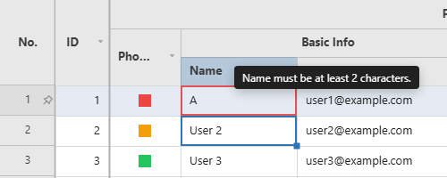

### `getRowData(rowIndex)` / `ready()`

```js
grid.getRowData(3);            // row 3's current data (with unsaved edits applied; null if not loaded)
grid.getCellValue(3, 'name');  // one cell of it, same rules; null for an unknown field
grid.getTotalRows();           // rows the grid is showing right now, filters applied
await grid.ready();            // waits until the initial metadata/first chunk load completes
```

`getTotalRows()` counts what the grid shows: the filtered total, rows added with
[`addRow()`](#addrowrowdata--deleterowrowindex) included and rows removed excluded, pinned copies
aside. With pagination on it is the whole dataset, not the current page.

### `destroy()`
Fully removes event listeners and DOM. Call this when unmounting a component or navigating away.

```js
grid.destroy();
```
---

## Features

Each of these is a capability of the grid rather than a single call - the options that switch it
on, the methods that drive it, and what it does. The [Constructor Options](#constructor-options)
table links here, and so does the method index above.

### Pagination

The default is continuous virtual scrolling, but setting the `pagination` option switches to a
classic page-based UI. Each page shows exactly `pageSize` rows (the last page holds the remainder), and scrolling only happens within
that page; moving to the next/previous page only happens via the auto-rendered pager bar at the
bottom (`«`, `‹`, page numbers, `›`, `»`) or via `goToPage()`/`nextPage()`/`prevPage()`.

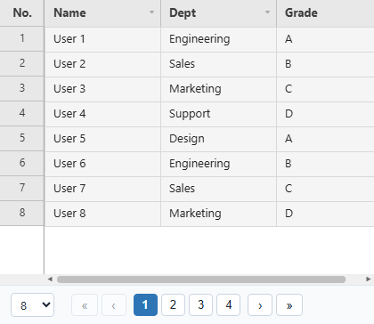

```js
const grid = new JHGrid({
  container: '#grid',
  fetchMeta, fetchData,
  pagination: { enabled: true, pageSize: 50 },
  onPageChange: (page, pageCount) => console.log(`${page + 1} / ${pageCount}`),
});

grid.nextPage();
grid.goToPage(3);
grid.getCurrentPage(); // 0-based
grid.getPageCount();
```

The pager bar shows up to five page numbers around the current page, next to the first, previous,
next and last buttons. It sits *below* the grid, so the grid's `height` is the height of the rows
area and the container ends up a little taller than `height` (with `responsive: true` the bar is taken
out of the container's height instead). Changing page commits an open edit, clears the cell selection
and scrolls to the top of the new page. Edits you have not saved are kept, and belong to the same
absolute row indices as before.

Every public API that deals with row indices (`getEdits()`, `onCellChange`, etc.) always uses
**absolute indices relative to the entire dataset**, regardless of pagination. Pagination only
limits what's scrolled/visible at once, it never changes how rows are addressed.

### Letting users pick the page size

Add `pageSizeOptions` and the pager bar gets a page-size dropdown. The page controls (`«` `‹` page numbers
`›` `»`) always stay centered on the bar; `pageSizePosition` puts the dropdown on the `'left'` (the
default) or the `'right'`.

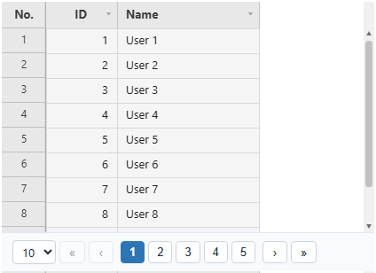

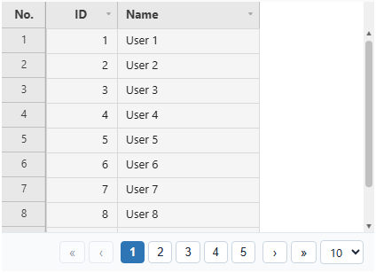

```js
const grid = new JHGrid({
  container: '#grid',
  fetchMeta, fetchData,
  pagination: {
    enabled: true,
    pageSize: 25,
    pageSizeOptions: [10, 25, 50, 100],
    pageSizePosition: 'right',            // 'left' (default) or 'right'
  },
  onPageSizeChange: (pageSize) => localStorage.setItem('pageSize', String(pageSize)),
});

// Start from what the user chose last time, or change it from your own control:
grid.setPageSize(Number(localStorage.getItem('pageSize')) || 25);
```

- `pageSizeOptions` takes whole numbers of at least 1. They are listed ascending, duplicates are
  dropped, and the starting `pageSize` is added if it is missing. Leave it out, or pass an empty
  array, for no dropdown.
- `pageSizePosition` is `'left'` or `'right'`; anything else means `'left'`. It only matters together with
  `pageSizeOptions`.
- The dropdown shows just the number, with no caption. Its accessible name and tooltip come from the
  grid's `locale` ("Rows per page", "페이지당 행 수", ...); `i18n.pagerPageSize` overrides that text.
- Changing the size keeps the first row of the page you were on in view: the 4th page at 50 per page
  (rows 150-199) becomes the 7th page at 25 per page, and the 2nd page at 100 per page.
- `onPageChange` also fires if the page number moved because of the new size. `getEdits()` and the
  other index-based APIs are unaffected, since indices stay absolute.
- Starting the grid from a saved size is a matter of passing it as `pageSize`; the size is not part
  of `getState()`.

### Button Columns (`type: 'button'`)

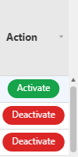

Renders the entire cell as a single clickable button. Activated by mouse click, touch tap, or
Space/Enter/F2 after selecting the cell, and always works regardless of `editableCols` (since it's
an action trigger, not a data edit). Shows a pointer cursor on hover, and clicking it does not draw
a cell-selection border (since it's an action target, not a selected data cell). `label`/`disabled`/
`variant` all support either a fixed value or a `(rowData, rowIndex) => value` function; if the
`label` function returns `null`/`''`, no button is drawn for that row.

Use `setCellValue()` alongside an action that actually changes another column's value (e.g.
toggling active/inactive); the example below toggles the `active` checkbox column via a button,
and the button's own label/color update immediately based on that value.

```js
const grid = new JHGrid({
  container: '#grid',
  fetchMeta, fetchData,
  columnDefs: [
    { field: 'active', label: 'Active', type: 'checkbox' },
    {
      field: 'actions', label: 'Actions', width: 90,
      type: 'button',
      button: {
        label:   (row) => row?.active === 'false' ? 'Activate' : 'Deactivate',
        variant: (row) => row?.active === 'false' ? 'success' : 'danger',
        onClick(rowIndex, rowData) {
          const wasActive = rowData?.active !== 'false';
          grid.setCellValue(rowIndex, 'active', wasActive ? 'false' : 'true');
        },
      },
    },
  ],
});
```

### Cell Buttons (`columnDefs[].cellButton`)

A small always-there click hotspot pinned to a cell's right edge, whatever the column's `type` -
unlike `type: 'button'`, which turns the *whole* cell into a button. The rest of the cell keeps
behaving normally: it still renders its value, still selects, still edits.

```js
{
  field: 'gas2', label: 'Gas 2', width: 100,
  cellButton: { icon: '+', onClick: (rowIndex, rowData, field) => openGasPicker(rowIndex) },
}
```

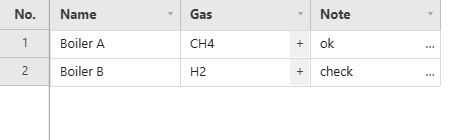

Both columns in the image, `+` with the default shaded band and `…` with `style: 'plain'`:

```js
new JHGrid({
  container: '#grid',
  data: [
    { name: 'Boiler A', gas: 'CH4', note: 'ok' },
    { name: 'Boiler B', gas: 'H2',  note: 'check' },
  ],
  editableCols: '*',
  columnDefs: [
    { field: 'name', label: 'Name' },
    {
      field: 'gas', label: 'Gas', width: 130,
      cellButton: { icon: '+', onClick: (rowIndex, rowData, field) => openGasPicker(rowIndex) },
    },
    {
      field: 'note', label: 'Note', width: 130,
      cellButton: { icon: '…', style: 'plain', onClick: (rowIndex) => openNote(rowIndex) },
    },
  ],
});
```

Giving it an `icon` is what makes the grid draw it — a shaded band with the glyph centred in it, the
same shape `CellRenderers.dropdown()` gives its arrow, so a button column sits with the grid's other
affordances instead of looking like a one-off. The width it draws is the width it hit-tests, so the
visible band and the clickable band cannot drift apart.

| Option | Default | Meaning |
|---|---|---|
| `onClick` | *(required)* | `(rowIndex, rowData, field) => void`. Fires regardless of `editableCols` — it is an action, not an edit, and takes no part in undo/redo |
| `icon` | – | The glyph to draw. Omit it and nothing is drawn while the hotspot stays clickable, for a host that would rather draw its own mark through `cellDecorator` |
| `width` | `20` | Hotspot width in px, measured in from the cell's right edge |
| `style` | – | `'plain'` drops the shaded band and draws the glyph alone |
| `iconSize` / `iconColor` | `13` / header text colour | Glyph font size and fill |

A click inside the hotspot fires `onClick` and does not start an edit on the cell behind it; the
cursor turns to a pointer there and nowhere else in the cell. An exception thrown by `onClick` is
caught and logged rather than left to break the click handler.

### Row Selection (`rowSelection`) / Header Checkbox

Setting `rowSelection: 'single' | 'multi'` lets you select rows by clicking the row-number cell
(or `Ctrl`/`Shift` for multi-select). `onRowSelect(rows)` is called whenever the selection changes,
and `getSelectedRows()` returns the currently selected row indices at any time. → [Live example](demo.md#row-selection)

How clicks behave:

- **`'single'`**: a click selects that row; clicking the selected row again clears it.
- **`'multi'`**: a click selects only that row, `Ctrl` (or `Cmd`) + click adds or removes a row,
  and `Shift` + click selects everything from the last clicked row to this one.
- On the keyboard, `Enter` or `Space` on a focused row number selects that row; see the
  [Interaction Reference](interaction.md).
- Clicking a cell clears the row selection unless `Ctrl`/`Shift` is held, and clicking a column
  header always does. With `showRowNumbers: false` there is no gutter to click, so clicking a cell
  selects its row instead.
- `onRowSelect` and `getSelectedRows()` give row indices in ascending order. The selection is cleared
  by a filter, a sort, `refresh()` and `reloadData()`, since those change which row an index means.
- With rows selected and no cell selected, `Ctrl+C` copies the selected rows, every column, as
  tab-separated text.

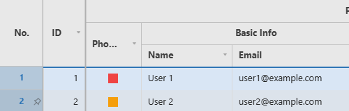

```js
const grid = new JHGrid({
  container: '#grid',
  fetchMeta, fetchData,
  rowSelection: 'multi',
  onRowSelect: (rows) => console.log('selected:', rows),
  columnDefs: [
    { field: 'name', label: 'Name', headerCheckbox: true },
    { field: 'age',  label: 'Age' },
  ],
});

grid.getSelectedRows();   // [2, 5, 9]
grid.clearRowSelection();
```

Setting `columnDefs[i].headerCheckbox: true` draws a checkbox in that column's header, and clicking it
calls `onHeaderCheckboxChange(field, checked)`. The box only records a checked state and reports it:
it does not select rows or change any cell by itself. What "checked" means is up to you, and the usual
answer is "tick or untick every row of a checkbox column", which `setCellValues()` does in one step:

```js
const rows = Array.from({ length: 200 }, (_, i) => ({ name: 'User ' + (i + 1), active: 'false' }));

const grid = new JHGrid({
  container: '#grid',
  data: rows,
  editableCols: ['active'],
  columnDefs: [
    { field: 'name' },
    { field: 'active', type: 'checkbox', width: 90, headerCheckbox: true },
  ],
  onHeaderCheckboxChange: (field, checked) => {
    // One undo step and one redraw for all 200 rows.
    grid.setCellValues(rows.map((_, row) => ({ row, field, value: String(checked) })));
  },
});
```

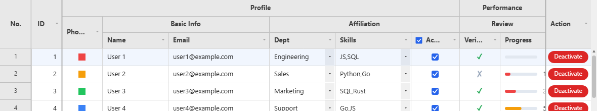

`setHeaderCheckbox(field, checked)` / `getHeaderCheckbox(field)` read and write the state from code;
`setHeaderCheckbox()` does not call `onHeaderCheckboxChange`. The state is part of
`getState()` (`headerCheckboxState`).

### Selection, Focus and Editing from Code (`getSelection` / `setSelection` / `focusCell` / `startEditing` / `stopEditing`)

Cell selection can be read and driven from code, and `onCellClick` reports clicks:

```js
const grid = new JHGrid({
  container: '#grid',
  fetchMeta, fetchData,
  onCellClick: (rowIndex, rowData, field) => console.log('clicked', rowIndex, field),
});

grid.getSelection();                                  // { type: 'single', row: 3, col: 1 } | { type: 'range', r1, c1, r2, c2 } | null
grid.setSelection({ row: 3, col: 'name' });           // one cell; a column is an index or a field name
grid.setSelection({ r1: 2, c1: 0, r2: 6, c2: 'age' }); // a range
grid.setSelection(null);                              // clear

grid.focusCell(3, 'name');                            // select it and give the grid keyboard focus
if (grid.startEditing(3, 'name')) { /* the editor is open */ }
grid.stopEditing();                                   // commit; grid.stopEditing({ cancel: true }) discards
```

- `onCellClick(rowIndex, rowData, field)` fires when the left button is pressed and released on the
  same cell, or when a cell is tapped, in addition to the built-in selection. A press that turns
  into a drag to another cell, a right-click and a click on a header or the row-number gutter do not
  count. `rowData` is `null` while the row is not loaded yet. On a pinned row `rowIndex` is the encoded
  pinned-row index (see [Pinned Rows](#pinned-rows-pinnedtoprows--pinnedbottomrows--pinrow)).
- `getSelection()` returns a copy in the same shape `onSelectionChange` reports, with columns as
  indexes. Whatever it returns can be passed straight to `setSelection()`.
- `setSelection(selection, { scroll })` scrolls the cell (a range's top-left cell) into view unless
  `scroll` is `false`. A row on another page switches to that page first. It fires
  `onSelectionChange`, commits an open editor, and leaves row selection
  ([`rowSelection`](#row-selection-rowselection--header-checkbox)) and keyboard focus alone.
- `focusCell(row, col)` is `setSelection()` on one cell plus keyboard focus, so the arrow keys,
  `Enter` and typing carry on from that cell.
- `startEditing(row, col)` selects the cell and opens its editor like a double-click. It returns
  `false` when nothing opened: a read-only cell, or a checkbox/button column. `stopEditing()` commits
  the open editor (or discards it with `{ cancel: true }`) and does nothing if none is open.
- A pinned row can be selected, focused and edited as a single cell (`row` is its encoded index). A
  range can only cover normal rows, and with pagination it cannot span two pages.
- A row that does not exist or a malformed selection throws a `TypeError`; an unknown field, an
  out-of-range column index or a range spanning two pages throws a `RangeError`.

### Context Menus (`rowContextMenuItems` / `colContextMenuItems` / `cellContextMenuItems` / `setOptions`)

Right-clicking opens one of three menus, depending on where the pointer is. On a touch screen a
half-second press does the same, and on the keyboard `ContextMenu` or `Shift+F10` opens the menu of
a focused column header or row number.

| Right-click on | Items | Narrowed by |
|---|---|---|
| A row number | Pin row to top / to bottom, Unpin row; Insert row above / below / at top / at bottom; Mark row for deletion and Delete row permanently (for a row from the server), Delete row (for a row you added), Undo delete | `rowContextMenuItems` |
| A column header | Freeze columns to the left / Unfreeze, Freeze columns to the right / Unfreeze, Column visibility…, Insert column left / right, Delete column / Undo delete | `colContextMenuItems` |
| A cell | Insert column left / right, Delete column, Insert row below, Delete row, followed by your own items | `cellContextMenuItems` and `cellContextMenuExtraItems` |

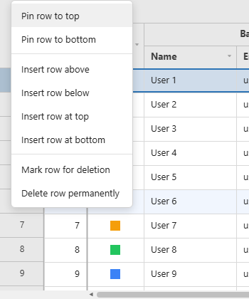

Each option is `false` to switch that menu off (a right-click then does nothing), or a list of the
keys to keep, or left out to show everything. An unknown key is ignored with a console warning
that lists the valid ones. `'row-delete'` stands for every delete-related item of the row menu and
`'row-pin'` for every pin item, since which of them shows depends on the row. Rows you supplied
through `pinnedTopRows` / `pinnedBottomRows` / `setPinnedRows()` get no row menu.

```js
const grid = new JHGrid({
  container: '#grid',
  data: rows,
  editableCols: '*',
  rowContextMenuItems:  ['row-insert-above', 'row-insert-below', 'row-delete'],  // no pin, no top/bottom insert
  colContextMenuItems:  ['freeze', 'freeze-right', 'visibility'],                // no insert or delete column
  cellContextMenuItems: ['row-delete'],
});
```

**Adding your own cell menu items.** `cellContextMenuExtraItems` is called each time the cell menu
opens and returns `{ label, onClick, disabled? }` items (or `null`) to add after the built-in ones. It
is the way to attach an action to a cell. `onClick` gets the same context, so it can use the row's
data or the pointer position:

```js
new JHGrid({
  container: '#grid',
  data: users,
  cellContextMenuItems: ['row-delete'],
  cellContextMenuExtraItems: ({ row, field, rowData }) => [
    { label: `Copy ${field}`,
      onClick: () => navigator.clipboard.writeText(String(rowData?.[field] ?? '')) },
    { label: 'Open user',
      disabled: !rowData?.id,
      onClick: ({ rowData }) => { location.href = `/users/${rowData.id}`; } },
  ],
});
```

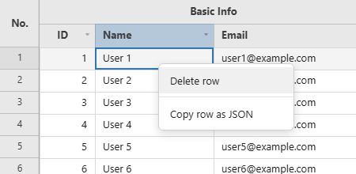

The context is `{ row, col, field, rowData, clientX, clientY }`; `clientX` / `clientY` are viewport
coordinates, so you can anchor your own popup at the cell. `rowData` is `null` for a row that has
not loaded.

**Changing them later.** `setOptions(patch)` changes these options on a live grid. The options it
accepts are the three menu filters, `cellContextMenuExtraItems`, `rowPinButton`,
`onRowPinToggle` and `editableCols`; anything else is read once when the grid is built, so it is
ignored with a console warning (the other keys of the same call still apply) and needs a new grid.
Passing `undefined` for a menu option puts it back to showing everything. Menus that are open close,
and a `patch` that is not an object throws a `TypeError`.

```js
// Switch the editing menus off while a record is locked, and back on afterwards.
function setLocked(locked) {
  grid.setOptions({
    rowContextMenuItems:  locked ? false : undefined,
    cellContextMenuItems: locked ? false : undefined,
    colContextMenuItems:  locked ? ['freeze', 'freeze-right', 'visibility'] : undefined,
  });
}

grid.setOptions({ rowPinButton: 'bottom' });   // pin icons now pin to the bottom band
```

**View mode / edit mode without rebuilding the grid.** `editableCols` takes the same values here as
in the constructor (`string[]` or `'*'`) and is applied immediately - no `destroy()`/recreate, so
scroll position, selection and undo history all survive the switch:

```js
const grid = new JHGrid({ container: '#grid', data: rows, editableCols: [] }); // starts read-only

viewModeToggle.addEventListener('change', (e) => {
  grid.setOptions({ editableCols: e.target.checked ? '*' : [] });
});
```

A `columnDef.editable` override still wins either way - it forces a column editable or read-only
regardless of what `editableCols` says, live or at construction.

### Set Filter / Quick Filter

Every column header has a filter icon at its right edge (it turns amber while that column has a
filter). Clicking it opens the filter / sort panel: two sort buttons, then the filter itself, then
**Apply**, **Reset** (this column) and **Reset all filters**.

The filter is a checkbox list of the column's distinct values, with a search box that narrows the
list and a **(Select all)** row. The list is built from the rows loaded so far, so on a server-paged
grid it only knows the pages it has fetched. It is offered while the column has at most 200 distinct
values; past that the panel switches to the [tag filter](#tag-filter-fetchfiltervalues) below. An
empty value is listed as `i18n.emptyCell`.

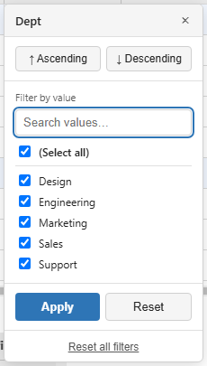

```js
grid.setFilterValues('status', ['active', 'pending']);
grid.setFilterValues('status', null); // clears the filter
```

The values are matched exactly, as text, so pass strings (`setFilterValues('level', ['1', '2'])`
for a numeric column; other values are converted with `String()`). `onFilter(filters)` reports the
result, and the same map is what a server-backed `fetchData` receives as `state.filters`.

### Tag Filter (`fetchFilterValues`)

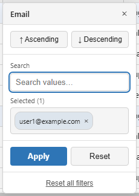

Above that 200-value cap the column's values cannot be listed from the rows in memory, so the panel
shows a **tag picker** instead of the checklist: the user types, picks from the suggestions, and
each pick becomes a chip. Chips are combined with **OR** and applied as a `string[]`, the same
shape the checklist already sends, so `fetchData`, `getState()`, and `onFilter` need no changes.

Where the suggestions come from is what `fetchFilterValues` decides. Without it they are scanned
out of the rows already loaded, and the list says so ("From loaded rows only"). With it, the
callback answers for the whole column, which is what you want on a server-paged grid whose table
is far larger than the cache. It receives the column and the typed text and returns the matching
values, as strings, numbers or `null` (shown as an empty cell):

```js
new JHGrid({
  container: '#grid',
  fetchMeta, fetchData,
  // Called as the user types, debounced. Bound it server-side where you can (LIMIT).
  fetchFilterValues: async (field, query) => {
    const res = await fetch(`/api/distinct?col=${encodeURIComponent(field)}&q=${encodeURIComponent(query)}&limit=50`);
    return res.json();          // e.g. ['Seoul', 'Busan', 'Incheon']
  },
  onFilter: (filters) => console.log(filters),   // { city: ['Seoul', 'Busan'] }
});
```

A callback that rejects is treated as "no matches". The callback gets no `state`, so it cannot
narrow its answer by the filters already applied to other columns.

The lookup is debounced (180 ms) and waits for **two characters** (`filterValueMinChars`), whether
it runs `fetchFilterValues` or scans the loaded rows. A single character against a large column is
the most expensive query this control can issue and the least selective answer it can get; below the
threshold the panel says so and still offers the substring fallback, which needs no lookup at all.
Set it to `1` for the pre-existing behaviour.

Return however many matched; the panel builds at most 50 rows regardless and reports the rest as
"+N more, narrow the search". A one-letter query against a large column would otherwise mean
thousands of DOM nodes built on every keystroke, which is a freeze rather than a long list, and no
220px dropdown can show them anyway. A `LIMIT` on your side still saves the transfer.

Picking a value drops it into the tray, clears the box and leaves the caret there, so the next value
starts with a fresh search. The list keeps the same height whether or not any chips have been
collected yet; it is the tray below that gives way when the panel runs short of room, since chips
are what you already chose rather than what you are reading.

A column that was once too large to enumerate keeps its search box for the life of the grid. The
value scan only sees loaded rows, so a filter narrows them, and without this a column filtered down
to a handful of rows would look small enough for a checklist and swap the control out from under
whoever had just used the search to filter it.

Columns small enough to enumerate keep their checklist, which is more precise than searching.

If the typed text matches nothing the lookup knows about, the list still offers a **contains "…"**
entry that falls back to today's substring filter and arrives as a plain `string`. A column carries
exact values *or* a substring, never both; the filter map holds one value per field and the two
mean different things, so picking the fallback clears the tags and shows its own dashed chip.

Chips wrap and then scroll rather than growing the panel off-screen, and a value too long for the
panel is ellipsized with the full text in its `title`. Nothing is applied until **Apply**: filtering
is a server round trip, and committing per chip would cost one request per tag.

A global search term across all columns is handled via the quick filter. JHGrid doesn't render
its own toolbar, so build the search box UI in the host page and pass the value through this API.
Every call reloads the data, so debounce it on a server-backed grid:

```html
<input id="search" type="search" placeholder="Search all columns">
<div id="grid"></div>

<script type="module">
import { JHGrid } from '@jh-grid/jhgrid-js';

const grid = new JHGrid({ container: '#grid', data: rows });

let timer;
document.querySelector('#search').addEventListener('input', (e) => {
  clearTimeout(timer);
  timer = setTimeout(() => grid.setQuickFilter(e.target.value), 250);
});

grid.getQuickFilter();     // the current term, '' when none
grid.clearQuickFilter();   // same as setQuickFilter('')
</script>
```

The term is at most 1000 characters. What it searches is up to `fetchData`: it receives the term as
`state.quickFilter`. For a `data` array, every value of a row is searched, including keys that
have no column.

### Field-Based Filter / Sort (`setFilter` / `setSort`)

Separately from `setFilterValues()` (the Set filter UI), you can also set an arbitrary filter
condition on a single field directly from code.

```js
grid.setFilter('status', 'active');   // substring match: rows whose 'status' contains 'active'
grid.removeFilter('status');          // clear just that field's filter
grid.clearFilters();                  // clear all filters, the sort and the quick filter

grid.setSort('age', 'desc');          // sort by 'age' descending (replaces any existing sort)
grid.removeSort('age');
grid.clearSort();
```

The grid sorts by one column at a time: `setSort()`, and the two sort buttons in the filter panel,
replace whatever sort was there. `onSort(sorts)` receives `[{ field, dir }]`, or `null` when there is
none.

Two things to know before wiring these to buttons:

- **They ask before discarding edits.** A filter or sort change reloads the rows, so an unsaved
  edit on a server row cannot keep pointing at the same record. When such an edit exists the grid
  shows a `window.confirm()` with `i18n.unsavedEditsWarning`; cancelling leaves the filters, sort
  and edits as they were, and confirming clears the edits, delete marks, row heights and undo
  history. Edits on rows added with `addRow()` and on pinned rows are kept. Save or collect
  [`getEdits()`](#getedits) first if you would rather not show the dialog. To answer the prompt
  with your own dialog instead of the browser's, pass `confirmUnsaved`:

  ```js
  new JHGrid({
    // ...
    confirmUnsaved: (message) => myConfirmSync(message),  // true discards the edits
  });
  ```

  It has to answer synchronously, because the call that asks (a header click, `setSort()`,
  `setFilter()`) is synchronous up to that point, so a modal that resolves later does not fit
  here. For that case, keep the edits out of the way yourself: read `getEdits()`, show your own
  dialog, and call `setSort()` / `setFilter()` from its callback once nothing is unsaved.
- **They validate their arguments.** A field that is not a column throws a `RangeError`, a
  non-string `field` or `value` throws a `TypeError`, and a `setFilter()` value over 1000
  characters throws a `RangeError`. Pass `null` or `''` to `setFilter()` to remove the filter.

```js
// A "Reset view" button: drop every filter and sort, then start from the first page.
resetBtn.addEventListener('click', () => grid.clearFilters());

// A status tab bar
tabs.addEventListener('click', (e) => {
  const status = e.target.dataset.status;          // 'active' | 'pending' | ''
  if (status) grid.setFilterValues('status', [status]);
  else grid.removeFilter('status');
});
```

### Adding/Deleting Rows (`addRow` / `deleteRow`)

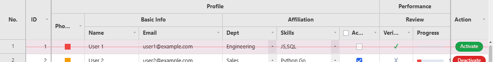

```js
grid.addRow({ name: 'New', age: 0 });        // append at the end
grid.addRow({ name: 'New' }, { index: 0 });  // insert at the front

grid.addRows([{ name: 'A' }, { name: 'B' }]);              // append a batch, returns [index, ...]
grid.addRows([{ name: 'A' }, { name: 'B' }], { index: 2 }); // A at 2, B at 3

grid.deleteRow(3);      // marks row 3 as deleted (strikethrough, undoable)
grid.undeleteRow(3);    // clears the deletion mark

grid.getNewRows();      // rows added this session, use this to send new-insert requests to the server
grid.getDeletedRows();  // server indices of rows marked for deletion (see the note below)
```

By default `deleteRow()` **marks** a server row (dims it with a strikethrough, keeps it on
screen, and reports it via `getDeletedRows()`) rather than removing it; this is the `deleteMode`
constructor option, `'mark'` by default. Pass `{ permanent: true }` (or set `deleteMode:
'permanent'` for the whole grid) to take the row off the screen immediately instead:

```js
grid.deleteRow(3, { permanent: true }); // removed from the screen right away
grid.getRemovedRows(); // server indices removed this way, separate from getDeletedRows()
grid.undeleteRow(3);   // brings a permanently-removed row back too
```

A row added via `addRow()` ignores all of this; it was never sent anywhere, so `deleteRow()` on
it just removes it outright regardless of `deleteMode`.

`addRows(rows, opts?)` inserts a whole list as **one** undo step and one redraw, which is what
calling `addRow()` in a loop does not do: a hundred calls leave a hundred undo steps behind and
redraw a hundred times. `index` places the first row and the rest follow it in order; omitted,
they all go to the end. It returns the index of each new row and ignores an empty list.

`getDeletedRows()`/`getRemovedRows()` report **server indices**, not screen positions: a row
inserted above a marked one moves it down the screen, but not in what these two report. A server
index is the row's position in the result the server returned for the filter and sort in effect
(what `page * size + i` counted in your `fetchData`), which for a `data` array with no filter or sort
is simply the index into the array.

`addRow()` returns the new row's index, and everything it does stays in the browser until you send
it. `getNewRows()` gives each added row as it was when added; edits made to it afterwards are
reported by `getEdits()` under its index (`isNewRow(index)` is `true`), and `getRowData(index)` returns
the row with them applied.

A save button that sends updated/added/deleted rows together can either assemble that payload by
hand from `getEdits()`/`getNewRows()`/`getDeletedRows()` as above, or — when rows have a stable key
(most do) — call [`getChanges()`](#batch-save-rowkey--getchanges--acknowledgechanges) instead, which
does the same assembly keyed by that column:

```js
saveBtn.addEventListener('click', async () => {
  grid.validateAll();
  if (!grid.isValid()) return alert('Fix the highlighted cells first.');

  const { updated, added, deleted } = grid.getChanges(); // requires the `rowKey` option

  const res = await fetch('/api/save', {
    method: 'POST',
    headers: { 'Content-Type': 'application/json' },
    body: JSON.stringify({ updated, created: added, deleted }),
  });
  if (res.ok) await grid.acknowledgeChanges(); // forgets the edits/adds/marks, re-reads the data
});
```

See [Batch Save](#batch-save-rowkey--getchanges--acknowledgechanges) for what each of the three
arrays looks like and the one case it doesn't cover (`deleteMode: 'permanent'` rows).

### Adding/Deleting/Hiding Columns (`addColumn` / `deleteColumn` / `hideColumn`)

```js
grid.addColumn('email', { label: 'Email' });                    // appended at the end
grid.addColumn('phone', { label: 'Phone' }, { index: 1 });      // inserted as the second column
grid.deleteColumn('email');
grid.undeleteColumn('email');
grid.getNewColumns();
grid.getDeletedColumns();
grid.commitColumns(['email']); // finalizes the add/delete marks (no longer undoable)

grid.hideColumn('age');
grid.showColumn('age');
grid.isColumnVisible('age');   // boolean
grid.getHiddenColumns();       // string[]
```

- Call these once the grid has loaded its columns: `await grid.ready()` first when it is straight
  after `new JHGrid()`. To start with columns hidden, use the `hiddenColumns` option instead.
- `addColumn(field, def, { index })` takes the same keys as a `columnDefs` entry and returns `false`,
  changing nothing, when a column called `field` exists already (visible, hidden or deleted).
  `deleteColumn(field)` returns `false` for an unknown field. A local column has no data behind
  it: its cells start empty and hold whatever the user enters, which `getEdits()` reports.
- `deleteColumn()` on a column the server sent hides it and records the deletion (`getDeletedColumns()`),
  `undeleteColumn()` brings it back, and `commitColumns()` says the change has been saved. Nothing is
  removed from your data.
- Hidden columns are left out of CSV export and printing, and a double line at the header edge marks
  where one is hidden (`theme.hiddenColIndicator`). The column menu's **Column visibility…** opens a
  dialog with a checkbox per column (below). `onColumnVisibilityChange(hiddenColumns)` reports every
  change.

  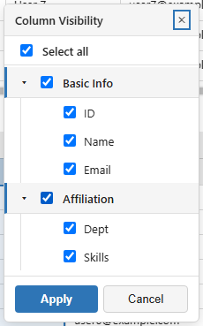
- A column dragged to a new place keeps it through sorts, filters and `reloadData()`.

### Row Height (`setRowHeight` / `autoFitColumns`)

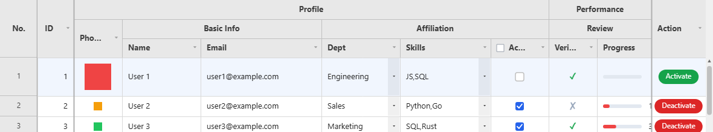

```js
grid.setRowHeight(3, 40);   // changes only row 3's height to 40px
grid.setRowHeight(28);      // called with one argument, changes the default row height for all rows
grid.getRowHeight(3);
grid.resetRowHeight(3);     // resets that row back to the default height

grid.autoFitColumns('name', 'age'); // auto-resizes the given columns to fit their content (all columns if no argument)
```
Like `isValid()`/`printGrid()`, `autoFitColumns()` only computes against currently loaded (cached) rows.

### Responsive Sizing (`responsive`)

`responsive` is **on by default** as long as you don't pass `width`/`height`: the grid fills its
container and follows it as the container resizes, via `ResizeObserver`. Size the container with CSS -
it needs a height of its own, since an element that is only as tall as its content has none to give,
and the grid then falls back to the fixed 1200 x 700 default until the container does have a size.

```html
<div id="grid" style="width: 100%; height: 60vh;"></div>

<script type="module">
import { JHGrid } from '@jh-grid/jhgrid-js';

new JHGrid({
  container: '#grid',
  // responsive: true is the default here - no width/height given
  data: [{ name: 'Alice', age: 30 }, { name: 'Bob', age: 25 }],
});
</script>
```

Pass `width`/`height` (or `responsive: false`) to opt back into a fixed size instead: `width` and
`height` are ignored (with a console warning) whenever `responsive` ends up on. With `pagination` on,
the pager bar is taken out of the container's height, so the rows keep whatever room is left. In a
flex or grid layout give the container `min-height: 0` (and `min-width: 0`) so it can shrink with its
parent. Browsers without `ResizeObserver` size the grid once (or use the fixed default) and do not
follow later changes.

### Frozen Columns (`frozenCols` / `frozenColsRight`)

Keeps the first *n* columns (`frozenCols`) and/or the last *n* (`frozenColsRight`) in place while the
columns between them scroll sideways. A separator line (`theme.frozenBorder`) marks each edge. The
row-number gutter is always fixed and is not counted.

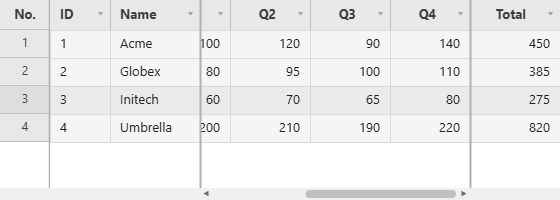

```js
const grid = new JHGrid({
  container: '#grid',
  data: rows,
  width: 560,
  frozenCols: 2,        // ID and Name stay on the left
  frozenColsRight: 1,   // Total stays on the right
  columnDefs: [
    { field: 'id',    label: 'ID',    width: 60 },
    { field: 'name',  label: 'Name',  width: 90 },
    { field: 'dept',  label: 'Dept',  width: 110 },
    { field: 'q1',    label: 'Q1',    width: 80, align: 'right' },
    // ... more columns ...
    { field: 'total', label: 'Total', width: 90, align: 'right' },
  ],
});
```

Users can also toggle it from the column header's right-click menu: *Freeze columns to the left* freezes that
column and everything to its left, *Freeze columns to the right* freezes that column and everything
to its right (`colContextMenuItems` can hide those entries). The counts are part of
[`getState()`/`setState()`](#state-snapshotrestore-getstate--setstate).

If the frozen columns would leave less than one default column width for the scrolling part, the
grid freezes fewer columns instead, so the scrollable area can never be squeezed to nothing.
Frozen columns work together with [pinned rows](#pinned-rows-pinnedtoprows--pinnedbottomrows--pinrow).

### Pinned Rows (`pinnedTopRows` / `pinnedBottomRows` / `pinRow`)

Pins one or more rows so they stay fixed at the top or bottom of the viewport, detached from
scrolling, sorting, and filtering entirely — the typical use is a totals/summary row that must
never be sorted away with the rest of the data.

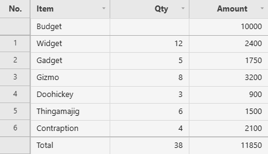

Pinned rows are **their own small data source, not a live view into the main dataset** — pinning
takes a snapshot of the row data at that moment. Editing a pinned cell edits only the pinned copy;
`onCellChange` still fires normally, so sync it back yourself if that's what you want. This is the
only implementable shape given the grid has no stable row-id concept and can't fetch an arbitrary
row from an unfetched server page.

```js
// Supply pinned rows directly, e.g. a host-computed totals row:
const grid = new JHGrid({
  // ...
  pinnedBottomRows: [{ name: 'Total', amount: 48200 }],
});

// Or pin a row that's already visible/loaded:
const handle = grid.pinRow(2, 'top');   // snapshots getRowData(2); null + console.warn if row 2 isn't loaded yet
grid.unpinRow(handle);                  // false if the handle is stale (band already mutated since)

grid.getPinnedRows('top');              // current pinned-top data, edits merged in
grid.setPinnedRows([{ name: 'Total', amount: 48200 }], 'bottom'); // wholesale replace
```

The grid in the image, with the totals computed from the data:

```js
const items = [
  { name: 'Widget', qty: 12, amount: 2400 },
  { name: 'Gadget', qty: 5,  amount: 1750 },
  // ...
];
const totalQty    = items.reduce((sum, r) => sum + r.qty, 0);
const totalAmount = items.reduce((sum, r) => sum + r.amount, 0);

const grid = new JHGrid({
  container: '#grid',
  data: items,
  columnDefs: [
    { field: 'name',   label: 'Item' },
    { field: 'qty',    label: 'Qty',    align: 'right' },
    { field: 'amount', label: 'Amount', align: 'right' },
  ],
  pinnedTopRows:    [{ name: 'Budget', qty: '', amount: 10000 }],
  pinnedBottomRows: [{ name: 'Total',  qty: totalQty, amount: totalAmount }],
});
```

A bottom band sits at the bottom of the **viewport**, not under the last row: with fewer rows than
fit, the gap between them is empty, exactly as a fixed table footer behaves. Size the grid to its
content if you would rather not see that gap.

When the data changes, recompute and replace the row rather than mutating it, since the pinned
rows are a copy:

```js
grid.setPinnedRows([{ name: 'Total', qty: newQty, amount: newAmount }], 'bottom');
```

#### Letting users pin rows

The row-number gutter's right-click menu already has **Pin row to top**, **Pin row to bottom** and
**Unpin row** for every row that comes from the data. `rowContextMenuItems` switches them off (leave
`'row-pin'` out of the list). For a one-click alternative, `rowPinButton` draws a pin at the right
edge of the gutter: an outlined pin appears while the pointer is over a row, and clicking it pins a
copy of that row. A row that has been pinned shows a filled pin, both on the original row and on
its pinned copy, and clicking either unpins it.

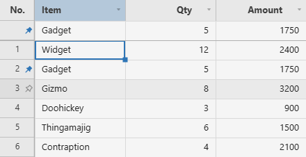

```js
const grid = new JHGrid({
  container: '#grid',
  data: items,
  rowPinButton: true,          // or 'top' (same as true) / 'bottom' to pin into the bottom band
  onRowPinToggle: ({ pinned, rowIndex, position, rowData, handle }) => {
    console.log(pinned ? 'pinned' : 'unpinned', rowData.name, 'at the', position);
  },
});
```

- The icon needs the row-number column: with `showRowNumbers: false` it is ignored and a console
  warning says so. It also needs `theme.hoverRowBg` to show the outlined pin on hover; the filled
  pin of an already-pinned row is always drawn.
- Rows that *you* supplied, through `pinnedTopRows` / `pinnedBottomRows` / `setPinnedRows()` (a totals
  row, say), are not user pins. They get no icon and no menu, so the user cannot remove them.
  Pins restored by `setState()` count as yours as well.
- `onRowPinToggle` runs after the user's own pin or unpin, once the change is already applied. It
  does not run for `pinRow()`, `unpinRow()` or `togglePinRow()` called from code. `rowData` is the row
  at that moment (edits of a pinned row included) and `rowIndex` its index then; treat both as a
  snapshot, since `rowIndex` means nothing once the data reloads.

The pin is a copy, so the original stays in the body. If you want "move" behaviour instead, take the
original out of your own data in `onRowPinToggle` and reload, then put it back on unpin:

```js
const all  = [ /* every row, each with a unique id */ ];
const rows = [...all];                       // the array the grid reads
const pinnedIds = new Set();

const grid = new JHGrid({
  container: '#grid',
  data: rows,
  rowPinButton: true,
  onRowPinToggle: ({ pinned, rowData }) => {
    if (pinned) pinnedIds.add(rowData.id); else pinnedIds.delete(rowData.id);
    rows.splice(0, rows.length, ...all.filter((r) => !pinnedIds.has(r.id)));
    grid.reloadData();                       // the pinned copies are untouched by the reload
  },
});
```

From code, `isRowPinned()` and `togglePinRow()` complement `pinRow()` / `unpinRow()`:

```js
grid.isRowPinned(2);                 // true for a row that has a pinned copy, and for the copy itself
grid.togglePinRow(2);                // pins row 2 to the top, or unpins it if it is pinned already
grid.togglePinRow(2, 'bottom');      // same, pinning to the bottom band
```

`isRowPinned()` recognises a row by the object it was copied from, so a row that was evicted from the
cache and fetched again reads as unpinned. `togglePinRow()` returns the new handle when it pinned, and
`null` when it unpinned or the row is not loaded. Both are undoable.

Multiple pinned rows stack in array order, closest to the header/footer first. Internally each
pinned row is addressed by an encoded visual row index — negative for pinned-top, `>= totalRows`
for pinned-bottom — so `row` arguments/return values across the API (`getRowData`, `setCellValue`,
`onCellChange`, `onRowSelect`, `cellTooltip`, ...) may be negative or out-of-range for a pinned row;
treat `row` as an opaque handle to pass back into `getRowData`/`setCellValue`, not as a position in
the main dataset.

What works the same as a normal row: cell rendering/editing (respecting `editableCols`), row
selection (click/ctrl-click; a shift-click spanning a pinned/normal row falls back to toggling just
the clicked row instead of range-filling), `cellDecorator`/`cellTooltip`/`cellContextMenuExtraItems`,
frozen columns, and undo/redo (both cell edits and pin/unpin/`setPinnedRows` itself).

Deliberately **not** supported in this version: per-row height/auto-grow (pinned rows always render
at `rowHeight`), row resize, row drag-reorder (as source or drop target), the row-number gutter's
context menu (apart from the unpin item on a row the user pinned), the fill-handle, the keyboard "row focus" mode (`←` from the first column), and drag range-select
spanning into or out of a pinned band (a range selection stays within one band). Arrow-key
navigation *does* work between a pinned band and the scrollable page — stepping off the near edge
of one lands on the near edge of the other. `cellDecorator`'s `rowIndex` and `cellBackground`'s
`row` argument report a 0-based index local to the pinned band for a pinned row, not the encoded
index seen elsewhere — use `rowData` to identify the row instead.

### State Snapshot/Restore (`getState` / `setState`)

Extracts the grid's current state (filters, sort, column order/visibility, edits, etc.) as a
serializable object, and can restore it later exactly as it was (e.g. saving a per-user view).

```js
const state = grid.getState();
localStorage.setItem('gridState', JSON.stringify(state));

grid.setState(JSON.parse(localStorage.getItem('gridState')));
```
A snapshot survives `JSON.stringify` / `JSON.parse` with one exception: a column added with
`addColumn()` that carries a function (a custom `renderer`, `editor`, `validator` or `button.onClick`)
keeps it only while the snapshot stays in memory. Restore such a column from your own definition
instead of from the saved copy.

A `setState()` call is recorded as a single undoable action. `setState()` returns a `Promise` that
resolves once the grid is actually showing that state; if the snapshot carries `sorts`,
`filters`, or `quickFilter`, those only describe what the *server* should return, so the grid
re-fetches and the promise waits for the answer. A snapshot that only moves columns around
resolves immediately, since there's nothing to ask for. Unknown fields are ignored, so a snapshot
taken with an older version of the grid still applies as far as it goes.

`GridState`'s fields:

| Field | Type | Description |
|---|---|---|
| `columns` | `string[]` | Current visible column order |
| `columnWidths` | `Record<string, number>` | Current width of every column, by field |
| `hiddenColumns` | `string[]` | Currently hidden fields |
| `frozenCols` / `frozenColsRight` | `number` | Current frozen-column counts |
| `pinnedTopRows` / `pinnedBottomRows` | `object[]` | Current pinned row data (edits merged in) — see [Pinned Rows](#pinned-rows-pinnedtoprows--pinnedbottomrows--pinrow) |
| `sorts` | `{field, dir}[]` | Active sort |
| `filters` | `Record<string, string \| string[]>` | Active per-column filters: `string` (substring match) or `string[]` (Set filter) |
| `quickFilter` | `string` | Active quick-filter term, `''` when inactive |
| `selectedRows` | `number[]` | Currently selected row indices (`rowSelection` mode) |
| `headerCheckboxState` | `Record<string, boolean>` | Checked state of every `headerCheckbox` column's header checkbox |
| `localColumns` | `ColumnDef[]` | Columns added via `addColumn()` not yet committed (see `getNewColumns()`/`commitColumns()`) |
| `deletedColumns` | `string[]` | Server columns marked deleted via `deleteColumn()`, not yet committed (see `getDeletedColumns()`) |
| `rowChanges` | `object` | Unsaved row work: see below |

`rowChanges` is the row counterpart of `localColumns`/`deletedColumns`, keyed by **server index**
throughout (never screen position, since a snapshot is meant to outlive whatever arrangement
produced it):

| `rowChanges` field | Type | Description |
|---|---|---|
| `added` | `{anchor, data, edits}[]` | Rows from `addRow()`. `anchor` is the server index the row sits in front of (equal to the row count when appended at the end) |
| `removed` | `number[]` | Server indices removed via `deleteRow(i, { permanent: true })`: see `getRemovedRows()` |
| `marked` | `number[]` | Server indices marked for deletion: see `getDeletedRows()` |
| `edits` | `Record<number, Record<string, string>>` | Unsaved cell edits on server rows, `serverIndex -> field -> value` |

`setState()` treats `rowChanges` as a full replacement, not an addition; restoring the same
snapshot twice doesn't duplicate rows. Restoring against changed server data names different
records by index, the same caveat that applies to `filters` naming fields that may no longer exist.

### Incremental Save (`getOriginalRowData` / `isNewRow` / `acknowledgeSave` / `acknowledgeInsert`)

For a host that saves as the user goes (auto-save on commit) rather than in one batch via
`getEdits()`, these let a single row be reconciled with the server without the full reset
(scroll position, filters, sort, selection) that `refresh()` does.

```js
grid.getOriginalRowData(3); // row 3's pre-edit snapshot: what getRowData(3) returned before
                             // any unsaved edits, independent of later addRow()/deleteRow() calls
grid.isNewRow(3);           // true if row 3 came from addRow() and has no server counterpart yet
```

```js
// A server row the user just edited, saved successfully:
async function saveRow(rowIndex) {
  const saved = await fetch('/api/rows/' + rowIndex, {
    method: 'PUT',
    body: JSON.stringify(grid.getRowData(rowIndex)),
  }).then(r => r.json());
  grid.acknowledgeSave(rowIndex, saved); // patches the cache, drops the pending edit
}

// A row added via addRow(), just created on the server:
async function createRow(rowIndex) {
  const created = await fetch('/api/rows', {
    method: 'POST',
    body: JSON.stringify(grid.getRowData(rowIndex)),
  }).then(r => r.json());
  grid.acknowledgeInsert(rowIndex, created); // turns it into an ordinary server row in place
}
```

`acknowledgeSave()` is a no-op if `isNewRow(rowIndex)` is true (a brand-new row has no server slot
yet to patch; use `acknowledgeInsert()` for that case instead, which returns `false` if
`rowIndex` wasn't actually a local/unsaved row).

### Batch Save (`rowKey` / `getChanges()` / `acknowledgeChanges()`)

For a "Save" button that sends everything at once instead of reconciling row by row, set `rowKey`
to the column that uniquely identifies a row (e.g. `'id'`) and use `getChanges()` /
`acknowledgeChanges()` in place of hand-assembling a payload from `getEdits()`/`getNewRows()`/
`getDeletedRows()`:

```js
grid.getChanges();
// {
//   updated: [{ id: 2, qty: 999 }],    // the key plus only the fields that changed
//   added:   [{ id: 100, name: 'x' }], // rows created with addRow(), with their current values
//   deleted: [5],                      // keys of rows marked with deleteRow() (deleteMode 'mark')
// }

await grid.acknowledgeChanges(); // forgets the edits, the added rows and the delete marks, and
                                  // re-reads the data - filters, sorts and scroll position survive
```

A value edited in a cell whose original value was a number comes back as a number (an emptied cell
as `null`); anything else stays the string that was typed. `getChanges()` throws if `rowKey` was
not set.

Rows removed with `deleteMode: 'permanent'` are **not** included in `deleted` — that mode is meant
for lists that commit as they go, not a batch save, so fall back to `getRemovedRows()` for those.
Pinned rows are never included either. `acknowledgeChanges(opts?: { keepScroll? })` takes the place
of `clearEdits()` + `reloadData()` here specifically because that combination would keep the added
rows around and show them a second time once the server returns them.

### Multi-Level Header Groups (`columnDefs[].group`)

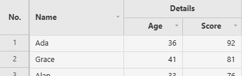

Consecutive columns sharing the same label at a given level are automatically merged into a
single header group cell.

```js
columnDefs: [
  { field: 'q1_score', label: 'Q1', group: 'Quantitative' },
  { field: 'q2_score', label: 'Q2', group: 'Quantitative' },
  { field: 'review',   label: 'Comments', group: 'Qualitative' },
],
```
For finer control, define header rows explicitly with the `headerRows` option instead of
`columnDefs[].group`. `headerRows` is `HeaderRowDef[][]`: an array of header rows, each an array
of group cells for that row:

```js
headerRows: [
  [ // top row
    { label: 'Quantitative', fields: ['q1_score', 'q2_score'] },
    { label: 'Qualitative',  fields: ['review'] },
  ],
],
columnDefs: [
  { field: 'q1_score', label: 'Q1' },
  { field: 'q2_score', label: 'Q2' },
  { field: 'review',   label: 'Comments' },
],
```

| `HeaderRowDef` field | Type | Description |
|---|---|---|
| `label` | `string` | The group cell's text |
| `fields` | `string[]` | Field names this group spans. Recomputed automatically after a column reorder, so it always tracks the current column order rather than a fixed position |
| `colspan` | `number` | Explicit column span, if it shouldn't be inferred from `fields.length` |
| `rowspan` | `number` | How many header rows tall the cell is (for a group with no further subdivision below it) |
| `align` | `'left' \| 'center' \| 'right'` | Group cell text alignment |

### Column Letter Header (`columnLetterHeader`)

Adds an Excel-style row of column letters (A, B, C, ...) above the header, handy when users refer
to cells the way a spreadsheet does. The letter cells are labels only: no sort, filter or checkbox.

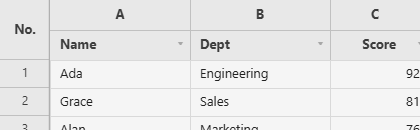

```js
const grid = new JHGrid({
  container: '#grid',
  columnLetterHeader: true,
  data: [
    { name: 'User 1', dept: 'Engineering', score: 30 },
    { name: 'User 2', dept: 'Sales',       score: 47 },
  ],
});
```

### Locale / Internationalization (`locale` / `i18n`)

Setting `locale` switches both the built-in UI text pack (currently Korean/Japanese/Simplified
Chinese are bundled) and the default locale for the number/date/currency cell renderers. Use
`i18n` to override specific strings on top of that.

```js
import { JHGrid, KO_I18N } from '@jh-grid/jhgrid-js';

const grid = new JHGrid({
  container: '#grid',
  fetchMeta, fetchData,
  locale: 'ko',                 // or 'ko-KR' (defaults to 'en-US')
  i18n: { ...KO_I18N, loading: 'Loading…' }, // override specific strings only
});
```

The same grid with Korean UI text (the row-number header reads 번호, menus and panels follow) and
number/date/currency cells formatted for the locale:

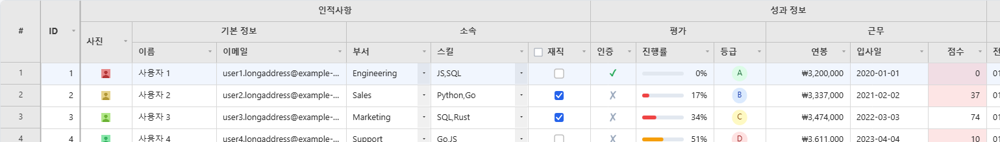

```js
import { JHGrid, CellRenderers } from '@jh-grid/jhgrid-js';

const grid = new JHGrid({
  container: '#grid',
  locale: 'ko',
  data: [
    { name: '김하늘', price: 1234500, joined: '2024-03-01' },
    { name: '이도윤', price: 98000,   joined: '2023-11-20' },
  ],
  columnDefs: [
    { field: 'name',   label: '이름' },
    { field: 'price',  label: '금액',   align: 'right', renderer: CellRenderers.currency({ currency: 'KRW' }) },
    { field: 'joined', label: '입사일', renderer: CellRenderers.date({ format: 'locale' }) },
  ],
});
```

`locale` decides how amounts and dates are written, not which currency: `currency()` defaults to
`'KRW'` whatever the locale, so pass `currency` explicitly for anything other than won.

Besides the number, date and currency renderers, `locale` selects the text of the built-in messages
and menus (see the reference below). A `type: 'date'` column that sets no `format` of its own follows
it too, through the pack's `dateFormat` (`'MM/DD/YYYY'` for `en`, `'YYYY-MM-DD'` for `ko`,
`'YYYY/MM/DD'` for `ja` and `zh`). Write the column's `format` out to pin it to one pattern whatever
the locale, or ask for `format: 'locale'` to have `Intl` write the date - see
[Date Columns](#date-columns-type-date).

### Text Reference (`i18n`)

Every string the grid shows comes from a text pack, and `i18n` overrides individual entries. The
pack is chosen from the first part of `locale` (`'ko'`, `'ko-KR'` and `'KO'` all pick Korean);
English, Korean (`ko`), Japanese (`ja`) and Simplified Chinese (`zh`) are built in, and any other tag
falls back to English. The packs are also exported as `KO_I18N`, `JA_I18N` and `ZH_I18N` for spreading
into your own overrides. A key you leave out keeps the pack's text; a value that is a function
receives the arguments listed below.

```js
import { JHGrid, JA_I18N } from '@jh-grid/jhgrid-js';

new JHGrid({
  container: '#grid',
  data: rows,
  locale: 'ja',
  i18n: {
    ...JA_I18N,                                            // optional: the pack is applied anyway
    noData:             'Nothing to show yet.',
    validationRequired: (col) => `${col} must not be empty.`,
    pagerPageLabel:     (page, pageCount) => `${page} / ${pageCount}`,
  },
});
```

The keys, with the English text:

| Area | Key | English text / arguments |
|---|---|---|
| States | `loading` | `Loading…` |
| | `loadError` | `⚠ Failed to load data.` (banner after a request failed its retries) |
| | `noData` | `No data to display.` |
| | `emptyCell` | `Empty cell` (spoken for an empty cell, and the label of an empty value in filter lists) |
| | `ariaGrid` | `Data grid` (used when `ariaLabel` is not set) |
| | `rowNumberLabel` | `No.` (header of the row-number column) |
| Clipboard | `pasteTruncated(n)` | `n value(s) did not fit and were not pasted` |
| | `copyIncomplete(n)` | `n row(s) hadn't loaded yet and were not copied` |
| Editing | `unsavedEditsWarning` | the `confirm()` text shown before a filter or sort discards edits |
| | `editAriaLabel(col, row)` | `Edit col, row row` |
| | `richtextToolbarLabel` | `Formatting` (accessible name of the rich-text editor's toolbar) |
| Filter / sort panel | `sortAsc`, `sortDesc` | `↑ Ascending`, `↓ Descending` |
| | `sortShiftHint` | `Shift+click: add to multi-sort` |
| | `filterDialog(col)` | `col Filter` (the panel's accessible name and title) |
| | `filterLabel`, `filterPlaceholder` | `Search`, `Enter search term…` |
| | `filterApply`, `filterReset`, `filterResetAll`, `filterClose` | `Apply`, `Reset`, `Reset all filters`, `Close` |
| | `filterValuesLabel`, `filterSelectAll` | `Filter by value`, `(Select all)` |
| | `filterTagPlaceholder` | `Search values…` |
| | `filterTagLocalScope`, `filterTagNoMatch`, `filterTagAllSelected` | `From loaded rows only`, `No matching values`, `All matches already selected` |
| | `filterTagMinChars(n)`, `filterTagMore(n)` | `Type at least n characters`, `+n more - narrow the search` |
| | `filterTagSelected(n)`, `filterTagContains(q)`, `filterTagRemove(v)` | `Selected (n)`, `Contains "q"`, `Remove v` |
| Column menu | `colFreeze`, `colUnfreeze` | `Freeze columns to the left`, `Unfreeze columns to the left` |
| | `colFreezeRight`, `colUnfreezeRight` | `Freeze columns to the right`, `Unfreeze columns to the right` |
| | `colVisibility` | `Column visibility…` |
| | `colInsertLeft`, `colInsertRight` | `Insert column left`, `Insert column right` |
| | `colDelete`, `colUndelete` | `Delete column`, `Undo delete` |
| Column chooser | `colChooserTitle`, `colChooserApply`, `colChooserCancel`, `colChooserSelectAll` | `Column Visibility`, `Apply`, `Cancel`, `Select all` |
| Insert-column dialog | `colInsertTitle`, `colInsertPlaceholder` | `Add column`, `Column name` |
| | `colInsertConfirm`, `colInsertCancel` | `Add`, `Cancel` |
| Row menu | `rowInsertAbove`, `rowInsertBelow` | `Insert row above`, `Insert row below` |
| | `rowInsertTop`, `rowInsertBottom` | `Insert row at top`, `Insert row at bottom` |
| | `rowDeleteMark`, `rowDeletePermanent`, `rowDelete`, `rowUndelete` | `Mark row for deletion`, `Delete row permanently`, `Delete row`, `Undo delete` |
| | `rowPinTop`, `rowPinBottom`, `rowUnpin` | `Pin row to top`, `Pin row to bottom`, `Unpin row` (also the pin icon's tooltip) |
| | `rowAddEnd` | `Add row` (not shown by the grid: a label for an add-row button of your own) |
| Validation | `validationRequired(col)`, `validationPattern(col)`, `validationInvalid(col)` | `col is required.`, `col format is invalid.`, `col is invalid.` |
| | `validationMin(col, min)`, `validationMax(col, max)` | `col must be at least min.`, `col must be at most max.` |
| | `validationMinLength(col, len)`, `validationMaxLength(col, len)` | `col must be at least len characters.`, `... at most len characters.` |
| Dates | `dateFormat` | `MM/DD/YYYY` (the default `format` of a `type: 'date'` column that sets none; `YYYY-MM-DD` in the `ko` pack, `YYYY/MM/DD` in `ja` and `zh`) |
| Pager | `pagerFirst`, `pagerPrev`, `pagerNext`, `pagerLast` | `First page`, `Previous page`, `Next page`, `Last page` |
| | `pagerPageSize`, `pagerPageLabel(page, pageCount)` | `Rows per page`, `Page page of pageCount` |
| Export | `exportCsvFilename`, `printButton` | `export.csv`, `Print` |
| Screen readers | `announceCell(row, col, value)` | `Row row, col: value` |
| | `columnHeaderAnnounce(col)`, `rowHeaderAnnounce(row)` | spoken when a header or row number takes keyboard focus |
| | `sortAppliedAnnounce(col, dir)`, `filterAppliedAnnounce(col)`, `filterClearedAnnounce(col)` | spoken after the panel applies a sort or filter |
| | `allFiltersClearedAnnounce`, `rowsSelectedAnnounce(n)`, `rowReorderAnnounce(from, to)` | spoken after a reset, a row selection change, a row drag-reorder |


### Conditional Styling (`rowHighlighter` / `cellBackground`)

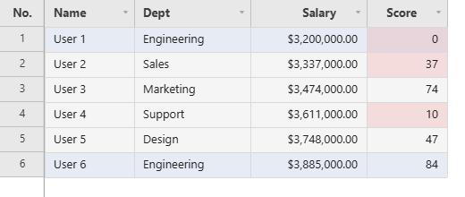

```js
const grid = new JHGrid({
  container: '#grid',
  fetchMeta, fetchData,
  rowHighlighter: (row) => row?.status === 'ERROR' ? 'rgba(239,68,68,0.12)' : null,
  cellBackground: (row, rowIndex, field) =>
    row && field === 'score' && row.score < 60 ? '#fee2e2' : null,
});
```
Both callbacks are called on every render (for visible rows/cells), so keep them lightweight;
exceptions thrown in `cellBackground` are logged and ignored, and don't block rendering.

### Cell Decorator / Tooltip (`cellDecorator` / `cellTooltip`)

`cellTooltip` supplies hover text for a cell; `cellDecorator` draws directly on the canvas on top of a
cell, for a small mark, icon, badge or bar that the cell's own renderer doesn't provide.

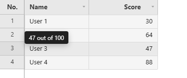

```js
const grid = new JHGrid({
  container: '#grid',
  data: [
    { name: 'User 1', score: 30 },
    { name: 'User 2', score: 64 },
    // ...
  ],
  columnDefs: [
    { field: 'name',  label: 'Name' },
    { field: 'score', label: 'Score', align: 'right', width: 180 },
  ],

  // Shown at once while the pointer rests on a Score cell.
  cellTooltip: (rowData, rowIndex, field) =>
    field === 'score' ? `${rowData?.score} out of 100` : null,
});
```

A decorator is a function that receives the canvas context and the cell's position, so it can draw
anything on top of the value. For example, a thin bar along the bottom edge of each Score cell, as
long as the score:

```js
new JHGrid({
  // ...
  cellDecorator: (ctx, { x, y, w, h, rowData, field }) => {
    if (field !== 'score') return;
    const score = Number(rowData?.score);
    if (!Number.isFinite(score)) return;
    ctx.fillStyle = '#2E75B6';
    ctx.fillRect(x + 1, y + h - 4, (w - 2) * Math.min(100, Math.max(0, score)) / 100, 3);
  },
});
```

A decorator draws on plain `ctx` with the cell box it is given, and the canvas state it inherits is
whatever the cell drawn just before it left behind. Unlike a column's renderer it does not start
from a reset state and has no `args.text()`, so set `textAlign`, `textBaseline` and `fillStyle`
yourself before any `fillText`. Leaving `textAlign` to chance puts the text wherever the previous
column's alignment says, which for a right-aligned neighbour means drawing it to the left of the
coordinate you passed.

`cellDecorator` runs for every visible, loaded cell on every render, so keep it cheap and let it
return early for cells it has nothing to say about. `cellTooltip` returns text (or `null` for
none), replaces the built-in overflow tooltip for that cell, and is itself overridden by a
validation error message on the same cell. If the decoration depends on host state that changed
outside the grid, call [`repaint()`](#repaint) and it is drawn again on the next frame. An exception
thrown by either callback is logged and does not interrupt rendering.

### Row Drag Reorder (`rowReorder`)

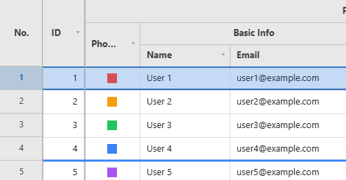

Drag rows by the row-number gutter to reorder them. Unlike column reordering, row data isn't
always resident in memory under server-side paging, so enabling this scans the entire dataset once
(it's an opt-in feature).

```js
const grid = new JHGrid({
  container: '#grid',
  fetchMeta, fetchData,
  rowReorder: true,
  onRowReorder: (fromIndex, toIndex, rowData) => console.log(fromIndex, '→', toIndex),
});
```

What to expect:

- After a drop the grid shows the new order at once, but only in the browser. A sort, a filter,
  `refresh()` or `reloadData()` fetches from your server again, so `onRowReorder` is where you save
  the order (`toIndex` is where the row ended up, `fromIndex` where it was).
- Like a sort, a drop discards the state keyed by row index (edits, selection, undo history), and
  asks with a `window.confirm()` first when a server row has an unsaved edit.
- Dragging starts working once the full scan has finished, so on a big dataset it is not available
  the instant the grid appears. Rows added with `addRow()` and pinned rows cannot be dragged. `fullScanPageSize` and
  `fullScanConcurrency` tune the scan.

```js
new JHGrid({
  container: '#grid',
  fetchMeta, fetchData,
  rowReorder: true,
  onRowReorder: (fromIndex, toIndex, rowData) => {
    fetch(`/api/tasks/${rowData.id}/move`, {
      method: 'POST',
      headers: { 'Content-Type': 'application/json' },
      body: JSON.stringify({ toIndex }),
    });
  },
});
```

### Built-in Cell Renderers (`CellRenderers`)

Assign any of these to `columnDefs[i].renderer` (either the string key or a call to the factory
directly; both are equivalent, but calling it yourself lets you pass options):

```js
import { CellRenderers } from '@jh-grid/jhgrid-js';

columnDefs: [
  { field: 'progress', renderer: CellRenderers.progressBar({ max: 100, showLabel: true }) },
  { field: 'grade',    renderer: CellRenderers.badge({ colorMap: { A: { bg: '#dcfce7', fg: '#166534' } } }) },
]
```

| Renderer | Options | Description |
|---|---|---|
| `progressBar({ max?, showLabel? })` | `max` (default `100`), `showLabel` (default `true`) | A filled bar sized to `value / max`, with an optional percentage label |
| `badge({ colorMap? })` | `colorMap: Record<value, {bg?, fg?}>` | A pill-shaped tag per distinct value, colored per `colorMap` (falls back to a neutral gray for values not listed) |
| `checkmark({ trueColor?, falseColor?, showFalse? })` | `trueColor` (default `#16a34a`), `falseColor` (default `#94a3b8`), `showFalse` (default `true`: draw a ✗ for a false-y value; `false` leaves it blank) | A ✓/✗ glyph instead of raw `'true'`/`'false'` text. Counts as ✓: `true`, `1`, `'true'`, `'Y'`, `'예'`; anything else is ✗ |
| `image({ fit?, radius?, size?, align? })` | `fit: 'cover' \| 'contain'` (default `'cover'`), `radius` (corner radius, px), `size` (fixed box in px, see below), `align: 'center' \| 'left' \| 'right'` (default `'center'`, placement of a fixed-`size` box) | Renders the cell value as an image URL: see the `type: 'image'` note below for caching/decoding details |
| `number({ locale?, decimals? })` | BCP-47 `locale`, fixed `decimals` (default `0`) | `Intl.NumberFormat`-based number formatting |
| `date({ format?, locale?, dateStyle?, align? })` | `format` (default `'YYYY-MM-DD'`): a `YYYY`/`MM`/`DD`/`HH`/`mm`/`ss` pattern, or `'locale'` to format via `Intl.DateTimeFormat`; `dateStyle`: `'full' \| 'long' \| 'medium' \| 'short'` for `'locale'`; `align` (default `'left'`) | Date formatting: pattern-based by default, locale-aware when `format: 'locale'` |
| `currency({ locale?, currency? })` | BCP-47 `locale`, ISO 4217 `currency` code (default `'KRW'`, so pass `currency: 'USD'` etc. explicitly) | `Intl.NumberFormat`-based currency formatting |
| `link({ color?, mutedColor?, underline?, align?, linked? })` | `linked`: `true` (default) or `(rowData) => boolean`; `color` (default `#2563eb`), `mutedColor`, `underline` (default `true`), `align` (default `'left'`) | Draws the cell as a link - coloured, underlined, ellipsized to fit. `linked` decides per row whether it looks (and so, paired with `onCellDoubleClick`, behaves) as one |
| `dropdown({ placeholder? })` | placeholder text for an empty value | Current value + a `▾` arrow, matching the dropdown editor's affordance |
| `multiselect({ placeholder? })` | placeholder text for an empty selection | Selected values joined + a `▾` arrow |
| `checkbox({ checkedColor?, size? })` | box color (default `#2563eb`) and size in px (default `14`) | A checked/unchecked box glyph. Counts as checked: `true`, `1`, `'true'`, `'1'`, `'Y'`, `'yes'` |
| `button({ label?, disabled?, variant? })` | same shape as `columnDefs[i].button` (see [Button Columns](#button-columns-type-button)); defaults: `label` `'Button'`, `variant` `'primary'` (`'primary'`, `'success'`, `'danger'` or `'neutral'`) | Renders the cell as a clickable button; this is what `type: 'button'` uses internally |
| `richtext()` | none | Draws the `<b>`/`<i>`/`<u>`/`<s>` markup of a `type: 'richtext'` cell as one line of styled text; this is what that type uses internally |

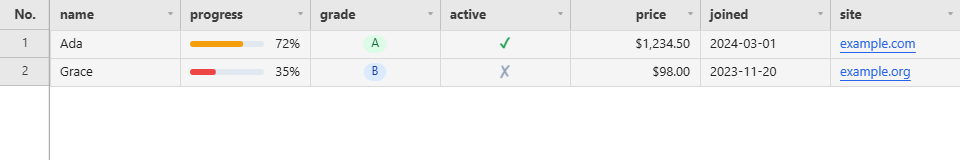

The grid above, in full:

```js
import { JHGrid, CellRenderers } from '@jh-grid/jhgrid-js';

const grid = new JHGrid({
  container: '#grid',
  data: [
    { name: 'Ada',   progress: 72, grade: 'A', active: 'true',  price: 1234.5,  joined: '2024-03-01', site: 'example.com' },
    { name: 'Grace', progress: 35, grade: 'B', active: 'false', price: 98,      joined: '2023-11-20', site: 'example.org' },
  ],
  columnDefs: [
    { field: 'name' },
    { field: 'progress', renderer: CellRenderers.progressBar({ showLabel: true }) },
    { field: 'grade',    renderer: CellRenderers.badge({ colorMap: {
        A: { bg: '#dcfce7', fg: '#166534' },
        B: { bg: '#dbeafe', fg: '#1e40af' },
        C: { bg: '#fef9c3', fg: '#854d0e' },
    } }) },
    { field: 'active',   renderer: CellRenderers.checkmark({ showFalse: true }) },
    { field: 'price',    align: 'right', renderer: CellRenderers.currency({ locale: 'en-US', currency: 'USD' }) },
    { field: 'joined',   renderer: CellRenderers.date({ format: 'YYYY-MM-DD' }) },
    { field: 'site',     renderer: CellRenderers.link({ linked: true }) },
  ],
});
```

A `link` cell only *looks* like a link. To make it act like one, handle the double-click yourself;
`linked` can also be a function so that only some rows look (and behave) clickable:

```js
new JHGrid({
  // ...
  columnDefs: [
    { field: 'site', renderer: CellRenderers.link({ linked: (row) => !!row?.site }) },
  ],
  onCellDoubleClick: (rowIndex, rowData, field) => {
    if (field === 'site' && rowData?.site) window.open('https://' + rowData.site, '_blank', 'noopener');
  },
});
```

`locale` on `number`/`date`/`currency` falls back to `theme.locale` (set via the top-level
`locale` constructor option) when omitted, so most grids never need to pass it per-column.

Clicking an already-selected `dropdown`/`multiselect` cell opens its editor immediately (no
double-click needed); see [Dropdown and Multiselect Columns](#dropdown-and-multiselect-columns-type-dropdown--multiselect).

Register your own under a string key with `registerCellRenderer(name, factory)` (and the editor
counterpart, `registerCellEditor`), see the custom-editor example below for the matching factory
shape. The factory is called once per column with the options you pass, and returns the function
that draws one cell. `args` carries the cell's box (`x`, `y`, `w`, `h`), `value`, `rowData`,
`rowIndex`, `colIndex`, `theme`, `padding` and `text()`.

`args.text(str, opts)` writes one line into the cell: it uses the column's own alignment, centres
the line vertically and clips it with an ellipsis at the cell edge, so a renderer that only puts
text in a cell needs no coordinates at all. `opts` takes `align`, `color`, `size`, `bold`, `font`
and `padding`. It draws only while the renderer runs; keeping it and calling it later does nothing.

```js
import { JHGrid, registerCellRenderer } from '@jh-grid/jhgrid-js';

// 0-5 as stars. No x/y arithmetic: args.text() knows the cell it is in.
registerCellRenderer('stars', () => (ctx, { value, text }) => {
  const n = Math.max(0, Math.min(5, Math.round(Number(value) || 0)));
  text('★'.repeat(n) + '☆'.repeat(5 - n), { color: '#f59e0b', size: 15 });
});

new JHGrid({
  container: '#grid',
  data: [{ name: 'Sky', rating: 4 }, { name: 'Rose', rating: 2 }],
  columnDefs: [
    { field: 'name' },
    { field: 'rating', renderer: 'stars' },
  ],
});
```

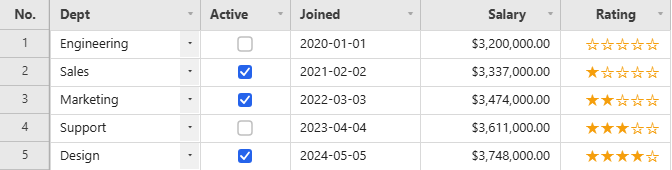

The same renderer runs on the [live demo page](demo.md#column-types--renderers)'s Rating column.

For anything beyond a line of text, draw on `ctx` with the cell box:

```js
import { JHGrid, registerCellRenderer } from '@jh-grid/jhgrid-js';

// A small colour swatch followed by the colour's text.
registerCellRenderer('swatch', ({ size = 12 } = {}) => (ctx, { x, y, w, h, value, theme, padding }) => {
  if (!value) return;
  ctx.fillStyle = String(value);
  ctx.fillRect(x + padding, y + (h - size) / 2, size, size);
  ctx.fillStyle    = theme.cellText;
  ctx.font         = `${theme.fontSize}px ${theme.fontFamily}`;
  ctx.textAlign    = 'left';
  ctx.textBaseline = 'middle';
  ctx.fillText(String(value), x + padding + size + 6, y + h / 2);
});

new JHGrid({
  container: '#grid',
  data: [{ name: 'Sky', color: '#38bdf8' }, { name: 'Rose', color: '#f43f5e' }],
  columnDefs: [
    { field: 'name' },
    { field: 'color', renderer: 'swatch' },   // or renderer: CellRenderers.swatch({ size: 14 })
  ],
});
```

A renderer runs for every visible cell on every frame, so keep it to plain canvas calls and do not
create objects or DOM in it. Registering a name that a built-in already uses replaces the built-in
and logs a warning.

### Column Types: `date` / `richtext` / `image`, and Custom Editors/Renderers

`columnDefs[i].type` supports `date`/`richtext`/`image` in addition to `checkbox`/`dropdown`/`button`.
When set, the matching editor (`CellEditors`) and display renderer (`CellRenderers`) are applied
automatically. → [Live example](demo.md#column-types--renderers)

```js
columnDefs: [
  { field: 'dob',    type: 'date', editorOptions: { min: '1900-01-01', max: '2100-12-31' } },
  { field: 'notes',  type: 'richtext' },              // bold/italic/underline/strikethrough
  { field: 'avatar', type: 'image', renderer: CellRenderers.image({ fit: 'cover' }) },
],
```

- `type: 'date'`: a masked input in the column's date pattern, or a native date input when its
  `format` is `'locale'`, and `CellRenderers.date()` for display. See
  [Date Columns](#date-columns-type-date).
- `type: 'richtext'`: double-clicking a cell opens a `contenteditable` editor with a bold/italic/
  underline/strikethrough toolbar. The stored value is a sanitized HTML string made up only of
  `<b>/<i>/<u>/<s>` tags, and the grid draws it on the canvas as a **single line** (line breaks,
  lists, and block elements aren't supported, to match the fixed row-height model). The stored
  value (what `getEdits()`/`getRowData()` return) keeps those tags; CSV export, `printGrid()` and
  copy-to-clipboard write the plain text with the tags removed.

  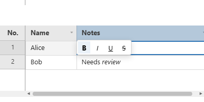
- `type: 'image'`: interprets the cell value as an image URL and draws it with
  `CellRenderers.image()` using its defaults. To pass options (`fit`, `radius`, `size`, `align`),
  set `renderer: CellRenderers.image({ ... })` on the column; the string form `renderer: 'image'`
  takes no options. Decoding is done via `fetch()` +
  `createImageBitmap`, downscaled to cover the cell's display size while keeping the source aspect
  ratio, so memory usage stays low regardless of the source resolution, and the same URL is reused across
  grids via a page-wide LRU cache (50MB budget). Redraws automatically once the async load finishes.
- Allowed URLs: only `http:`, `https:`, `blob:` and `data:image/...` (and relative paths) are loaded.
  Any other scheme (`javascript:`, `file:`, `ftp:`, `data:text/html`, ...) is not requested and the
  cell shows the error tile. Because the grid fetches a cell's URL as soon as the cell is drawn,
  and a same-origin URL is sent with the page's cookies like a normal ``, do not put
  user-supplied URLs in an image column unless your server treats such GET requests as safe.
- Image size: by default the image fills the cell (minus padding), so it grows and shrinks with the
  column width and row height. Pass `size` to `CellRenderers.image()` to keep it a fixed size
  instead (capped to the cell, vertically centered, horizontally placed by `align`):
  - `size: 32` is a 32x32 box; `fit` decides how a non-square image sits in it (`'contain'` shows
    the whole image, `'cover'` crops).
  - `size: { width: 48, height: 32 }` sets both sides, with `fit` applied inside that box.
  - `size: { height: 32 }` (or only `width`) fixes one side and lets the other follow the image's
    own aspect ratio, so non-square images are neither stretched nor letterboxed. A square
    placeholder is shown until the image loads.

  ```js
  { field: 'avatar', type: 'image', renderer: CellRenderers.image({ size: { height: 28 }, radius: 4 }) }
  ```

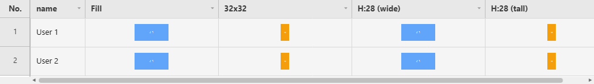

The image above, in full. The 2:1 and 1:2 source images are never stretched, and only the first
column changes size with the row height:

```js
new JHGrid({
  container: '#grid',
  data: [
    { name: 'User 1', photo: '/img/u1-wide.png', avatar: '/img/u1-tall.png', banner: '/img/u1-wide.png', poster: '/img/u1-tall.png' },
    // ...
  ],
  rowHeight: 48,
  columnDefs: [
    { field: 'name' },
    { field: 'photo',  renderer: CellRenderers.image({ fit: 'contain' }) },                 // fills the cell
    { field: 'avatar', renderer: CellRenderers.image({ size: 32, fit: 'contain' }) },      // 32x32 box, whole image visible
    { field: 'banner', renderer: CellRenderers.image({ size: { height: 28 } }) },          // 28px tall, width follows the image
    { field: 'poster', renderer: CellRenderers.image({ size: { height: 28 } }) },
  ],
});
```

To build your own cell editor, assign a function to `columnDefs[i].editor`, the same way `renderer`
accepts a function:

```js
{ field: 'color', editor: (ctx) => {
    const input = document.createElement('input');
    input.type = 'color';
    input.value = ctx.initialValue || '#000000';
    ctx.cellBox({ el: input });   // positions it over the cell for you
    input.addEventListener('change', () => ctx.commit());
    return input; // any shape works as long as it has .value / .remove()
  } }
```

`ctx` carries `row`/`col`/`field`/`rowData`, position/size (`x`/`y`/`colW`/`rowH`), `theme`/`i18n`/
`columnLabel`, `initialValue` (always a string), and callbacks to notify the host grid: `commit()`/
`cancel()`/`moveSel(dr, dc)`/`focusWrapper()`. `wrapper` is the grid's root element. `insertLineBreak()`
re-opens a text editor with a line break at the caret (what `Alt+Enter` does), and `suppressReopen()`
tells the grid not to open a dropdown-style editor again when the click that just closed it landed
on the same cell. The return value only needs `.value` (a string) and `.remove()`,
so you can either return an `<input>` directly (as above) or return an object shaped like
`CellEditors.dropdown()`'s `{ get value() {...}, remove() {...} }`.

#### Editor surfaces: `ctx.cellBox()` / `ctx.popup()` / `ctx.done()`

The example above positions its `<input>` by hand, which is fine for a control that covers exactly
the cell. Anything larger - an option panel, a picker, a form - has to sit outside the cell, escape
whatever `overflow: hidden` is between the grid and the page, stay put while the page scrolls, and
close on the same keys and outside clicks as every other editor. `ctx` provides all of that, so a
custom editor never computes a coordinate:

A complete one: a column that stores the chosen certificates as `'Crane,Forklift'`, edited in a panel
of checkboxes under the cell.

```js
{ field: 'certify', width: 200, editor: (ctx) => {
    ctx.cellBox();                                                  // accent border over the cell
    const panel = ctx.popup({ role: 'listbox', minWidth: 220 });    // anchored under the cell

    const chosen = new Set(String(ctx.initialValue ?? '').split(',').filter(Boolean));
    for (const name of ['Forklift', 'Crane', 'Welding']) {
      const row = document.createElement('label');
      row.style.cssText = 'display:flex;gap:8px;padding:6px 10px;cursor:pointer';
      const box = document.createElement('input');
      box.type = 'checkbox';
      box.checked = chosen.has(name);
      box.addEventListener('change', () => (box.checked ? chosen.add(name) : chosen.delete(name)));
      row.append(box, name);
      panel.append(row);
    }

    // Enter commits, Escape cancels, Tab commits and moves, a click outside commits.
    return ctx.done({ value: () => [...chosen].join(',') });
  } }
```

**`ctx.cellBox({ el, border = true, interactive })`** → a box covering exactly the cell, carrying
the same accent border the built-in editors draw. It lives inside the grid wrapper, so it tracks the
grid on its own, and it is removed with the editor.

Pass `el` to place an element you already have — a native `<input type="color">`, say — instead of
letting it make a `<div>`; that is what an editor whose control *is* its element wants, and it is how
the example above positions its input. Either way the element fills the cell, as the built-in
editors' inputs do (clear its `width`/`height` afterwards if you want its natural size).

`interactive` decides whether the box receives clicks. It defaults to `false` for a `<div>` cellBox
makes itself (its usual job is to mark the cell, not to catch anything) and to `true` when you pass
`el`, since an element handed in is there to be typed in or clicked.

**`ctx.popup(opts)`** → an empty `<div>` anchored to the cell, mounted on `<body>` with
`position: fixed` so no ancestor can clip it, and re-anchored as ancestors scroll or the window
resizes. Options:

| Option | Default | Meaning |
|---|---|---|
| `placement` | `'below'` | `'below'` / `'above'` / `'over'` the cell |
| `align` | `'left'` | which cell edge it lines up with: `'left'` / `'right'` / `'stretch'` (cell width) |
| `minWidth` | `'cell'` | `'cell'`, a number of px, or `null` |
| `maxHeight` | `240` | px, or `null` for unbounded. Scrolls past it |
| `flip` | `true` | flip to the other side of the cell when the chosen one has no room, and clamp horizontally into the viewport |
| `chrome` | `true` | apply the standard overlay background/border/shadow, matching the built-in panels |
| `role` | – | ARIA role, e.g. `'listbox'` |
| `ariaLabel` | `true` | `true` for the grid's standard "edit *column*, row *n*" label, a string for your own, `false` for none |

**`ctx.done(opts)`** → the `{ value, remove }` object the grid commits from, with the keyboard and
outside-click behaviour every built-in editor shares already wired: Enter commits, Escape cancels,
Tab commits and moves one cell (Shift+Tab backwards), and a mousedown outside commits. It also tears
down every surface the editor created, so there is nothing to clean up by hand.

| Option | Default | Meaning |
|---|---|---|
| `value` | *(required)* | `() => string` (or a plain value), read once at commit |
| `outside` | `'commit'` | what a mousedown outside the editor does: `'commit'` / `'cancel'` / `'ignore'`. The built-in single-choice dropdown uses `'cancel'` |
| `keys` | – | per-key override, e.g. `{ enter: false, escape: 'cancel' }`. Each is `'commit'`, `'cancel'`, `'commit-and-move'`, or `false` to leave the key alone |
| `onKey` | – | `(e) => boolean`, seen before the mapping above, for keys the editor handles itself (arrow navigation in a listbox, say). Return `true` to stop there. Torn down with the rest, so an editor never registers a keydown listener of its own |
| `onCommit` / `onCancel` | – | run just before the grid is told, for editor-local bookkeeping |

The returned object also exposes `commit()` and `cancel()`, for an editor that closes itself from
its own UI (an OK button, say).

> These surfaces exist on the **editor** context only, and deliberately so. A canvas grid's
> performance comes from not building DOM per cell; one edit session is alive at a time (starting
> another edit, scrolling the grid, or mousing down elsewhere all commit the current one first), so
> what they mount is bounded at one editor and its popups no matter how many rows are loaded. The
> renderer and `cellDecorator` contexts draw on the canvas and have no DOM equivalent.


You can also register reusable editors/renderers by name, so multiple columns can reference them by string key:

```js
import { registerCellEditor, registerCellRenderer, CellRenderers } from '@jh-grid/jhgrid-js';

registerCellEditor('color', (opts) => (ctx) => { /* same factory shape as above */ });
registerCellRenderer('color', () => (ctx, info) => { /* draw a color swatch on the canvas */ });

columnDefs: [{ field: 'favoriteColor', editor: 'color', renderer: 'color' }]
```

### Text Cells and Line Breaks

A plain text cell edits in a single-line box. `Alt+Enter` inserts a line break (a plain `Enter` commits
and moves down), and from then on the cell edits in a multi-line box. When a value with a line
break is entered, the row grows to show every line. Rows that arrive with multi-line values already
in the data start at the normal height and clip them, so double-click the bottom edge of the row
number to fit the row to its tallest cell, or call `setRowHeight()`. The grid draws each line of the
value; it does not wrap long lines, so keep line breaks explicit.

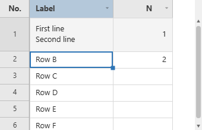

A value with line breaks is copied to the clipboard in quotes, the way a spreadsheet does, so it
pastes back as one cell. To use the multi-line box from the first keystroke (say, a notes column
whose values start empty), name it as the editor:

```js
columnDefs: [
  { field: 'note', label: 'Note', width: 220, editor: 'textMultiline' },
],
```

### Checkbox Columns (`type: 'checkbox'`)

```js
const grid = new JHGrid({
  container: '#grid',
  data: [
    { name: 'Ada',   active: true  },
    { name: 'Grace', active: false },
  ],
  editableCols: ['active'],
  columnDefs: [
    { field: 'name',   label: 'Name' },
    { field: 'active', label: 'Active', type: 'checkbox', width: 90 },
  ],
  onCellChange: ({ row, field, newValue }) => save(row, field, newValue === 'true'),
});
```

The cell is drawn as a box and counts as checked for `true`, `1`, `'true'`, `'1'`, `'Y'` and `'yes'`.
Clicking it, or pressing `Space` / `Enter` / `F2` on the selected cell, toggles it at once with no
editor. Like any edit this needs the column to be editable, through `editableCols` or
`editable: true`, and what it writes is the text `'true'` or `'false'`, which is what
`getEdits()`, `onCellChange` and `getRowData()` report (convert it with `=== 'true'`). For a select-all
box in the header see [`headerCheckbox`](#row-selection-rowselection--header-checkbox).

### Date Columns (`type: 'date'`)

A date cell holds **text**, not a `Date` object. Every date column has a pattern: the `format` you
give it, or the one its locale uses when you give none (`'MM/DD/YYYY'` under `en`, `'YYYY-MM-DD'`
under `ko`, `'YYYY/MM/DD'` under `ja` and `zh`). `format: 'locale'` is the one case without a pattern:

| | With a pattern (`format`, or the locale's) | `format: 'locale'` |
|---|---|---|
| Cell shows | the value written in that pattern | the date the way `Intl` writes it for the grid's `locale` (`2024. 3. 1.` under `ko-KR`) |
| Editor | a text box that inserts the separators as you type digits, with a calendar button that opens the native picker | the browser's native date input |
| Saved as | text in that pattern, for example `'25/01/02'` | `YYYY-MM-DD` (`YYYY-MM-DDTHH:mm` with `editorOptions: { mode: 'datetime-local' }`) |
| Valid when | it matches the pattern, or is ISO text, and is a real date: month 1 to 12, a day that exists in that month (leap years included), hour and minute in range | it is ISO text |

`format` is a pattern of `YYYY`, `YY`, `MM`, `DD`, `HH`, `mm` and `ss`; every other character is copied as
it is. A pattern with a time part (`HH`, `mm`) gives the calendar button a date-and-time picker.

```js
const grid = new JHGrid({
  container: '#grid',
  editableCols: '*',
  data: [
    { task: 'Design review', due: '2025-03-14', start: '2025-03-14 09:30' },
    { task: 'Ship 1.0',      due: '2025-06-30', start: '' },
  ],
  columnDefs: [
    { field: 'task',  label: 'Task', width: 160 },
    // No format: the locale's pattern (MM/DD/YYYY under en). min/max limit what the picker offers.
    { field: 'due',   label: 'Due',  type: 'date', width: 130,
      editorOptions: { min: '2025-01-01', max: '2025-12-31' } },
    // With a format: type 2025-03-14 0930 and it becomes 2025-03-14 09:30.
    { field: 'start', label: 'Start', type: 'date', format: 'YYYY-MM-DD HH:mm', width: 170 },
  ],
});
```

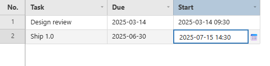

Things worth knowing:

- **A value is read through the column's pattern, or as ISO text - never guessed at.** `'2024-03-01'`
  shows as `'24/03/01'` under `YY/MM/DD`, and `'14/03/2024'` shows as `'2024-03-14'` under
  `DD/MM/YYYY`. A value that is neither - `'03/01/2020'` in a `YYYY-MM-DD` column, where there is no
  telling the month from the day - is left exactly as it was loaded: shown, copied and exported as
  that same text, and marked invalid, rather than silently turned into another date. An ISO
  timestamp that names its zone (`'2024-03-01T10:00:00Z'`) is read as an instant and shown in local
  time.
- **An ISO value is at home in any date column.** It is read and displayed in the column's pattern, the
  editor opens on it in that pattern, and it passes validation - so a server that sends ISO needs no
  translation layer. Opening such a cell and closing it without a change leaves the stored ISO text as
  it is; a date the user really types is saved in the column's pattern, so a column fed both formats
  ends up holding both (which displays, sorts, copies and exports the same either way).
- **`format: 'locale'`** shows the date the way the grid's `locale` does (`2024. 3. 1.` for `ko-KR`).
  That is not a pattern an input mask can be built from, so such a column edits with the native date
  picker and stores ISO text (`2024-03-01`); use a pattern when you want the typed, masked input.
- **`editorOptions.min` and `max`** are passed to the native input or calendar as its `min`/`max`. They
  limit the picker, not what can be typed; use `validation` to reject a typed value.
- **`validation.min` and `max`** read the value through the column's `format`, so they work for
  `YY/MM/DD` or `DD.MM.YYYY` as well as ISO text. A limit can be written in the same format or as
  `YYYY-MM-DD` (optionally followed by `HH:mm`). See [Validation](#validation-columndefsvalidation).
- The date is copied, exported to CSV and printed as displayed, in `format`.

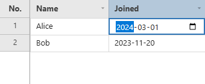

### Dropdown and Multiselect Columns (`type: 'dropdown'` / `'multiselect'`)

`options` lists the choices: strings, or `{ value, label }` objects. A cell **stores and shows the
`value`**; `label` is only the text of the entry in the open list. If people should see "Active"
rather than `'A'`, use the readable text as the value, or draw the label yourself with a custom
renderer.

```js
const grid = new JHGrid({
  container: '#grid',
  editableCols: '*',
  data: [
    { name: 'Ada',   country: 'KR', city: 'Seoul', tags: 'admin,beta' },
    { name: 'Grace', country: 'JP', city: '',      tags: '' },
  ],
  columnDefs: [
    { field: 'name' },
    { field: 'country', type: 'dropdown', options: ['KR', 'JP'] },
    // Options can depend on the row: rowData carries the row as it is now, edits included.
    { field: 'city', type: 'dropdown',
      options: (row) => ({ KR: ['Seoul', 'Busan'], JP: ['Tokyo', 'Osaka'] })[row.country] ?? [] },
    // A multiselect holds its checked values joined by a comma: 'admin,beta'.
    { field: 'tags', type: 'multiselect', width: 180,
      options: [{ value: 'admin', label: 'Administrator' }, 'beta', 'staff'] },
  ],
});
```

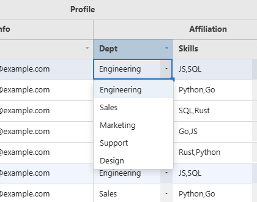
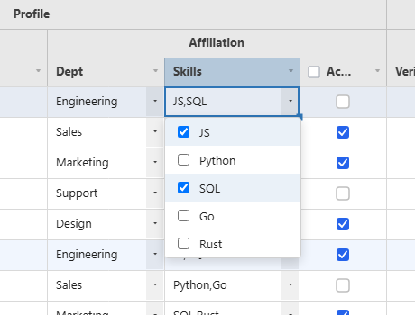

- **Opening.** Double-click, or press `Enter` or `F2` on the selected cell, or simply click a cell
  that is already selected. A column with an empty `options` list does not open an editor.
- **Dropdown.** `↑` / `↓` move the highlight, `Enter` or a click picks the entry, and `Escape` or a
  click outside closes the list without changing the cell.
- **Multiselect.** A click ticks or unticks an entry and keeps the list open. `Enter`, `Tab` or a click
  outside commits the ticked values; `Escape` discards them. The joiner is `editorOptions.delimiter`
  (default `','`); set it if a value can contain a comma.
- **Checked automatically.** A dropdown value that is not one of the options, or a multiselect value
  with a part that is not, is marked invalid without any `validation` block, so a typed or pasted
  stray value shows up. An empty value is accepted; add `validation: { required: true }` to reject it.

### Editor Options (`columnDefs[].editorOptions`)

Each built-in editor is a `CellEditors` entry, chosen by the column's `type` or named with
`editor: 'key'`. `editorOptions` are handed to it:

| Editor key | Chosen by | `editorOptions` |
|---|---|---|
| `text` | `type: 'text'` (the default) | none |
| `textMultiline` | automatically for a value that contains a line break, or `editor: 'textMultiline'` | none |
| `date` | `type: 'date'` | `mode`: `'date'` (default) or `'datetime-local'`, used when the column's `format` is `'locale'`. `min` / `max`: limits for the native picker, as `'YYYY-MM-DD'` text. See [Date Columns](#date-columns-type-date) |
| `dropdown` | `type: 'dropdown'` | `options`: replaces the column's `options` |
| `multiselect` | `type: 'multiselect'` | `options` as above, and `delimiter` (default `','`) |
| `richtext` | `type: 'richtext'` | `marks`: which toolbar buttons to offer, from `'bold'`, `'italic'`, `'underline'`, `'strike'` (default all four) |

```js
columnDefs: [
  // A bold/italic-only rich text column.
  { field: 'summary', type: 'richtext', editorOptions: { marks: ['bold', 'italic'] } },
  // A multiselect that joins with a semicolon instead of a comma.
  { field: 'skills', type: 'multiselect', options: ['js', 'sql', 'go'], editorOptions: { delimiter: ';' } },
  // Use the date editor on a column that is otherwise plain text.
  { field: 'hired', editor: 'date' },
],
```

To register an editor of your own under a key, or to write one inline, see
[Column Types](#column-types-date--richtext--image-and-custom-editorsrenderers) below.

### Validation (`columnDefs[].validation`)

Rules are declared per column and checked whenever a cell's value is committed: an edit, a paste, a
fill, a clear with `Delete`, `setCellValue()` / `setCellValues()`, and undo / redo. A cell that fails is
outlined in red (`theme.invalidCellBorder`) and its message appears in a tooltip while the pointer
rests on it. Validation reports; it never blocks the edit, so the invalid value is kept until the
user fixes it.

| Rule | Type | Fails when |
|---|---|---|
| `required` | `boolean` | the value is empty once trimmed |
| `pattern` | `RegExp \| string` | the value does not match. A string is compiled as a regular expression |
| `min` / `max` | `number` | `Number(value)` is below / above the limit, or the value is not a number. On a `type: 'date'` column the limits are date strings, and the value is compared as a date, read through the column's `format` when it has one |
| `minLength` / `maxLength` | `number` | the text is shorter / longer than the limit |
| `validator` | `(value, rowData) => boolean \| string` | it returns `false` (the default message, or `message`) or a string (that string is the message). `value` is the cell text and `rowData` the row with edits applied. An exception is logged and counts as valid |
| `message` | `string` | not a rule: it replaces the default message of every rule above |

An empty value only ever fails `required`; every other rule is skipped for it. The rules run in the
order of the table and the first one that fails supplies the message. The default messages come from
`i18n` (`validationRequired`, `validationPattern`, `validationMin`, `validationMax`, `validationMinLength`,
`validationMaxLength`, `validationInvalid`) and follow `locale`.

```js
const grid = new JHGrid({
  container: '#grid',
  editableCols: '*',
  data: [{ email: 'ada@example.com', age: '36', code: 'A-100', due: '2025-03-14', ticket: 'TCK-7' }],
  columnDefs: [
    { field: 'email',
      validation: { required: true, pattern: /^\S+@\S+\.\S+$/, message: 'Enter a valid email.' } },
    { field: 'age',    validation: { min: 0, max: 120 } },
    { field: 'code',   validation: { validator: (v) => v.startsWith('A') || 'Code must start with A.' } },
    { field: 'due',    type: 'date',
      validation: { min: '2025-01-01', max: '2025-12-31', message: 'Pick a date in 2025.' } },
    // A rule that looks at the rest of the row:
    { field: 'ticket', validation: { validator: (v, row) => row.code ? true : 'Fill in Code first.' } },
  ],
  // Fired each time a cell's validity changes; message is null when it became valid.
  onValidationError: (row, field, message) => console.log(row, field, message),
});
```

A date column with a `format` takes its limits the same way. Here the value is `YY/MM/DD` text and the
limits are ISO dates:

```js
{ field: 'due', type: 'date', format: 'YY/MM/DD',
  validation: { min: '2025-01-01', max: '2025-12-31', message: 'Pick a date in 2025.' } },
```

Besides the declared rules, a dropdown or multiselect value outside its `options`, and a date that
does not fit its `format`, are flagged without any `validation` block. To gate a save on all of it,
call `validateAll()`, then `isValid()` / `getInvalidCells()` - see
[below](#isvalid--getinvalidcells--validateall) - and keep in mind that only rows already loaded
into the browser are checked.

### Data Export (`exportCsv` / `printGrid`)

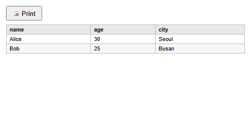

`exportCsv(options)` downloads the grid as a CSV file and returns a `Promise` that resolves once the
download has been started. `printGrid(options)` opens a popup window with the grid as a plain HTML
table and a **Print** button.

By default both cover only the **rows loaded so far**: the chunks the grid has fetched, plus rows
you added. `exportCsv({ full: true })` fetches every row that matches the current filter and sort
instead, asking your `fetchData` for each page (a `data` array simply has all of them already).
`printGrid()` has no `full` option, so it prints what has loaded.

| `exportCsv` option | Default | Meaning |
|---|---|---|
| `filename` | `i18n.exportCsvFilename` (`'export.csv'`) | Name of the downloaded file |
| `delimiter` | `','` | Field separator. Use `';'` for spreadsheets set to a comma decimal mark, or `'\t'` for TSV |
| `includeHeaders` | `true` | Start with a line of column labels |
| `bom` | `true` | Prefix a UTF-8 byte order mark, so Excel reads Korean, Japanese or Chinese text correctly. `false` for a plain UTF-8 file |
| `full` | `false` | Export every row that matches the filter and sort, not only loaded ones |

| `printGrid` option | Default | Meaning |
|---|---|---|
| `title` | `''` | Heading above the table, and the popup's title |
| `includeHeaders` | `true` | Show the column labels |

```js
// A CSV button. exportCsv is asynchronous when full: true, so await it.
csvBtn.addEventListener('click', async () => {
  csvBtn.disabled = true;
  try {
    await grid.exportCsv({ filename: 'users.csv', full: true });
  } finally {
    csvBtn.disabled = false;
  }
});

// A semicolon-separated file for a locale where Excel expects it.
grid.exportCsv({ filename: 'users-eu.csv', delimiter: ';' });

// Print from a click: the popup is blocked unless it starts from a user gesture.
printBtn.addEventListener('click', () => grid.printGrid({ title: 'User List' }));
```

What ends up in the file or the table:

- The columns you can see, in their current order, under their labels; hidden and deleted columns
  are left out. Rows follow the order on screen.
- The text the cells show: unsaved edits are included, and dates are written in the column's `format`.
  A rich-text cell is written without its tags.
- Rows you removed with `deleteRow(i, { permanent: true })` are left out; rows only marked for
  deletion are still on screen, so they are exported.
- A value that begins with `=`, `+`, `-`, `@`, a tab or a carriage return, and is not a plain number, gets a
  leading `'` in the CSV so a spreadsheet will not run it as a formula. Numbers such as `-5` are left
  alone.
- Lines end with `\r\n`. When only loaded rows are exported and the server has more, a console warning
  says how many were left out.
- `printGrid()` logs `popup blocked` and does nothing if the browser stops the popup.

### Plugins (`JHGrid.use`)

`JHGrid.use(plugin)` installs a plugin, an object whose optional `install(JHGrid)` runs once and whose
other members the grid calls where it supports them. Installing the same object again does nothing.
Row selection and pinned rows are built in this way, and a plugin package installs itself when you
import it, so an application normally never calls `use()` at all.

### Accessibility

The canvas is hidden from assistive technology, and the grid keeps a small, real ARIA structure in
step with it: a `role="grid"` element with the row and column counts, the column headers, and the
active cell, which is announced when the selection moves. Name the grid with `ariaLabel` (it
defaults to `i18n.ariaGrid`).

- Everything can be done from the keyboard: cells, the headers and the row numbers all take focus,
  the filter panel keeps `Tab` inside it, and the menus are driven with the arrow keys. See the
  [Interaction Reference](interaction.md).
- Sorting, filtering, resetting filters, row selection, row reordering and pastes that dropped values
  are announced through a live region, in the wording of `i18n`.
- Under `prefers-reduced-motion: reduce` the hover fade, selection glide, wheel easing and column
  slide are switched off and the loading shimmer is held still.
- In Windows high-contrast mode (`forced-colors: active`) the canvas colours are replaced by the system
  colours, so the grid stays legible with whatever theme you set, and go back when the mode ends.

### Exports

Besides `JHGrid`, the package exports:

| Export | What it is |
|---|---|
| `CellRenderers`, `registerCellRenderer` | The built-in renderers and the way to add one |
| `CellEditors`, `registerCellEditor` | The built-in editors and the way to add one |
| `KO_I18N`, `JA_I18N`, `ZH_I18N` | The bundled text packs, see [Text Reference](#text-reference-i18n) |
| `GRID_CLASSES` | The class names of the DOM surfaces, see [Themes](theming.md#styling-with-your-own-css) |
| `VERSION` | The package version, as a string |
| `SUPPORTED_BROWSERS` | The minimum browser versions, see [Browser Support](browser-support.md) |
| `Renderer`, `DataManager`, `DEFAULT_THEME`, `computeHeaderCells`, `BuiltinRenderers` | Low-level pieces, see [Architecture](architecture.md#advanced--low-level-exports) |

With the CDN build all of them hang off the `JHGrid` global (`JHGrid.JHGrid`, `JHGrid.CellRenderers`,
`JHGrid.KO_I18N`, ...).

