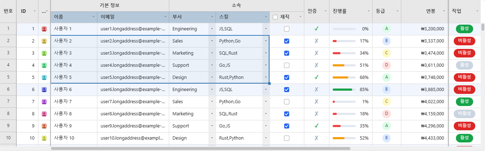
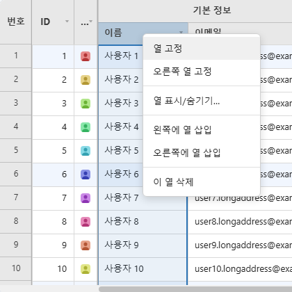

# Interaction Reference

[← Docs index](README.md)

## Mouse

| Action | Result |
|---|---|
| Click a cell | Selects that cell (blue border) |
| Shift+click a cell | Extends the selection into a range from the last-selected cell |
| Drag a cell | Multi-cell range selection (blue border + translucent overlay) |
| Double-click | Enters cell edit mode (only for columns included in `editableCols`) |
| Drag the scrollbar | Vertical/horizontal scroll |
| Click the scrollbar track | Jumps to that position immediately |
| Right-click a column header | Opens the column context menu (freeze, hide, insert, delete) |
| Right-click a row number | Opens the row context menu (insert, delete) |

## Keyboard

| Key | Action |
|---|---|
| `Ctrl+C` | Copy selected cell(s)/range — range is copied in TSV format |
| `Ctrl+V` | Paste starting from the selection (only applied to editable columns) |
| `Ctrl+Z` | Undo |
| `Ctrl+Y` / `Ctrl+Shift+Z` | Redo |
| `Ctrl+A` | Extend the selection to the sheet's used range (Excel-style "current region") |
| `↑ ↓ ← →` | Move the cell selection |
| `Shift+↑ ↓ ← →` | Extend the cell selection |
| `Enter` | Commit the edit and move down one row |
| `Tab` | Commit the edit and move to the cell on the right (`Shift+Tab`: left) |
| `Delete` / `Backspace` | Clear the selected cell(s) |
| `Escape` | Cancel the edit |

> **Performance note:** `Ctrl+A` on a very large dataset (hundreds of thousands of rows or more)
> selects the entire used range, and `Delete` on that selection clears every cell in it
> synchronously. On a 1,000,000-row × 14-column grid this has been measured to block the main
> thread for tens of seconds — there's no debounce or chunking on the clear path yet.
