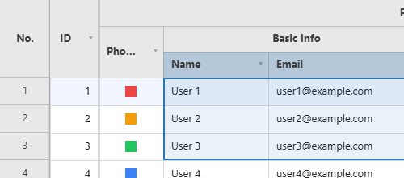
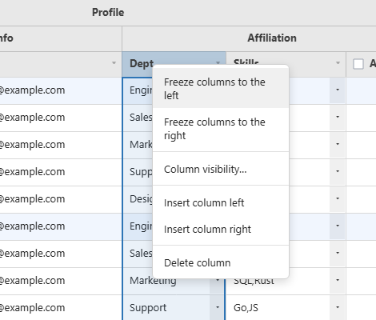
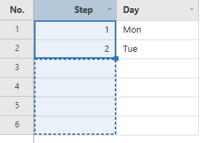

# Interaction Reference

[← Docs index](README.md)

What a click, a drag or a key does. Everywhere below, `Ctrl` also means `Cmd` on a Mac.

## Mouse

### Cells

| Action | Result |
|---|---|
| Click a cell | Selects that cell (blue border). `onCellClick` fires |
| Click a checkbox cell | Toggles it at once, if the column is editable |
| Click a button column cell | Runs its `onClick`, whatever `editableCols` says. No selection border is drawn |
| Click a cell's `cellButton` hotspot | Runs that button's `onClick` and does not start an edit |
| Click an already-selected dropdown or multiselect cell | Opens its option list |
| Shift+click a cell | Extends the selection into a range from the last-selected cell |
| Drag across cells | Selects a range (blue border + translucent overlay). Dragging past the edge of the grid scrolls it |
| Double-click a cell | Starts editing it, if the column is editable. `onCellDoubleClick` fires either way |
| Drag the small square at the corner of a selection | Fills the dragged-over cells from the selection, in any direction. See [Filling](#filling) |
| Right-click a cell | Opens the cell menu. A right-click inside the current selection keeps the selection |
| Rest the pointer on a cell | A tooltip after about half a second if the text is cut off, at once for a validation error or `cellTooltip` |
| Move the pointer over a row | Highlights the row (`theme.hoverRowBg`) |



### Headers

| Action | Result |
|---|---|
| Click a column header | Selects the whole column. Shift+click extends it across columns |
| Click a header's filter icon | Opens the filter / sort panel for that column |
| Click a header checkbox | Toggles it and calls `onHeaderCheckboxChange` |
| Drag a column header | Reorders the column; the columns in between slide out of the way. `Escape` puts it back |
| Drag a column header's right border | Resizes the column (30 px at the narrowest) |
| Double-click a column header's right border | Fits the column to its content; with a range of columns selected, fits all of them |
| Right-click a column header | Opens the column menu (freeze, hide, insert, delete) |

### Row numbers

| Action | Result |
|---|---|
| Click a row number | Selects the row, when `rowSelection` is `'single'` or `'multi'`. `Ctrl`+click adds or removes a row and `Shift`+click selects a range, in `'multi'` |
| Drag a row number | Reorders the row, when `rowReorder` is on |
| Click the pin at the right of a row number | Pins or unpins the row, when `rowPinButton` is on |
| Drag the bottom edge of a row number | Resizes that row (16 px at the shortest) |
| Double-click the bottom edge of a row number | Fits that row to its tallest cell; with several rows selected, fits all of them |
| Right-click a row number | Opens the row menu (pin, insert, delete) |

### Scrolling and touch

| Action | Result |
|---|---|
| Mouse wheel / trackpad | Scrolls, with a short glide for wheel notches (`scrollEaseMs`) |
| Drag the scrollbar | Vertical/horizontal scroll |
| Click the scrollbar track | Jumps to that position immediately |
| Tap | Acts as a click |
| Long-press (about half a second) | Opens the context menu for whatever is under the finger |



The menus themselves are described under [Context Menus](api.md#context-menus-rowcontextmenuitems--colcontextmenuitems--cellcontextmenuitems--setoptions).

## Keyboard

### Moving and selecting

| Key | Action |
|---|---|
| `↑ ↓ ← →` | Move the cell selection. With nothing selected, the first arrow selects the first cell |
| `Shift+↑ ↓ ← →` | Extend the cell selection |
| `Tab` / `Shift+Tab` | Move one cell right / left. The key stays inside the grid |
| `Home` / `End` | First / last column of the current row (`Ctrl+Home` / `Ctrl+End`: first / last cell of the grid) |
| `PageUp` / `PageDown` | Move the selection up / down by one screenful of rows |
| `Ctrl+A` | Extend the selection to the sheet's used range (Excel-style "current region") |
| `Escape` | Cancels an edit or a drag; otherwise closes an open filter panel or menu; otherwise clears the selection |
| `Ctrl+↑` | Move focus to the column header (see [Keyboard focus on the headers](#keyboard-focus-on-the-headers)) |
| `←` on the first column | Move focus to the row-number gutter (row focus mode) |

### Editing

| Key | Action |
|---|---|
| `Enter` / `F2` | Start editing the selected cell. On a checkbox column they toggle the box; on a button column they click the button |
| `Space` | Same as `F2`, except that it types a space into a text cell |
| Any printable key | Starts editing a text cell with that character in place of its current value |
| `Enter` (while editing) | Commit and move down one row |
| `Alt+Enter` (while editing text) | Insert a line break; the row grows to fit |
| `Tab` (while editing) | Commit and move right (`Shift+Tab`: left) |
| `Escape` (while editing) | Cancel the edit |
| `Delete` / `Backspace` | Clear the selected cell(s). Read-only cells are skipped |
| `Ctrl+Z` | Undo |
| `Ctrl+Y` / `Ctrl+Shift+Z` | Redo |

`Delete`, `Ctrl+Z` and `Ctrl+Y` / `Ctrl+Shift+Z` can be switched off one by one with the
`keyboardShortcuts` option, which leaves the key for your own `keydown` handler:

```js
new JHGrid({
  container: '#grid',
  data: rows,
  keyboardShortcuts: { delete: false },   // Delete/Backspace no longer clear cells; undo and redo stay on
});
```

### Clipboard

| Key | Action |
|---|---|
| `Ctrl+C` | Copy the selected cell or range as tab-separated text, the way a spreadsheet does. With rows selected and no cell selected, copies those rows |
| `Ctrl+V` | Paste, starting at the selected cell |

- Copied text is what the cells show: dates in their `format`, edits included. A value that contains
  a tab, a quote or a line break is quoted, so it pastes back as one cell.
- Rows that have not loaded yet cannot be copied; a message says how many were left out.
- A paste writes only to editable cells. Values that fall past the last row or column, or into a
  read-only column, are dropped and a message says how many. A paste never adds rows or columns.
- A single value pasted onto a selected range fills the whole range.
- The whole paste is one undo step.
- An image on the clipboard, pasted onto an editable `type: 'image'` cell, becomes a `blob:` URL that
  only exists in this page. Upload it and replace the value before you save.
- The browser can ask for permission the first time a paste reads the clipboard.

### Filling

Drag the small square at the corner of a selection (the *fill handle*) over neighbouring cells, up,
down, left or right, and they are filled from the selection. Only editable columns are filled.



- A **single number** counts up by one for each cell (`2` gives `3, 4, 5, ...`), and down by one when
  you drag up or left.
- **Two or more numbers** with a constant step continue that step (`1, 2` gives `3, 4, 5`;
  `10, 20` gives `30, 40`).
- **Anything else** repeats the selected cells as a pattern (`Mon, Tue` gives `Mon, Tue, Mon, ...`).
- The fill is one undo step, and `Escape` during the drag cancels it.

### Keyboard focus on the headers

The grid can be driven without a mouse all the way out to the headers:

| From | Key | Result |
|---|---|---|
| A selected cell | `Ctrl+↑` | Focuses that column's header |
| A focused header | `←` / `→` | Moves to the neighbouring column's header |
| A focused header | `Enter` / `F2` / `Space` | Opens the column's filter/sort panel |
| A focused header | `ContextMenu` or `Shift+F10` | Opens the column's right-click menu |
| A focused header | `↓` or `Escape` | Returns to the cell below it |
| A selected cell in the first column | `←` | Focuses that row's number (row focus) |
| A focused row number | `↑` / `↓` | Moves to the previous / next row |
| A focused row number | `Enter` / `Space` | Selects the row (when `rowSelection` is on; `Ctrl`/`Shift` extend it) |
| A focused row number | `ContextMenu` or `Shift+F10` | Opens the row's right-click menu |
| A focused row number | `→` or `Escape` | Returns to the first cell of that row |

Inside an open menu, `↑` / `↓` move between the items, `Enter` or `Space` runs the focused one, and
`Escape` closes it. The filter panel keeps `Tab` inside itself, and `Enter` in its search box
applies the filter.

> **Performance note:** `Ctrl+A` on a very large dataset (hundreds of thousands of rows or more)
> selects the entire used range, and `Delete` on that selection clears every cell in it
> synchronously, so the tab is unresponsive while it runs. Clearing 1,000,000 rows × 20 columns
> (20,000,000 cells) takes roughly 15 seconds and about 1 GB of extra memory, and `Ctrl+Z`
> takes about 12 seconds. Time and memory both grow with the number of cells cleared. Repeating
> `Delete` and `Ctrl+Z` does not accumulate memory, and a `Delete` over cells that are already
> cleared does nothing.
