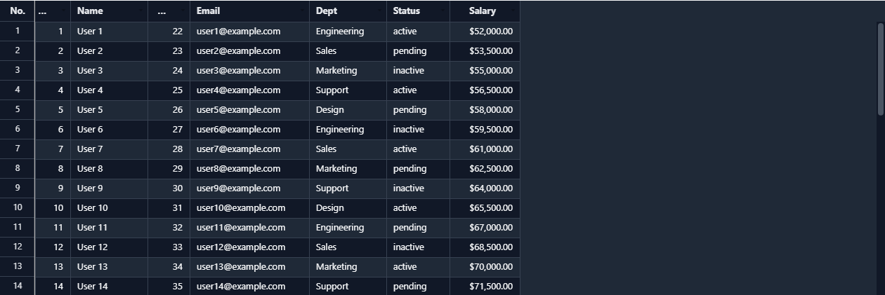

# Theming

[← Docs index](README.md)

Pass a `theme` object to override any default value:

```js
const grid = new JHGrid({
  container: '#grid',
  fetchMeta,
  fetchData,
  theme: {
    headerBg:       '#1e3a5f',
    headerText:     '#ffffff',
    rowEven:        '#ffffff',
    rowOdd:         '#f0f4ff',
    cellText:       '#111827',
    scrollbarThumb: '#6b7280',
  },
});
```



## Full Theme Reference

### Canvas tokens

Everything below is painted directly on the `<canvas>`: the grid body, header, selection,
scrollbars, and cell state indicators. `theme` is the only way to set most of them; two
(`selectionColor`, `fontFamily`) are also bridged to a `--jhg-*` CSS variable because DOM overlays
(the filter panel's "Apply" button, cell editors) borrow them for visual consistency with the
canvas; see the note under the table below.

| Key | Default | Description |
|---|---|---|
| `headerBg` | `#E8E8E8` | Header background color |
| `headerText` | `#3D3D3D` | Header text color |
| `headerBorder` | `#C0C0C0` | Header column separator color |
| `rowEven` | `#FFFFFF` | Even row background |
| `rowOdd` | `#FFFFFF` | Odd row background |
| `cellBorder` | `#D9D9D9` | Cell border color |
| `cellText` | `#212121` | Cell text color |
| `loadingText` | `#BFBFBF` | Text color while chunk is loading |
| `skeletonBar` | `#E4E7EB` | Bar drawn in a cell whose row hasn't arrived yet, instead of leaving it blank |
| `skeletonSheen` | `rgba(255,255,255,0.65)` | The lighter band that sweeps across those skeleton bars. Held still under `prefers-reduced-motion: reduce` |
| `cellPadding` | `10` | Horizontal padding inside cells (px) |
| `selectionColor` | `#2E75B6` | Cell selection / range border color |
| `selectionFill` | `rgba(46,117,182,0.10)` | Range selection background overlay |
| `selRowBg` | `rgba(46,117,182,0.12)` | Background overlay for selected rows (when `rowSelection` is active) |
| `hoverRowBg` | `rgba(0,0,0,0.045)` | Wash over the row under the pointer. Neutral rather than the selection blue so the two stay tellable apart on the same row; use a light value on a dark theme, or a falsy value to disable |
| `frozenBorder` | `#B0B0B0` | Separator line between frozen and scrollable columns |
| `scrollbarBg` | `#F0F0F0` | Scrollbar track background |
| `scrollbarThumb` | `#C0C0C0` | Scrollbar thumb color |
| `scrollbarRadius` | `4` | Scrollbar thumb border radius (px) |
| `groupHeaderBg` | `#EEF2F7` | Multi-level header group cell background |
| `groupHeaderText` | `#1E293B` | Multi-level header group cell text |
| `footerBg` | `#F2F2F2` | Aggregate footer row background |
| `footerText` | `#1E293B` | Aggregate footer row text |
| `filterIconBg` | `rgba(245,158,11,0.18)` | Background of the filter icon on a header with an active filter |
| `filterIconColor` | `#C87B00` | Filter icon color |
| `sortIconBg` | `rgba(46,117,182,0.12)` | Background of the sort icon on a header with an active sort |
| `sortIconColor` | `#2E75B6` | Sort icon color |
| `headerIconColor` | `rgba(0,0,0,0.28)` | Color of other header icons (when no filter/sort is applied) |
| `hiddenColIndicator` | `#94A3B8` | Border color of the Excel-style double-line drawn on headers adjacent to a hidden column |
| `editableCellBg` | `undefined` (no tint) | Background tint applied to editable cells when `editableCols` is not `'*'` |
| `readonlyCellBg` | `#F5F5F5` | Background tint applied to readonly cells when `editableCols` is not `'*'` |
| `imagePlaceholderBg` | `#F1F5F9` | `CellRenderers.image()` cell background while an image is loading |
| `imageErrorBg` | `#FEE2E2` | `CellRenderers.image()` cell background on load failure |
| `imageErrorIcon` | `#DC2626` | `CellRenderers.image()` "broken image" X glyph color |
| `fontSize` | `13` | Font size for all text (px) |
| `headerFontSize` | defaults to `fontSize` | Header cell font size (px) |
| `fontFamily` | `-apple-system, BlinkMacSystemFont, "Segoe UI", Roboto, sans-serif` | Font family for all text |
| `locale` | `'en-US'` | Default BCP-47 tag used by `CellRenderers.number/date/currency` when a column doesn't pin its own `locale`. Not a visual token; this is set via `JHGridOptions.locale` |
| `invalidCellBorder` | `#dc2626` | Outline drawn around a cell whose value fails its column's `validation` |
| `deletedRowFill` | `rgba(239,68,68,0.10)` | Background of a row marked deleted by `deleteRow()` but not yet committed |
| `deletedRowStrike` | `rgba(239,68,68,0.55)` | Strikethrough color for text in a row marked deleted |
| `dragGhostShadow` | `rgba(15,23,42,0.30)` | Drop shadow under the ghost that follows the pointer during a column-header drag |
| `dragIndicatorFill` | `rgba(59,130,246,0.12)` | Insertion-point fill shown while dragging a column/row to reorder |
| `dragIndicatorLine` | `#3b82f6` | Insertion-point line shown while dragging a column/row to reorder |

`dragIndicatorFill`/`dragIndicatorLine`/`deletedRowFill`/`deletedRowStrike`/
`invalidCellBorder` are automatically remapped to system colors in high-contrast (`forced-colors`)
mode; visibility in high-contrast mode is preserved even with a custom theme applied.

`selectionColor` doubles as the DOM overlays' accent color via `--jhg-accent` (e.g. the filter
panel's "Apply" button and the sort-direction toggle), and `fontFamily` is mirrored to
`--jhg-font-family` so overlay text matches the canvas font without being set twice.

### DOM surface tokens

These style the parts of the grid that are real DOM rather than canvas: the filter panel,
context menus, the column chooser, cell editors, and the pager. `theme` reaches them the same way
as the canvas tokens above, but each is *also* bridged to a `--jhg-*` CSS custom property (see
[Styling with your own CSS](#styling-with-your-own-css) below); set the variable in your own
stylesheet and it wins over whatever `theme` says, since every one of these is emitted as
`var(--jhg-…, <theme value>)`.

| Key | CSS variable | Default | Description |
|---|---|---|---|
| `overlayBg` | `--jhg-overlay-bg` | `#FFFFFF` | Background of panels, menus and dialogs |
| `overlayBorder` | `--jhg-overlay-border` | `#D0D0D0` | Their outer border |
| `overlayHeaderBg` | `--jhg-overlay-header-bg` | `#F5F5F5` | Header strip inside a panel or dialog |
| `overlayDivider` | `--jhg-overlay-divider` | `#E0E0E0` | Hairline between sections of a panel |
| `overlayText` | `--jhg-overlay-text` | `#212121` | Primary text on those surfaces |
| `overlayMutedText` | `--jhg-overlay-muted-text` | `#595959` | Secondary text (labels, counts) |
| `overlayHintText` | `--jhg-overlay-hint-text` | `#909090` | Placeholder and hint text |
| `overlayHoverBg` | `--jhg-overlay-hover-bg` | `#F5F5F5` | Hover background for a row in a list, such as a filter checklist |
| `overlayItemHoverBg` | `--jhg-overlay-item-hover-bg` | `#F0F0F0` | Hover (and keyboard-focus) background for a menu item |
| `overlayShadow` | `--jhg-overlay-shadow` | `0 4px 16px rgba(0,0,0,0.15)` | Shadow under panels and dialogs |
| `overlayMenuShadow` | `--jhg-overlay-menu-shadow` | `0 4px 12px rgba(0,0,0,0.15)` | Shadow under context menus, which sit closer to the surface |
| `overlayAccentText` | `--jhg-overlay-accent-text` | `#FFFFFF` | Text on an accent-filled control, such as the filter panel's apply button |
| `pagerBg` | `--jhg-pager-bg` | `#f8fafc` | Pager bar background. Only rendered with `pagination` enabled |
| `pagerText` | `--jhg-pager-text` | `#1e293b` | Pager bar text |
| `pagerBorder` | `--jhg-pager-border` | `#e2e8f0` | Border between the pager bar and the grid |
| `pagerButtonBg` | `--jhg-pager-button-bg` | `#ffffff` | Page-button background |
| `pagerButtonBorder` | `--jhg-pager-button-border` | `#cbd5e1` | Page-button border |

## Styling with your own CSS

The grid body, header, selection and scrollbars are painted on a `<canvas>`, so CSS cannot reach
them; those are configured through `theme` above. Everything *around* the grid is real DOM and
can be styled directly.

Each DOM surface carries a stable class, and the `theme` object is mirrored onto `--jhg-*` custom
properties scoped to the grid. Overriding a variable in your own CSS wins over the built-in value:

```css
.jhg-root, .jhg-pager {
  --jhg-overlay-bg: #1f2937;
  --jhg-overlay-text: #f9fafb;
  --jhg-overlay-border: #374151;
  --jhg-accent: #60a5fa;
}
```

| Class | Surface |
| --- | --- |
| `.jhg-root` | Grid wrapper (variable scope) |
| `.jhg-overlay` | Any floating surface; carries the entrance animation |
| `.jhg-panel` | Filter / sort panel |
| `.jhg-dialog` | Column visibility chooser |
| `.jhg-menu` / `.jhg-menu-item` | Context menus and their rows |
| `.jhg-btn` / `.jhg-swatch` | Buttons and color swatches inside overlays |
| `.jhg-pager` / `.jhg-pager-btn` | Pagination bar and its buttons |
| `.jhg-editor` | Cell editors and the filter search input |
| `.jhg-loading` / `.jhg-empty` / `.jhg-tooltip` | Loading overlay, empty state, cell tooltip |

These strings are also exported as `GRID_CLASSES`, for code that wants to target a surface without
hardcoding the class name:

```js
import { GRID_CLASSES } from '../dist/jhgrid.esm.js';

document.querySelectorAll(`.${GRID_CLASSES.menuItem}`);
```

Motion is deliberately restrained (≈140 ms, opacity/transform only) and is disabled automatically
under `prefers-reduced-motion: reduce`. Retime it globally without rewriting rules:

```css
.jhg-root { --jhg-motion-fast: 90ms; --jhg-motion-slow: 120ms; }
```

Only motion and focus rules live in the injected stylesheet (one `<style id="jhgrid-styles">` per
document); colors and layout stay inline so a missing stylesheet degrades to "no animation" rather
than an unstyled grid.

## Canvas motion

The grid body is painted into a `<canvas>`, so none of the CSS above reaches it. What it does have
is a **row hover highlight**: the row under the pointer takes the `hoverRowBg` wash, and the
highlight fades as it appears and disappears.

The row it sits on moves *instantly* while only the opacity eases. Fading the movement itself would
make the highlight trail the pointer while you scan down a column, which reads as the grid being
slow, and would briefly light two rows at once.

The **selection box** also travels to its new cell or range instead of jumping (`selectionMoveMs`).
It deliberately snaps rather than easing whenever easing would put the border somewhere the user is
actively aiming:

- during a range drag or fill drag: the box has to stay under the pointer;
- when the selection appears from nothing or clears;
- when a move arrives before the previous one has landed. Held arrow keys repeat far faster than
  the box can cross a cell, so the first step eases and the rest are exact.

**Dragging a column header** lifts its header cell out and carries it under the cursor, and the
reorder happens live: as the pointer crosses each boundary the columns it displaces slide aside
(`columnSlideMs`), so the grid previews the arrangement it will actually end up in instead of
rearranging on drop. Outside the drag handler it is still one move: `onColumnReorder` fires once
with the final order, one undo step covers the whole drag, and <kbd>Esc</kbd> puts the column back.

**Mouse-wheel scrolling** glides to where the gesture is heading (`scrollEaseMs`) rather than
teleporting a notch at a time. Deltas smaller than one row are applied immediately instead: a
precision trackpad emits a dense stream of few-pixel deltas that is already smooth, and easing it
would add lag the hardware had already removed. The split is by step size, not by trying to
identify the device.

```js
new JHGrid({
  // …
  hoverFadeMs: 0,                                  // instant, no fade
  selectionMoveMs: 0,                              // selection box jumps
  scrollEaseMs: 0,                                 // wheel deltas applied immediately
  theme: { hoverRowBg: 'rgba(255,255,255,0.055)' } // light wash for a dark theme
});
```

Set `theme.hoverRowBg` to a falsy value to turn the highlight off entirely; the grid then does no
hover tracking or repainting at all. Both durations are forced to `0` under
`prefers-reduced-motion: reduce`, which removes the easing but keeps the highlight and the box.
